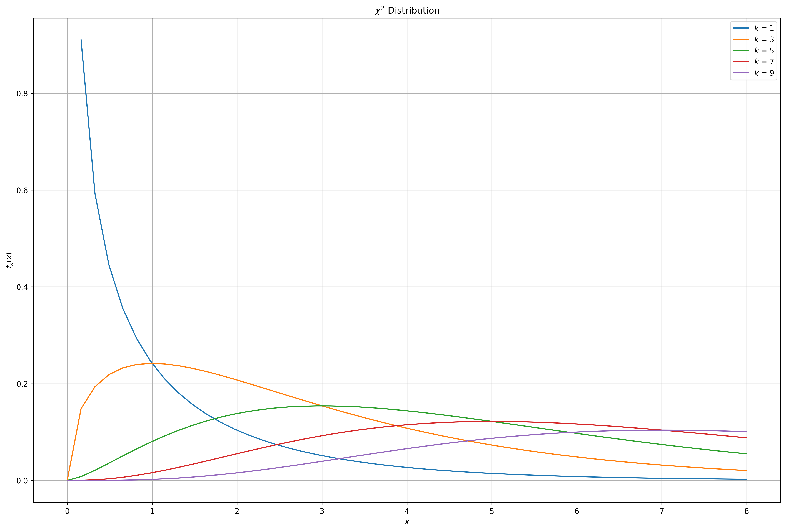
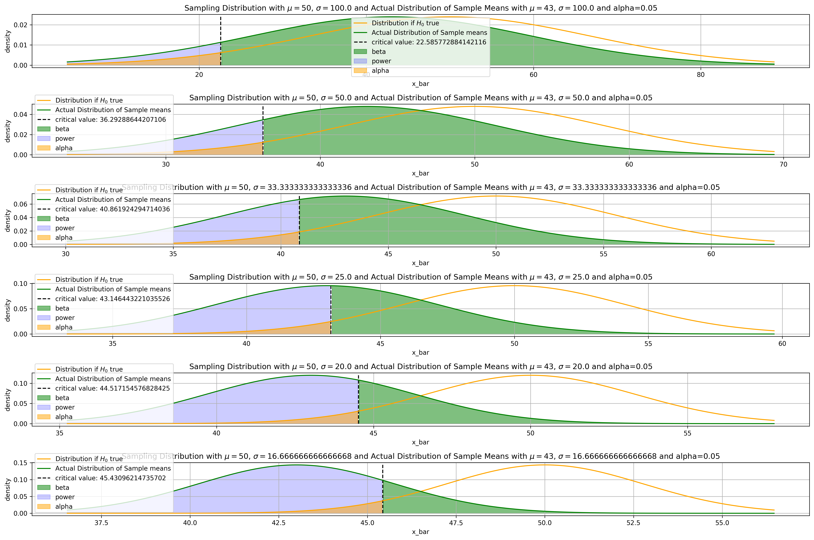
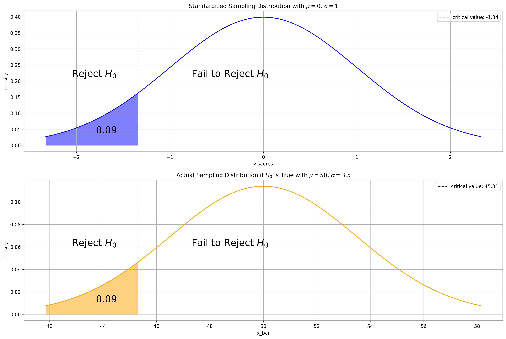

# Probability and Statistics Review

We'll review some fundamental statistical and probability theory you need to know to understand the how most machine learning algorithms, especially those in [Natural Language Processing](https://jeffchenchengyi.github.io/machine-learning/06-natural-language-processing/basics/README.html) and [Bayesian Methods](https://jeffchenchengyi.github.io/machine-learning/11-bayesian-methods/README.html) work.

### Table of Contents
1. [Probability Distributions](#distributions)
2. [Basic Statistics](#bs)
3. [Hypothesis Testing](#hyptest)
4. [$Z$-test](#z-test)
5. [Student's $T$-test](#t-test)
6. [Anova](#anova)
7. [Chi-squared Test](#cs-test)
8. [A/B Testing](#abtest)

## Preliminaries

### Basic Probability Rules

Independence: $P(A \cap B) = P(A) \times P(B)$

### Expectation and Moments of Random Variable

Discrete:
- 1st Moment - $\mathbb{E}[X] = \sum^N_{i = 1}xf_xdx = \mu$
    - 1st Central Moment / Mean = 0
- [2nd Moment](https://www.youtube.com/watch?v=cwa2xONQFOc) - $\mathbb{E}[X^2] = \sum^N_{i = 1}x^2f_xdx$
    - 2nd Central Moment / Variance - $Var(X) = \mathbb{E}[(X - \mathbb{E}[X])^2] = \sum^N_{i = 1}(x - \mu)^2f_xdx \underset{\text{expand}}{=} \mathbb{E}[X^2] - \mathbb{E}[X]^2 = \sigma^2$
- 3rd Moment - $\mathbb{E}[X^2] = \sum^N_{i = 1}x^2f_xdx$

Continuous:
- 1st Moment - $\mathbb{E}[X] = \int^\infty_{-\infty}xf_xdx$
- 2nd Moment - $\mathbb{E}[X^2] = \int^\infty_{-\infty}x^2f_xdx$

$f_x$ is the output of the probability mass / distribution function @ $x$ 

### Kurtosis

### Skewness

### Expectation and Variance Properties

### Covariance and Correlation

### Population Vs. Sample Parameters

Population:
$$
\mathbb{E}[X] = \mu,\,Var(X) = \sigma^2
$$

Sample:
$$
\bar{x} = \frac{1}{N}\sum^N_{i=1}x_i,\,s^2 = \frac{1}{N-1}\sum^N_{i=1}{(x_i - \bar{x})}^2
$$


<div markdown="1" class="cell code_cell">
<div class="input_area" markdown="1">
```python
# Visualization / ML Libraries
from collections import namedtuple
import numpy as np
import pandas as pd
import matplotlib
import matplotlib.pyplot as plt
import matplotlib.cm as cm
import matplotlib.font_manager as fm
import matplotlib.patches as mpatches
from mpl_toolkits.axes_grid1.anchored_artists import AnchoredSizeBar
import seaborn as sns
from scipy.stats import norm, f, chi2
from sklearn.datasets import make_spd_matrix

# plotting defaults
plt.rcParams['figure.dpi'] = 300
plt.rcParams['figure.figsize'] = (18, 12)
get_colors = lambda length: plt.get_cmap('Spectral')(np.linspace(0, 1.0, length))

```
</div>

</div>


<div markdown="1" class="cell code_cell">
<div class="input_area" markdown="1">
```python
plt.rcParams['figure.dpi'] = 300
plt.rcParams['figure.figsize'] = (18, 12)

```
</div>

</div>


---
# Probability Distributions<a id='distributions'></a>


# 1. Discrete


## Categorical

- Special case of **Multinomial** where $n=1$
- Distribution of possible results of a random variable that can take on one of $K$ possible categories, with the probability of each category separately specified
    - e.g. If we roll a dice, what's the probability that 3 comes up?


## Bernoulli

- Special case of **Binomial** where $n=1$
- Special case of **Categorical** where $k=2$
- Distribution of the number of success in a single $n=1$ Bernoulli trial ($k=2$, success / failure)
    - e.g. If a coin is tossed once, what is the probability it comes up heads?


## Binomial

- Special case of **Multinomial** where $k=2$
- Distribution of the number of success in $n$ **i.i.d.** Bernoulli trials ($k=2$, success / failure) **with** replacement
    - e.g. If a coin is tossed 20 times, what is the probability heads comes up exactly 14 times?


## Multinomial

- Distribution of the outcome of $n$ **i.i.d.** trials, where the outcome of each trial has a categorical distribution ($k>2$, multiple classes) **with** replacement
    - e.g. If we draw 5 colored balls from a bag, what is the probability that we get 2 blue balls, 2 red balls, and 1 green ball?


## Negative Binomial

- Distribution of the number of **i.i.d.** Bernoulli trials needed to get $k$ successes
    - e.g. If a coin is repeatedly tossed, what is the probability the 3rd time heads appears occurs on the 9th toss?


## Geometric

- Special case of **Negative Binomial** where $k=1$
- Distribution of the number of **i.i.d.** Bernoulli trials needed to get the first success
    - e.g. If a coin is repeatedly tossed, what is the probability that the **first** time heads appears occurs on the 8th toss?


## Hypergeometric

- Binomial closely approximates Hypergeometric if we are sampling only a small fraction of the population
- Distribution of the number of success in $n$ **i.i.d.** Bernoulli trials ($k=2$, success / failure) **without** replacement
    - e.g. If 5 cards are drawn without replacement, what is the probability 3 hearts are drawn?


## Poisson

- Distribution of the number of **i.i.d.** events in a given time / length / area / volume
    - e.g. What is the probability there will be 4 car accidents on a university campus in a given week?


# 2. Continuous


## Univariate Gaussian / Normal

$$
\chi \sim \mathcal{N}(\mu, \sigma^2)
$$

PDF:
$$
f(x \vert \mu, \sigma^2) = \frac{1}{\sqrt{2\pi\sigma^2}}e^{-\frac{(x - \mu)^2}{2\sigma^2}}
$$


## Multivariate Gaussian / Normal

$\mathbf{X}$ is our data, where
$$
\mathbf{X} \sim \mathcal{N}(\mathbf{\mu}, \mathbf{\Sigma} = \mathbf{\Lambda}^{-1})
$$


### Parameterizations

Multivariate Gaussian PDF:
$$
p(x\mid\mu,\Sigma) = \frac{1}{(2\pi)^{n/2}{\vert\Sigma\vert}^{1/2} } {e}^{-\frac{1}{2}{(x - \mu)}^\top {\Sigma}^{-1} (x - \mu)}, x \in \mathbb{R}^d
$$

Moment Parameterization:
$$
\begin{aligned}
    \mu &= E(x) \\
    \Sigma &= E(x - \mu){(x - \mu)}^\top
\end{aligned}
$$

Canonical Parameterization:
$$
\begin{aligned}
    \Lambda &= \Sigma^{-1}\,\text{Precision Matrix = Inverse Covariance Matrix} \\
    \eta &= \Sigma^{-1}\mu
\end{aligned}
$$

$$
p(x\mid \eta, \Lambda) = {e}^{a + \eta^\top x - \frac{1}{2} x^\top \Lambda x} , a = -\frac{1}{2} (n log(2\pi) - log\vert\Lambda\vert + \eta^\top \Lambda \eta)
$$

Converting Canonical Parameters to Moment Parameters:
$$
\begin{aligned}
\mu &= \Lambda^{-1}\eta \\
\Sigma &= \Lambda^{-1}
\end{aligned}
$$


### MLE estimates

We are given a dataset $\mathcal{D} = \{\mathbf{x}_1, \mathbf{x}_2, \ldots, \mathbf{x}_n\}$, where $\mathbf{x}_i \in \mathbb{R}^d$ sampled from a multivariate gaussian and each sample is sampled i.i.d.

Goal: 
$$
\begin{aligned}
    \hat{\theta}_{MLE} &= \operatorname*{argmax}_{\theta} \,P(\mathcal{D}; \theta = \mu, \Sigma) \\
    &= \operatorname*{argmax}_{\theta} \,P(X_1=\mathbf{x}_1,\ldots,X_n=\mathbf{x}_n; \theta = \mu, \Sigma) \\
    &= \operatorname*{argmax}_{\theta} \,\prod_{i=1}^n P(X_i=\mathbf{x};\theta = \mu, \Sigma) \because \text{ Each sample is i.i.d. } \\
    &= \operatorname*{argmax}_{\theta} \,\prod_{i=1}^n  \frac{1}{(2\pi)^{n/2}{\vert\Sigma\vert}^{1/2} } {e}^{-\frac{1}{2}{(\mathbf{x}_i - \mu)}^\top {\Sigma}^{-1} (\mathbf{x}_i - \mu)} \\
    &= \operatorname*{argmax}_{\theta} \,\sum_{i=1}^n  log(\frac{1}{(2\pi)^{n/2}{\vert\Sigma\vert}^{1/2} })\,-\frac{1}{2}\sum_{i=1}^n { {(\mathbf{x}_i - \mu)}^\top {\Sigma}^{-1} (\mathbf{x}_i - \mu)} \because \text{ Logarithms are strictly increasing } \\
    &= \operatorname*{argmax}_{\theta} \,-\frac{n}{2}\sum_{i=1}^n  log(2\pi)\,-\frac{1}{2}\sum_{i=1}^n log({\vert\Sigma\vert})\,-\frac{1}{2}\sum_{i=1}^n { {(\mathbf{x}_i - \mu)}^\top {\Sigma}^{-1} (\mathbf{x}_i - \mu)} \\
    &= \operatorname*{argmax}_{\theta} \,-\frac{n^2}{2}log(2\pi)\,-\frac{n}{2}log({\vert\Sigma\vert})\,-\frac{1}{2}\sum_{i=1}^n { {(\mathbf{x}_i - \mu)}^\top {\Sigma}^{-1} (\mathbf{x}_i - \mu)} \\
    &= \operatorname*{argmax}_{\theta} \,\frac{n}{2}log({\vert\Sigma^{-1}\vert})\,-\frac{1}{2}\sum_{i=1}^n tr\big[{ {(\mathbf{x}_i - \mu)}^\top {\Sigma}^{-1} (\mathbf{x}_i - \mu)} \big]
\end{aligned}
$$

$\hat{\mu}_{MLE}$:
$$
\begin{aligned}
    \frac{\partial}{\partial\mu}\,\frac{n}{2}log({\vert\Sigma^{-1}\vert})\,-\frac{1}{2}\sum_{i=1}^n tr\big[{ {(\mathbf{x}_i - \mu)}^\top {\Sigma}^{-1} (\mathbf{x}_i - \mu)} \big] &= 0 \\
    -\frac{1}{2}\sum_{i=1}^n \frac{\partial}{\partial\mu} tr\big[{ {(\mathbf{x}_i - \mu)}^\top {\Sigma}^{-1} (\mathbf{x}_i - \mu)} \big] &= 0 \\
    \sum_{i=1}^n \frac{\partial}{\partial\mu} tr\big[{ {(\mathbf{x}_i - \mu)(\mathbf{x}_i - \mu)}^\top {\Sigma}^{-1} } \big] &= 0 \because \mathbf{x}^\top A\mathbf{x} = tr(\mathbf{x}^\top A\mathbf{x}) = tr(\mathbf{x}\mathbf{x}^\top A) = tr(A\mathbf{x}\mathbf{x}^\top) \\
    \sum_{i=1}^n { {\Sigma}^{-1}(\mathbf{x}_i - \mu)} &= 0 \because 
\frac{\partial}{\partial s}(\mathbf{x}-\mathbf{s})^\top W (\mathbf{x}-\mathbf{s}) = -2W(\mathbf{x}-\mathbf{s}) \text{ when } W \text{ is symmetric} \\
    \sum_{i=1}^n \mathbf{x}_i &= \sum_{i=1}^n \mu \\
    \hat{\mu}_{MLE} &= \frac{1}{n} \sum_{i=1}^n \mathbf{x}_i
\end{aligned}
$$

$\hat{\Sigma}_{MLE}$:
$$
\begin{aligned}
    \frac{\partial}{\partial\Sigma^{-1} }\,\frac{n}{2}log({\vert\Sigma^{-1}\vert})\,-\frac{1}{2}\sum_{i=1}^n tr\big[{ {(\mathbf{x}_i - \mu)}^\top {\Sigma}^{-1} (\mathbf{x}_i - \mu)} \big] &= 0 \\
    \frac{n}{2}\frac{\partial}{\partial\Sigma^{-1} }\,log({\vert\Sigma^{-1}\vert})\,-\frac{1}{2}\sum_{i=1}^n \frac{\partial}{\partial\Sigma^{-1} }\, tr\big[{ {(\mathbf{x}_i - \mu)}^\top {\Sigma}^{-1} (\mathbf{x}_i - \mu)} \big] &= 0 \\
    \frac{n}{2}\Sigma\,-\frac{1}{2}\sum_{i=1}^n \frac{\partial}{\partial\Sigma^{-1} }\, tr\big[{ {(\mathbf{x}_i - \mu)}^\top {\Sigma}^{-1} (\mathbf{x}_i - \mu)} \big] &= 0 \because \frac{\partial log\vert A \vert}{\partial A} = A^{-T} \text{ and covariance matrix is assumed symmetric } \\
    \frac{n}{2}\Sigma\,-\frac{1}{2}\sum_{i=1}^n (\mathbf{x}_i - \mu){(\mathbf{x}_i - \mu)}^\top &= 0 \because \frac{\partial \mathbf{a}^\top X \mathbf{b} }{\partial X} = \mathbf{a} \mathbf{b}^\top \\
    \hat{\Sigma}_{MLE} &= \frac{1}{n}\sum_{i=1}^n (\mathbf{x}_i - \mu){(\mathbf{x}_i - \mu)}^\top &= 0
\end{aligned}
$$


### Covariance Matrices

$$
{\large\Sigma}=
\begin{pmatrix}
{\operatorname{var}(\mathbf{X_0})}
&{\operatorname{cov}(\mathbf{X_0,X_1})}
&{\operatorname{cov}(\mathbf{X_0,X_2})}\\
{\operatorname{cov}(\mathbf{X_1,X_0})}
&{\operatorname{var}(\mathbf{X_1})}
&{\operatorname{cov}(\mathbf{X_1,X_2})}\\
{\operatorname{cov}(\mathbf{X_2})}
&{\operatorname{cov}(\mathbf{X_2,X_1})}
&{\operatorname{var}(\mathbf{X_2})}\\
\end{pmatrix}$$

- Real symmetric, $\therefore$ Hermitian
- Positive Semi-definite
- We can use Cholesky decomposition to break down the matrix into a lower triangular matrix and its transpose or upper triangular matrix with its transpose, and then find the inverse of the covariance matrix, which is also called the precision matrix

$$
\begin{aligned}
\mathbf{\Sigma} &= \mathbf{L L^\top} = \mathbf{U^\top U} \\
\mathbf{\Sigma^{-1} } &= \mathbf{ {({L}^{-1})}^\top ({L}^{-1})} = \mathbf{({U}^{-1}) {({U}^{-1})}^\top} \\
&= \mathbf{\Lambda}\,(\text{Precision Matrix})
\end{aligned}
$$

### Precision Matrices
- The key property of the precision matrix is that its zeros tell you about conditional independence. Specifically: $\mathbf{\Lambda}_{ij} = 0$ if and only if $X_i$ and $X_j$ are conditionally independent given all other coordinates of $X$ 
$$P(X_i, X_j \mid X_1,\ldots,X_n) = P(X_i\mid X_1,\ldots,X_n)P(X_j\mid X_1,\ldots,X_n)$$

- It may help to compare and contrast this with the analogous property of the covariance matrix: $\mathbf{\Sigma}_{ij} = 0$ if and only if $X_i$ and $X_j$ are independent 

$$P(X_i, X_j) = P(X_i)P(X_j)$$

- That is, whereas zeros of the covariance matrix tell you about independence, zeros of the precision matrix tell you about **conditional** independence.


### Clarifying Terms

#### Conjugate Transpose
E.g. Suppose we want to calculate the conjugate transpose of the following matrix $A$:
$$
\boldsymbol{A} = \begin{bmatrix} 1 & -2 - i & 5 \\ 1 + i & i & 4-2i \end{bmatrix}
$$

We first transpose the matrix:
$$
\boldsymbol{A}^\mathrm{T} = \begin{bmatrix} 1 & 1 + i \\ -2 - i & i \\ 5 & 4-2i\end{bmatrix}
$$

Then we conjugate every entry of the matrix:
$$
\boldsymbol{A}^\mathrm{H} = \begin{bmatrix} 1 & 1 - i \\ -2 + i & -i \\ 5 & 4+2i\end{bmatrix}
$$

#### Hermitian Matrix

$$
\begin{bmatrix}
  2     & 2 + i & 4 \\
  2 - i & 3     & i \\
  4     &   - i & 1 \\
\end{bmatrix}
\underset{conjugate}{\rightarrow}
\begin{bmatrix}
  2     & 2 - i & 4 \\
  2 + i & 3     & -i \\
  4     &   i & 1 \\
\end{bmatrix}
\underset{transpose}{\rightarrow}
\begin{bmatrix}
  2     & 2 + i & 4 \\
  2 - i & 3     & i \\
  4     &   - i & 1 \\
\end{bmatrix}
$$

$$A = A^{H} (\text{Conjugate Transpose})$$
- The complex extension of real symmetric matrices $(A = A^\top , a_{ij} = a_{ji} \in \mathbb{R})$

#### Positive Semi-definiteness

A $n \times n$ symmetric real matrix $M$ is said to be `positive semidefinite` or `non-negative definite` if $x^\textsf{T} Mx \geq 0$ for all non-zero $x$ in $\mathbb{R}^n$.

$$
M \text{ positive semi-definite} \quad \iff \quad x^\textsf{T} Mx \geq 0 \text{ for all } x \in \mathbb{R}^n \setminus \mathbf{0}
$$

A $n \times n$ Hermitian complex matrix $M$ is said to be `positive semi-definite` or `non-negative definite` if $x^* Mx \geq 0$ for all non-zero $x$ in $\mathbb{C}^n$.

$$
M \text{ positive semi-definite} \quad \iff \quad x^* Mx \geq 0 \text{ for all } x \in \mathbb{C}^n \setminus \mathbf{0}
$$

#### Cholesky Decomposition
- Decomposes a Hermitian, Positive semi-definite matrix into a product of a lower triangular matrix and its conjugate transpose

$$
\mathbf{A} = \mathbf{L L}^*
$$

- where $\mathbf{L}$ is a lower triangular matrix with real and positive diagonal entries, and $\mathbf{L*}$ denotes the conjugate transpose of L. Every Hermitian positive-definite matrix (and thus also every real-valued symmetric positive-definite matrix) has a unique Cholesky decomposition.

- If the matrix $\mathbf{A}$ is Hermitian and positive semi-definite, then it still has a decomposition of the form $\mathbf{A} = \mathbf{L L}^*$ if the diagonal entries of $\mathbf{L}$ are allowed to be zero.

- When $\mathbf{A}$ has only real entries, $\mathbf{L}$ has only real entries as well, and the factorization may be written $\mathbf{A} = \mathbf{L L}^\top$.

- If $\mathbf{A}$ is positive definite:
    - The Cholesky decomposition is unique when $\mathbf{A}$ is positive definite; there is only one lower triangular matrix $\mathbf{L}$ with strictly positive diagonal entries such that $\mathbf{A} = \mathbf{L L}^*$. However, the decomposition need not be unique when $\mathbf{A}$ is positive semidefinite.

    - The converse holds trivially: if $\mathbf{A}$ can be written as $\mathbf{L L}^*$ for some invertible $\mathbf{L}$, lower triangular or otherwise, then $\mathbf{A}$ is Hermitian and positive definite.


### Normal Markov Chain

Consider a Markov chain $X_1, X_2, X_3, \ldots$ where the transitions are given by $X_{t+1} \mid X_{t} \sim \mathcal{N}(X_t,1)$. You might think of this Markov chain as corresponding to a type of "random walk": given the current state, the next state is obtained by adding a random normal with mean $0$ and variance $1$.

The following code simulates a realization of this Markov chain, starting from an initial state $X_1 \sim \mathcal{N}(0,1)$, and plots it.


<div markdown="1" class="cell code_cell">
<div class="input_area" markdown="1">
```python
np.random.seed(100)
x_t = 0
X = []
for i in range(100):
    x_t = np.random.normal(x_t, 1)
    X.append(x_t)
    
plt.figure(figsize=(8, 6), dpi=200)
plt.plot(X, 
         fillstyle='none', 
         **dict(color='black', 
                linestyle=':', 
                marker='o',
                markersize=8))
plt.xlabel('Index')
plt.ylabel('Normal Markov Chain Simulation')
plt.grid();

```
</div>

<div class="output_wrapper" markdown="1">
<div class="output_subarea" markdown="1">

{:.output_png}


</div>
</div>
</div>


### Creating a Linear Regression Dataset


<div markdown="1" class="cell code_cell">
<div class="input_area" markdown="1">
```python
# Make a sample 5 dimensional covariance matrix
covariance_matrix = make_spd_matrix(n_dim=5, random_state=42)
covariance_matrix

```
</div>

<div class="output_wrapper" markdown="1">
<div class="output_subarea" markdown="1">


{:.output_data_text}
```
array([[ 0.97766615, -0.23316137, -1.21865345, -0.39562   ,  0.92189636],
       [-0.23316137,  0.64354244,  1.047413  ,  0.38781049, -0.53749089],
       [-1.21865345,  1.047413  ,  2.97417899,  1.05308457, -1.61639237],
       [-0.39562   ,  0.38781049,  1.05308457,  0.90057916, -0.78071011],
       [ 0.92189636, -0.53749089, -1.61639237, -0.78071011,  1.64198243]])
```


</div>
</div>
</div>


<div markdown="1" class="cell code_cell">
<div class="input_area" markdown="1">
```python
# Get the cholesky decomposition 
L = np.linalg.cholesky(covariance_matrix)

```
</div>

</div>


<div markdown="1" class="cell code_cell">
<div class="input_area" markdown="1">
```python
# Get the precision matrix
precision_matrix = np.dot(np.linalg.inv(L), np.linalg.inv(L.transpose()))
precision_matrix

```
</div>

<div class="output_wrapper" markdown="1">
<div class="output_subarea" markdown="1">


{:.output_data_text}
```
array([[ 1.02284405,  0.31456152,  1.37001189, -0.09807947, -1.04906827],
       [ 0.31456152,  1.79760353, -1.99908273, -0.05096202,  0.37923192],
       [ 1.37001189, -1.99908273,  7.35825964, -0.85555487, -2.49064347],
       [-0.09807947, -0.05096202, -0.85555487,  2.187769  ,  0.97090646],
       [-1.04906827,  0.37923192, -2.49064347,  0.97090646,  3.76302031]])
```


</div>
</div>
</div>


## Chi-squared

$$
Q = \sum^k_{i=1}\chi_i^2
$$

- $\chi_i,..., \chi_k$ are independent, standard normal random variables, then the sum of their squares
- $k$ is the degrees of freedom

PDF:
$$
\frac{1}{}
$$


<div markdown="1" class="cell code_cell">
<div class="input_area" markdown="1">
```python
# Plot Chi^2 distribution for varying degrees
# of freedom
fig, ax = plt.subplots(1, 1)
for k in range(1, 10, 2):
    ax.plot(np.linspace(0, 8), chi2(k).pdf(np.linspace(0, 8)), label='$k$ = {}'.format(k))
ax.grid()
ax.legend()
ax.set_title('$\chi^2$ Distribution')
ax.set_xlabel('$x$')
ax.set_ylabel('$f_k(x)$')
plt.show();

```
</div>

<div class="output_wrapper" markdown="1">
<div class="output_subarea" markdown="1">

{:.output_png}


</div>
</div>
</div>


We note that as the degrees of freedom increases, the peak of the curve shifts to the right as we add up more and more squared normally distributed random variables.


## Exponential

- Special case of **Gamma** where $n=1$, Continuous counterpart of **Geometric**
- Distribution of the time between events in a Poisson point process, i.e., a process in which events occur continuously and independently at a constant average rate.
    - e.g. How much time will pass until the next plane lands on a landing strip?


### Gamma

- Gamma : Exponential :: Binomial : Bernoulli
- Distribution of 
    - e.g. How much time will pass until $n$ planes land on any given landing strip


### Wishart / Multivariate Gamma

- Multivariate Generalization of **Gamma**
- Gamma : Wishart :: Beta : Dirichlet
- Distribution of 
    - e.g. 


### Beta

- Special case of **Dirichlet**
- Distribution over real values on the interval [0, 1]
    - e.g. What is probability of 27% of people getting infected by the disease?


### Dirichlet / Multivariate Beta

$$
f \left(x_1,\ldots, x_{K}; \alpha_1,\ldots, \alpha_K \right) = \frac{1}{B(\boldsymbol\alpha)} \prod_{i=1}^K x_i^{\alpha_i - 1}
$$

where $ \{ x_k \}_{ k=1 }^{ k=K }$ belong to the standard $K-1$ simplex, or in other words: $\sum_{i=1}^{K} x_i=1 \text{ and } x_i \geq 0 \text{ for all } i \in [1,K]$

The normalizing constant is the multivariate beta function, which can be expressed in terms of the gamma function:

$$
B(\boldsymbol\alpha) = \frac{\prod_{i=1}^K \Gamma(\alpha_i)}{\Gamma\left(\sum_{i=1}^K \alpha_i\right)},\,\boldsymbol{\alpha}=(\alpha_1,\ldots,\alpha_K)
$$

- Multivariate Generalization of **Beta**
- Beta : Dirichlet :: Binomial : Multinomial :: Gamma : Wishart
- Conjugate Prior of Multinomial and Categorical
- When $\alpha=1$, Dirichlet is essentially a uniform distribution as it gives each $x_i$ equally probability of $\frac{1}{\text{normalizing constant}\,{\mathrm{B}(\boldsymbol\alpha)} }$, this is called a flat Dirichlet distribution
- Distribution over vectors whose values are all in the interval [0, 1] and sum of values in the vector = 1, AKA a probability simplex
    - e.g. 


### Symmetric Dirichlet

- Special case of **Dirichlet** where vector $\mathbf{\alpha}$ has all the same values


## Conjugate Priors

- If the posterior distributions $p(\theta \mid X)$ are in the same probability distribution family as the prior probability distribution $p(\theta)$, the prior and posterior are then called conjugate distributions, and the prior is called a conjugate prior for the likelihood function $p(X \mid \theta)$.

Probability distribution families:
1. Exponential Family
    - normal
    - exponential
    - gamma
    - chi-squared
    - beta
    - Dirichlet
    - Bernoulli
    - categorical
    - Poisson
    - Wishart
    - inverse Wishart
    - geometric
    - binomial (with fixed number of trials)
    - multinomial (with fixed number of trials)
    - negative binomial (with fixed number of failures)


---
# Hypothesis Testing

There are 2 probability distributions that we deal with when talking about Hypothesis testing:
1. Sampling Distribution when $H_0$ is indeed **True** (Normal $\because$ Central Limit Theorem)
    - In a basic statistics class, we care about this distribution and draw the $\alpha$ level and p-value here
    - Define a significance level = P(Type I error) = P(False Positive) 
    
    
2. Sampling Distribution when $H_0$ is indeed **False** (Normal $\because$ Central Limit Theorem)


| Truth Table | $$P(H_0 = \text{True})$$ | $$P(H_0 = \text{False})$$ |
| ------------- | ------------- | ------------- |
| Accept $H_0$, Reject $H_\alpha$ | $$\begin{aligned}P(\text{Accept}\,H_0 \mid H_0=\text{True}) &= P(\text{True Accept}) \\ &= 1 - \alpha \end{aligned}$$ | $$\begin{aligned}P(\text{Accept}\,H_0 \mid H_0=\text{False}) &= P(\text{Type II error}) \\ &= \beta \end{aligned}$$ |
| Reject $H_0$, Accept $H_\alpha$ | $$\begin{aligned}P(\text{Reject}\,H_0 \mid H_0=\text{True}) &= P(\text{Type I error}) \\ &= \alpha \end{aligned}$$ | $$\begin{aligned}P(\text{Reject}\,H_0 \mid H_0=\text{False}) &= \text{Power} \\ &= 1 - \beta \end{aligned}$$ |
| Sum | $$(1 - \alpha) + (\alpha) = 1$$ | $$(\beta) + (1 - \beta) = 1$$ |


Relationship between $\alpha$ and $\beta$:
- If we choose a very small value of $\alpha$, we will make it very difficult to reject $H_0$, making Type II errors, hence $\beta$ higher
- Normally we care more about Type I errors, so we'll set the $\alpha$ value at the start of the hypothesis test


## Calculating Power and Probability of Type II error, $\beta$ (One-Tailed Example)

Suppose we are about to randomly sample 36 values from a normally distributed population, where $\sigma=21$, but $\mu$ is unknown. We are going to test:

$$
\begin{aligned}
H_0 &: \mu = 50 \\
H_{\alpha} &: \mu < 50
\end{aligned}
$$ at $\alpha=0.09$

1. For what values of $Z = \frac{\bar{X}-\mu_0}{\frac{\sigma}{\sqrt{n} } }$ will we reject $H_0$?


<div markdown="1" class="cell code_cell">
<div class="input_area" markdown="1">
```python
def plot_dists_given_H0_true(mean, std, n, alpha):
    """
    Function:
    ---------
    Plots the actual and standardized sampling distribution and the rejection
    region given alpha, the significance level (Allowance for Type I error)
    
    Parameters:
    -----------
    mean: The sampling mean 
    std: The standard deviation
    n: Number of samples
    alpha: significance level (Allowance for Type I error)
    
    Returns:
    --------
    None. Plots the sampling distribution both standardized and actual
    """
    fig, ax = plt.subplots(2, 1)
    
    # Standard error of the mean / STD of sampling distribution
    sem = std / np.sqrt(n)
    sampling_dist = norm(loc=0, scale=1)
    p_crit = sampling_dist.ppf(alpha)

    # Plot the standardized sampling distribution
    sample_mean_z_scores = np.linspace(start=sampling_dist.ppf(0.01), 
                                       stop=sampling_dist.ppf(0.99), num=500)
    y = sampling_dist.pdf(sample_mean_z_scores)
    ax[0].plot(sample_mean_z_scores, y, c='blue')
    ax[0].vlines(p_crit, 0, np.max(y),
                 linestyles = '--', label='critical value: {}'.format(np.round(p_crit, 2)))
    ax[0].fill_between(sample_mean_z_scores, y, where=(sample_mean_z_scores <= p_crit), alpha=.5, color='blue')
    ax[0].set_xlabel('z-scores')
    ax[0].set_ylabel('density')
    ax[0].set_title('Standardized Sampling Distribution with $\mu=${}, $\sigma=${}'.format(0, 1))
    ax[0].grid()
    ax[0].legend()
    ax[0].text(0.10, 1.75, 'Reject $H_0$', transform=ax[1].transAxes, fontsize=20,
               verticalalignment='center')
    ax[0].text(0.35, 1.75, 'Fail to Reject $H_0$', transform=ax[1].transAxes, fontsize=20,
               verticalalignment='center')
    ax[0].text(0.15, 1.35, str(alpha), transform=ax[1].transAxes, fontsize=20,
               verticalalignment='center')
    
    # Plot the sampling distribution if Null Hypothesis was true
    actual_dist = norm(loc=50, scale=sem)
    x_bar = np.linspace(start=actual_dist.ppf(0.01), 
                        stop=actual_dist.ppf(0.99), num=500)
    y = actual_dist.pdf(x_bar)
    ax[1].plot(x_bar, y, c='orange')
    ax[1].vlines((p_crit*sem)+mean, 0, np.max(y),
                 linestyles = '--', label='critical value: {}'.format(np.round((p_crit*sem)+mean, 2)))
    ax[1].fill_between(x_bar, y, where=(x_bar <= (p_crit*sem)+mean), alpha=.5, color='orange')
    ax[1].set_xlabel('x_bar')
    ax[1].set_ylabel('density')
    ax[1].set_title('Actual Sampling Distribution if $H_0$ is True with $\mu=${}, $\sigma=${}'.format(mean, sem))
    ax[1].grid()
    ax[1].legend()
    ax[1].text(0.10, 0.55, 'Reject $H_0$', transform=ax[1].transAxes, fontsize=20,
               verticalalignment='center')
    ax[1].text(0.35, 0.55, 'Fail to Reject $H_0$', transform=ax[1].transAxes, fontsize=20,
               verticalalignment='center')
    ax[1].text(0.15, 0.15, str(alpha), transform=ax[1].transAxes, fontsize=20,
               verticalalignment='center')
    
    plt.show();
    
plot_dists_given_H0_true(mean=50, std=21, n=36, alpha=0.09)

```
</div>

<div class="output_wrapper" markdown="1">
<div class="output_subarea" markdown="1">

{:.output_png}


</div>
</div>
</div>


We will reject $H_0$ for $Z < -1.34$ or $\bar{X} < 45.31.$


2. If $\mu=43$, what is $P(\text{Type II error})$?

$$
\begin{aligned}
H_0 &: \mu = 50 \\
H_{\alpha} &: \mu < 50
\end{aligned}
$$

$P(\text{Type II error}) = P(\text{Fail to Reject}\,H_0 \mid \mu=43) = P(\bar{X} > 45.31 \mid \mu=43) = \beta$


<div markdown="1" class="cell code_cell">
<div class="input_area" markdown="1">
```python
def plot_H0_true_dist_and_actual_dist(ax, H0_mean, actual_mean, std, n, alpha):
    
    # Get H0 true distribution, and the actual distribution
    sem = std / np.sqrt(n)
    critical_val = (norm(loc=0, scale=1).ppf(alpha) * sem) + H0_mean
    H0_true_dist = norm(loc=H0_mean, scale=sem)
    actual_dist = norm(loc=actual_mean, scale=sem)

    # Plot the H0 true distribution
    x_bar_H0_true = np.linspace(start=actual_dist.ppf(0.01),
                                stop=H0_true_dist.ppf(0.99), num=500)
    y_H0_true = H0_true_dist.pdf(x_bar_H0_true)
    ax.plot(x_bar_H0_true, y_H0_true, c='orange', label='Distribution if $H_0$ true')
    
    # Plot the actual distribution
    x_bar_actual = np.linspace(start=actual_dist.ppf(0.01),
                               stop=H0_true_dist.ppf(0.99), num=500)
    y_actual = actual_dist.pdf(x_bar_actual)
    ax.plot(x_bar_actual, y_actual, c='green', label='Actual Distribution of Sample means')
    
    # PLot critical value
    ax.vlines(critical_val, 0, np.max(y_actual),
              linestyles = '--', label='critical value: {}'.format(critical_val))
    ax.fill_between(x_bar_actual, y_actual, where=(x_bar_actual > critical_val), alpha=.5, color='green', label='beta')
    ax.fill_between(x_bar_actual, y_actual, where=(x_bar_actual < critical_val), alpha=.2, color='blue', label='power')
    ax.fill_between(x_bar_H0_true, y_H0_true, where=(x_bar_H0_true < critical_val), alpha=.5, color='orange', label='alpha')
    ax.set_xlabel('x_bar')
    ax.set_ylabel('density')
    ax.set_title('Sampling Distribution with $\mu=${}, $\sigma=${} and Actual Distribution of Sample Means with $\mu=${}, $\sigma=${} and alpha={}'.format(H0_mean, std, actual_mean, std, alpha))
    ax.grid()
    ax.legend()
    return ax
    
fig, ax = plt.subplots(1, 1)
plot_H0_true_dist_and_actual_dist(ax=ax, H0_mean=50, actual_mean=43, std=21, n=36, alpha=0.09);

```
</div>

<div class="output_wrapper" markdown="1">
<div class="output_subarea" markdown="1">

{:.output_png}


</div>
</div>
</div>


$P(\bar{X} > 45.31 \mid \mu=43)=$ The Shaded region $\underset{\text{Standardize} }{\rightarrow} P(Z > \frac{45.31 - 43}{\frac{21}{\sqrt{36} } }) = P(Z > 0.66) = 0.255 = \beta$ . 

$$
\therefore \beta = 0.255 \\
\text{Power of Test (Ability to detect a False }H_0)=P(\text{Reject }H_0\mid \mu=43)=1-\beta=0.745
$$


- The orange shaded region shows the probability we allocate to Type I error (Rejecting $H_0$ OR saying that the true mean is not 50 - We set this significance level because this is as much as we're willing to accept in terms of false positives - *"We might indeed get values < 45.31 even if the actual mean of the population is 50, but getting a value < 45.31 is so rare and suspicious that it is highly likely that the true mean is not actually 50"*)


- The green shaded region shows the probability we allocate to Type II error, *"if our population mean was truly not 50, by setting an $\alpha = 0.09$ and using the data we've gathered, this is the probability that we have wrongly 'accepted' $H_0$"*


- The blue shaded region shows *"Hey, if our population mean was truly not 50, by setting an $\alpha = 0.09$ and using the data we've gathered, this is the probability that we have correctly 'accepted' $H_0$"*


## Effect of changes in $\alpha, n, \mu, \sigma$ on Power $1-\beta$

Power increases as:
- $\alpha$ increases
- $n$ increases
- $\sigma$ decreases
- The true value of $\mu$ gets further from $\mu_0$ (in the direction of the alternate hypothesis)


### As $\alpha$ increases,


<div markdown="1" class="cell code_cell">
<div class="input_area" markdown="1">
```python
fig, ax = plt.subplots(6, 1)
for idx in range(1, 7):
    ax[idx-1] = plot_H0_true_dist_and_actual_dist(
        ax=ax[idx-1], 
        H0_mean=50, 
        actual_mean=43, 
        std=21, 
        n=36, 
        alpha=(idx*0.01))
    
plt.tight_layout()
plt.show();

```
</div>

<div class="output_wrapper" markdown="1">
<div class="output_subarea" markdown="1">

{:.output_png}


</div>
</div>
</div>


- As $\alpha$ increases, our Type II error rate decreases, and Power of test increases. However because $\alpha$ increases, the chances of us making a Type I (false positive) increases...


### As $n$ increases, both distributions become sharper $\because S.E.M. = \frac{\sigma}{\sqrt{n} }$


<div markdown="1" class="cell code_cell">
<div class="input_area" markdown="1">
```python
fig, ax = plt.subplots(6, 1)
for idx in range(1, 7):
    ax[idx-1] = plot_H0_true_dist_and_actual_dist(
        ax=ax[idx-1], 
        H0_mean=50, 
        actual_mean=43, 
        std=21, 
        n=idx*20, 
        alpha=0.05)
    
plt.tight_layout()
plt.show();

```
</div>

<div class="output_wrapper" markdown="1">
<div class="output_subarea" markdown="1">

{:.output_png}


</div>
</div>
</div>


- As $n$ increases, Type II error rate decreases, Power of test increases too (We get more confident of our test as the number of samples increase to support).


### As $\sigma$ decreases, both distributions become sharper $\because S.E.M. = \frac{\sigma}{\sqrt{n} }$


<div markdown="1" class="cell code_cell">
<div class="input_area" markdown="1">
```python
fig, ax = plt.subplots(6, 1)
for idx in range(1, 7):
    ax[idx-1] = plot_H0_true_dist_and_actual_dist(ax=ax[idx-1], H0_mean=50, actual_mean=43, 
                                                std=100/idx, n=36, alpha=0.05)
    
plt.tight_layout()
plt.show();

```
</div>

<div class="output_wrapper" markdown="1">
<div class="output_subarea" markdown="1">

{:.output_png}


</div>
</div>
</div>


- As $\sigma$ decreases, Type II error rate decreases, Power of test increases too (We get more confident of our test as the amount of variation that we can possibly get from our data is lower).


---
# Analysis of Variance (ANOVA)<a id='anova'></a>

## One-Way Anova

E.g. Imagine we have $k = 3$ different populations and a random sample of 3 individuals are drawn from each population (Total sample size $N = 9$) and we will get their test scores. The test scores are below:

1. Population: Only eats red meat
    - Albert scored 1
    - Beatrice scored 2
    - Alice scored 5
2. Population: Only eats white meat
    - Tim scored 2
    - James scored 4
    - Tom scored 2
3. Population: Eats both red and white meat
    - Jeff scored 2
    - Samantha scored 3
    - Hilbert scored 4


<div markdown="1" class="cell code_cell">
<div class="input_area" markdown="1">
```python
# Create design matrix for Anova
X = np.array(
    [
        [1, 0, 0],
        [2, 0, 0],
        [5, 0, 0],
        [0, 2, 0],
        [0, 4, 0],
        [0, 2, 0],
        [0, 0, 2],
        [0, 0, 3],
        [0, 0, 4]
    ]
)
X

```
</div>

<div class="output_wrapper" markdown="1">
<div class="output_subarea" markdown="1">


{:.output_data_text}
```
array([[1, 0, 0],
       [2, 0, 0],
       [5, 0, 0],
       [0, 2, 0],
       [0, 4, 0],
       [0, 2, 0],
       [0, 0, 2],
       [0, 0, 3],
       [0, 0, 4]])
```


</div>
</div>
</div>


Step 1: Declare Null / Alternate Hypothesis and Alpha level A priori

$$
\begin{aligned}
&H_0: \mu_1 = \mu_2 = \mu_3 \\
&H_a: \text{At least 1 Difference among the means},\,\alpha=0.05
\end{aligned}
$$


Step 2: Find degrees of freedom and $F$-critical value

$$
\begin{aligned}
Numerator: df_{between} &= k - 1 = 3 - 1 = 2 \\
Denominator: df_{within} &= N - k = 9 - 3 = 6 \\
df_{total} &= df_{between} + df_{within} = 2 + 6 = 8
\end{aligned}
$$


<div markdown="1" class="cell code_cell">
<div class="input_area" markdown="1">
```python
# Declare alpha level
a = 0.05
df_between, df_within = 2, 6

# Get critical value using significance level and degrees of freedom
F_crit = f.ppf(1-a, dfn=2, dfd=6) 
F_crit

```
</div>

<div class="output_wrapper" markdown="1">
<div class="output_subarea" markdown="1">


{:.output_data_text}
```
5.143252849784718
```


</div>
</div>
</div>


Step 3a: Calculate mean of each group $\bar{x_1},\,\bar{x_2},\,\bar{x_3}$


<div markdown="1" class="cell code_cell">
<div class="input_area" markdown="1">
```python
x1_bar = round(np.true_divide(X[:, 0].sum(axis=0), (X[:, 0] != 0).sum(axis=0)), 2)
x2_bar = round(np.true_divide(X[:, 1].sum(axis=0), (X[:, 1] != 0).sum(axis=0)), 2)
x3_bar = round(np.true_divide(X[:, 2].sum(axis=0), (X[:, 2] != 0).sum(axis=0)), 2)
print(x1_bar, x2_bar, x3_bar)

```
</div>

<div class="output_wrapper" markdown="1">
<div class="output_subarea" markdown="1">
{:.output_stream}
```
2.67 2.67 3.0
```
</div>
</div>
</div>


$$
\begin{aligned}
\bar{x_1} &= 2.67 \\
\bar{x_2} &= 2.67 \\
\bar{x_3} &= 3.00 \\
\end{aligned}
$$


Step 3b: Calculate Grand mean $\bar{x_G}$


<div markdown="1" class="cell code_cell">
<div class="input_area" markdown="1">
```python
x_grand = np.mean([x1_bar, x2_bar, x3_bar])
x_grand

```
</div>

<div class="output_wrapper" markdown="1">
<div class="output_subarea" markdown="1">


{:.output_data_text}
```
2.78
```


</div>
</div>
</div>


$$
\bar{x_G} = 2.78
$$


Step 4a: Calculate Sum of Squares Total $SS_{total} = \sum^k_{j=1} \sum^{N_j}_{i=1} {((x_j)_i - \bar{x_G})}^2$


<div markdown="1" class="cell code_cell">
<div class="input_area" markdown="1">
```python
ss_total = np.sum((X[np.nonzero(X)] - x_grand) ** 2)
ss_total

```
</div>

<div class="output_wrapper" markdown="1">
<div class="output_subarea" markdown="1">


{:.output_data_text}
```
13.5556
```


</div>
</div>
</div>


$$
SS_{total} = 13.56
$$


Step 4b: Calculate Sum of Squares Within $SS_{within} = \sum^k_{j=1} \sum^{N_j}_{i=1} {((x_j)_i - \bar{x_j})}^2$


<div markdown="1" class="cell code_cell">
<div class="input_area" markdown="1">
```python
ss_within = \
    np.sum((X[:, 0][np.nonzero(X[:, 0])] - x1_bar) ** 2) \
    + np.sum((X[:, 1][np.nonzero(X[:, 1])] - x2_bar) ** 2) \
    + np.sum((X[:, 2][np.nonzero(X[:, 2])] - x3_bar) ** 2)
ss_within

```
</div>

<div class="output_wrapper" markdown="1">
<div class="output_subarea" markdown="1">


{:.output_data_text}
```
13.333400000000001
```


</div>
</div>
</div>


$$
SS_{within} = 13.33
$$


Step 4c: Calculate $SS_{between} = SS_{total} - SS_{within}$


<div markdown="1" class="cell code_cell">
<div class="input_area" markdown="1">
```python
ss_between = round(ss_total - ss_within, 2)
ss_between

```
</div>

<div class="output_wrapper" markdown="1">
<div class="output_subarea" markdown="1">


{:.output_data_text}
```
0.22
```


</div>
</div>
</div>


Step 5a: Calculate Variance between groups $MS_{between} = \frac{SS_{between}}{df_{between}}$


<div markdown="1" class="cell code_cell">
<div class="input_area" markdown="1">
```python
ms_between = ss_between / df_between
ms_between

```
</div>

<div class="output_wrapper" markdown="1">
<div class="output_subarea" markdown="1">


{:.output_data_text}
```
0.11
```


</div>
</div>
</div>


$$
MS_{between} = 0.11
$$


Step 5b: Calculate Variance within groups $MS_{within} = \frac{SS_{within}}{df_{within}}$


<div markdown="1" class="cell code_cell">
<div class="input_area" markdown="1">
```python
ms_within = ss_within / df_within
ms_within

```
</div>

<div class="output_wrapper" markdown="1">
<div class="output_subarea" markdown="1">


{:.output_data_text}
```
2.2222333333333335
```


</div>
</div>
</div>


$$
MS_{within} = 2.22
$$


Step 6 (Final): Calculate $F$-statistic $F = \frac{MS_{between}}{MS_{within}}$


<div markdown="1" class="cell code_cell">
<div class="input_area" markdown="1">
```python
F_stat = ms_between / ms_within
F_stat

```
</div>

<div class="output_wrapper" markdown="1">
<div class="output_subarea" markdown="1">


{:.output_data_text}
```
0.04949975250123749
```


</div>
</div>
</div>


Hence, since our $F$-statistic $= 0.05 < $ $F$-critical $=5.14$, we **fail to reject $H_0$**, and maintain that $\mu_1 = \mu_2 = \mu_3$ (No significant difference between the 3 groups).


---
# $\chi^2$ Tests<a id='cs-test'></a>

Conditions:
1. Random Sampling of data
2. Large counts / frequencies of each category in Expectation (not observation) $\rightarrow$ Expected values $\geq 5$ 
3. Independent samples
    - Sampling **with** replacement OR
    - Sample size must be $< 10%$ of population size if Sampling **without** replacement
    
General Algorithm:
1. Find Expected frequencies (if not provided)
2. Calculate $\chi^2$ statistic
    1. Subtract the expected frequency from each observation frequency
    2. Square it
    3. Divide each by the expected frequency
    4. Sum everything
3. Find degrees of freedom
    1. df = (# Num rows in contingency table excluding totals) x (# Num cols in contingency table excluding totals)
4. Find $p$-value and compare with $\alpha$
5. Reject or fail to reject accordingly

3 Cases:
1. [Goodness of fit](#gof)
2. [Homogeneity](#homo)
3. [Association / Independence](#assoc)


## $\chi^2$ Goodness of Fit Test<a id='gof'></a>

Example:
A shop owner expects a certain percentage of customers to come in throughout the week as follows:

| Day | Monday | Tuesday | Wednesday | Thursday | Friday | Saturday | Total |
| --- | ------ | ------- | --------- | -------- | ------ | -------- | ----- |
| Expected (%) | 10 | 10 | 15 | 20 | 30 | 15 | 100 |
| Observed Count | 30 | 14 | 34 | 45 | 57 | 20 | 200 |
| Expected Count | 10% * 200 = 20 | 10% * 200 = 20 | 15% * 200 = 30 | 20% * 200 = 40 | 30% * 200 = 60 | 15% * 200 = 30 |

We will test:
$$
\begin{aligned}
H_0&:\,\text{Owner is correct} \\
H_\alpha&:\,\text{Owner is not correct}
\end{aligned}
$$

at an $\alpha = 0.05$ significance level / false positive (Type I error) rate.

$\chi^2$ Statistic:
$$
\begin{aligned}
\chi^2 &= \sum^k_{i=1} \frac{(\text{Observed Count}\,-\,\text{Expected Count})^2}{\text{Expected Count}} \\
&= \frac{(30 - 20)^2}{20} + \frac{(14 - 20)^2}{20} + \frac{(34 - 30)^2}{30} + \frac{(45 - 40)^2}{40} + \frac{(57 - 60)^2}{60} + \frac{(20 - 30)^2}{30}
\end{aligned}
$$


<div markdown="1" class="cell code_cell">
<div class="input_area" markdown="1">
```python
# Set the data and significance level
alpha = 0.05
Day = namedtuple('Day', ['name', 'observed', 'expected'])
days = [
    Day('monday', 30, 20),
    Day('tuesday', 14, 20),
    Day('wednesday', 34, 30),
    Day('thursday', 45, 40),
    Day('friday', 57, 60),
    Day('saturday', 20, 30),
]

chi_squared_stat = np.sum([(day.observed - day.expected) ** 2 / day.expected for day in days])

```
</div>

</div>


<div markdown="1" class="cell code_cell">
<div class="input_area" markdown="1">
```python
chi_squared_stat

```
</div>

<div class="output_wrapper" markdown="1">
<div class="output_subarea" markdown="1">


{:.output_data_text}
```
11.441666666666666
```


</div>
</div>
</div>


$$
\chi^2 = 11.44
$$


Degrees of Freedom: $k - 1 = 6 - 1 = 5$


<div markdown="1" class="cell code_cell">
<div class="input_area" markdown="1">
```python
df = len(days) - 1

```
</div>

</div>


<div markdown="1" class="cell code_cell">
<div class="input_area" markdown="1">
```python
chi2.isf(alpha, df=df)

```
</div>

<div class="output_wrapper" markdown="1">
<div class="output_subarea" markdown="1">


{:.output_data_text}
```
11.070497693516355
```


</div>
</div>
</div>


Our $\chi^2$ critical value @ significance level of $\alpha = 0.05$ is:

$$
\chi^2_{crit} = 11.07
$$


### Conclusion

Since $\chi^2 > \chi^2_{crit}$, it means that the probability of getting the current observations is so rare that it is highly unlikely to be due to sampling error, so we will reject the $H_0$ and conclude that statistically, he is incorrect in his prediction of the frequencies.


## $\chi^2$ Test for Homogeneity<a id='homo'></a>

- We sample from **2 different groups** and we see if the distribution of **1 variable** among the 2 groups are the same

Example:
Someone proposed that Subject preference for right and left handed people are different and so they gathered some results as follows:

Observed:

| Subject | Right | Left | Total |
| ------- | ----- | ---- | ----- |
| STEM    | 30 | 10 | 40 |
| Humanities | 15 | 25 | 40 |
| Equal | 15 | 5 | 20 |
| Total | 60 | 40 | 100 |

We state our hypotheses:

$$
\begin{aligned}
H_0 &:\,\text{No difference in subject preference} \\
H_\alpha &:\,\text{There's a difference in subject preference} \\
\end{aligned}
$$

Expected: Since we expect there to be no difference between groups, we expect the left and right handed groups to have the same proportion of people in each subject as the total population proportions

| Subject | Right | Left |
| ------- | ----- | ---- |
| STEM    | 40% * 60 = 24 | 40% * 40 = 16 |
| Humanities | 40% * 60 = 24 | 40% * 40 = 16 |
| Equal | 20% * 60 = 12 | 20% * 40 = 8 |
| Total | 60 | 40 |

Now let's calculate our $\chi^2$ statistic and test our hypothesis at a significance level of $\alpha = 0.05$.


<div markdown="1" class="cell code_cell">
<div class="input_area" markdown="1">
```python
# Set the data
observed = np.array([
    [30, 10],
    [15, 25],
    [15, 5]
])

expected = np.array([
    [24, 16],
    [24, 16],
    [12, 8]
])

chi_squared_stat = np.sum((observed.flatten() - expected.flatten()) ** 2 / expected.flatten())
df = (3 - 1) * (2 - 1) # (Num rows - 1)(Num cols - 1)
alpha = 0.05

```
</div>

</div>


<div markdown="1" class="cell code_cell">
<div class="input_area" markdown="1">
```python
p_val = 1 - chi2.cdf(chi_squared_stat, df=df)
p_val

```
</div>

<div class="output_wrapper" markdown="1">
<div class="output_subarea" markdown="1">


{:.output_data_text}
```
0.0008838263069350649
```


</div>
</div>
</div>


### Conclusion

Hence, since the $p$-value $= 0.000884 < \alpha = 0.05$, we reject the $H_0$ because our observations show that the disrepancy in the distribution of counts we observe vs. expect is statistically significant. The probability that the values we observe are due to random sampling error is too small to be true.


## $\chi^2$ Test for Association<a id='assoc'></a>

- We are look at **2 different variables** for **1 group**

Example: Someone wants to test whether foot length (Variable 1) and hand length (Variable 2) are independent and so recorded the values as follows:

| 1st Variable / 2nd variable | Right foot longer | Left foot longer | Both feet same | Total |
| -- | -- | -- | -- | -- |
| Right hand longer | 11 | 3 | 8 | ? |
| Expected | ? | ? | ? | ? |
| Left hand longer | 2 | 9 | 14 | ? |
| Expected | ? | ? | ? | ? |
| Both hands same | 12 | 13 | 28 | ? |
| Expected | ? | ? | ? | ? |
| Total | ? | ? | ? | ? |

We state our hypothesis:

$$
\begin{aligned}
H_0 &:\,\text{No association between foot & hand length (Independent)} \\
H_\alpha &:\,\text{There is an association (Dependent)}
\end{aligned}
$$

Let's fill in our table:

Fill out totals:

| 1st Variable / 2nd variable | Right foot longer | Left foot longer | Both feet same | Total |
| -- | -- | -- | -- | -- |
| Right hand longer | 11 | 3 | 8 | 11 + 3 + 8 = 22 |
| Expected | ? | ? | ? | 22 |
| Left hand longer | 2 | 9 | 14 | 2 + 9 + 14 = 25 |
| Expected | ? | ? | ? | 25 |
| Both hands same | 12 | 13 | 28 | 12 + 13 + 28 = 53 |
| Expected | ? | ? | ? | 53 |
| Total | 11 + 2 + 12 = 25 | 3 + 9 + 13 = 25 | 8 + 14 + 28 = 50 | 22 + 25 + 53 = 100 |

Fill out expected frequencies (since we expect Variable 1 and 2 to be independent, $P(\text{Variable 1} \cap \text{Variable 2}) = P(\text{Variable 1}) \times P(\text{Variable 2})$:

| 1st Variable / 2nd variable | Right foot longer | Left foot longer | Both feet same | Total |
| -- | -- | -- | -- | -- |
| Right hand longer | 11 | 3 | 8 | 22 P(Right hand longer) = 0.22 |
| Expected | 0.22 x 0.25 x 100 = 5.5 | 0.22 x 0.25 x 100 = 5.5 | 0.22 x 0.5 x 100 = 11 | 22 |
| Left hand longer | 2 | 9 | 14 | 25 P(Left hand longer) = 0.25  |
| Expected | 0.25 x 0.25 x 100 = 6.25 | 0.25 x 0.25 x 100 = 6.25 | 0.25 x 0.5 x 100 = 12.5 | 25 |
| Both hands same | 12 | 13 | 28 | 53 P(Both hands same) = 0.53 |
| Expected | 0.53 x 0.25 x 100 = 13.25 | 0.53 x 0.25 x 100 = 13.25 | 0.53 x 0.5 x 100 = 26.5 | 53 |
| Total | 25 P(Right foot longer) = 0.25 | 25 P(Left foot longer) = 0.25 | 50 P(Both feet same) = 0.5 | 100 |

Now let's calculate our $\chi^2$ statistic and test our hypothesis at a significance level of $\alpha = 0.05$.


<div markdown="1" class="cell code_cell">
<div class="input_area" markdown="1">
```python
# Set the data
observed = np.array([
    [11, 3, 8],
    [2, 9, 14],
    [12, 13, 28]
])

expected = np.array([
    [5.5, 5.5, 11],
    [6.25, 6.25, 12.5],
    [13.25, 13.25, 26.5]
])

chi_squared_stat = np.sum((observed.flatten() - expected.flatten()) ** 2 / expected.flatten())
df = (3 - 1) * (3 - 1) # (Num rows - 1)(Num cols - 1)
alpha = 0.05

```
</div>

</div>


<div markdown="1" class="cell code_cell">
<div class="input_area" markdown="1">
```python
p_val = 1 - chi2.cdf(chi_squared_stat, df=df)
p_val

```
</div>

<div class="output_wrapper" markdown="1">
<div class="output_subarea" markdown="1">


{:.output_data_text}
```
0.01778711460986071
```


</div>
</div>
</div>


### Conclusion

Hence, since the $p$-value $= 0.018 < \alpha = 0.05$, we reject the $H_0$ because our observations show that the disrepancy in the distribution of counts we observe vs. expect assuming that hand and feet length are independent is statistically significant. The probability that the values we observe are due to random sampling error is too small to be true. Meaning it's highly unlikely that feet and hand length are independent, suggesting that there might indeed be an association between hand and feet length.


---
# A/B Testing


## Parametric Vs Non-Parametric Tests


---
# Metrics

## False Positive Rate:
- Ratio of false positives to total negatives, $\frac{\text{FP} }{\text{N} }=\frac{\text{FP} }{\text{FP + TN} }$

## False Negative Rate:
- Ratio of false negatives to total positives, $\frac{\text{FN} }{\text{P} }=\frac{\text{FN} }{\text{FN + TP} }$

## Precision:
- Ratio of true positives to total positives and false positives, $\frac{\text{TP} }{\text{TP + FP} }$

## Recall:
- Ratio of true positives to total positives and false negatives, $\frac{\text{TP} }{\text{TP + FN} }$

## Accuracy:
- Ratio of correct classifications to total classifications, $\frac{\text{TP + TN} }{\text{TP + FP + TN + FN} }$

## F-beta:
- Weighted Harmonic Mean of precision and recall, $(1 + \beta^2) \times \frac{\text{precision } \times \text{ recall} }{\beta^2 \times \text{precision } + \text{ recall} }$

## ROC-AUC:


---
## Resources:

Probability:
- [Overview of Some Discrete Probability Distributions(Binomial,Geometric,Hypergeometric,Poisson,NegB)](https://www.youtube.com/watch?v=UrOXRvG9oYE)
- [Conjugate Prior Wiki](https://en.wikipedia.org/wiki/Conjugate_prior)
- [Exponential family wiki](https://en.wikipedia.org/wiki/Exponential_family)
- [What is the gamma distribution used for?](https://www.quora.com/What-is-gamma-distribution-used-for)
- [Beta & Dirichlet distribution video](https://www.youtube.com/watch?v=CEVELIz4WXM)

Statistics:
- [JBStatistics Hypothesis testing videos](https://www.youtube.com/watch?v=7mE-K_w1v90)
- Anova
    - [One-way Anova by hand](https://www.youtube.com/watch?v=q48uKU_KWas)
- Chi-squared Test
    - [Khan Academy on Chi-squared](https://www.khanacademy.org/math/statistics-probability/inference-categorical-data-chi-square-tests)
    
MLE for Multivariate Gaussian:
- [Quick run through of MLE estimates for Multivariate Gaussian](https://stats.stackexchange.com/questions/351549/maximum-likelihood-estimators-multivariate-gaussian)
- [Princeton MVN MLE notes](https://www.cs.princeton.edu/~bee/courses/scribe/lec_09_09_2013.pdf)
- [Multivariate Gaussian Parameterizations and MLE from Prof. Michael Jordan of Berkeley](https://people.eecs.berkeley.edu/~jordan/courses/260-spring10/other-readings/chapter13.pdf)
- [Stat 260/CS 294 Bayesian Modeling and Inference lecture notes](https://people.eecs.berkeley.edu/~jordan/courses/260-spring10/lectures/index.html)
- [The Matrix Cookbook](https://www.math.uwaterloo.ca/~hwolkowi/matrixcookbook.pdf)

Covariance Matrix:
- [Precision Matrix and Markov Chain](https://stephens999.github.io/fiveMinuteStats/normal_markov_chain.html)
- [How to draw Error Ellipse representing Covariance matrix](http://www.visiondummy.com/2014/04/draw-error-ellipse-representing-covariance-matrix/)
- [Why is the shape of the isocontour of a 2D multivariate gaussian an ellipse?](http://cs229.stanford.edu/section/gaussians.pdf)
- [Linear Algebra review for Change of Basis and Ellipses](http://i-systems.github.io/HSE545/machine%20learning%20all/10%20Gaussian/01_Gaussian_python.pdf)
- [Transpose Matrices recap](http://www.katjaas.nl/transpose/transpose.html)
- [Eigenbasis and Decomposition](https://intuitive-math.club/linear-algebra/eigenbasis)
- [Orthonormal Bases](https://www.khanacademy.org/math/linear-algebra/alternate-bases/orthonormal-basis/v/linear-algebra-introduction-to-orthonormal-bases)
- [Why the Chi-squared distribution is the sum of squares of k independent standard normal random variables](http://www.dataanalysisclassroom.com/lesson53/)
- [Relationship between Correlation / Covariance and Dot Product (Inner Product)](https://brenocon.com/blog/2012/03/cosine-similarity-pearson-correlation-and-ols-coefficients/)

