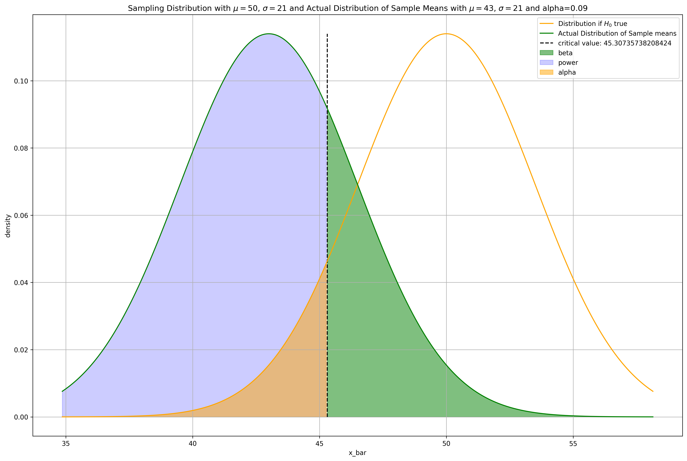

# Probability and Statistics Review

We'll review some fundamental statistical and probability theory you need to know to understand the how most machine learning algorithms, especially those in [Natural Language Processing](https://jeffchenchengyi.github.io/machine-learning/06-natural-language-processing/basics/README.html) and [Bayesian Methods](https://jeffchenchengyi.github.io/machine-learning/11-bayesian-methods/README.html) work.

### Table of Contents
1. [Basic Probability Theory](#bp)
- [Probability Distributions](#distributions)
- [Basic Statistics](#bs)
- [Hypothesis Testing](#hyptest)
- [$Z$-test](#z-test)
- [Student's $T$-test](#t-test)
- [Anova](#anova)
- [Chi-squared Test](#cs-test)
- [A/B Testing](#abtest)

## Preliminaries

### Expectation and Moments of Random Variable

Discrete:
- 1st Moment - $\mathbb{E}[X] = \sum^N_{i = 1}xf_xdx = \mu$
    - 1st Central Moment / Mean = 0
- [2nd Moment](https://www.youtube.com/watch?v=cwa2xONQFOc) - $\mathbb{E}[X^2] = \sum^N_{i = 1}x^2f_xdx$
    - 2nd Central Moment / Variance - $Var(X) = \mathbb{E}[(X - \mathbb{E}[X])^2] = \sum^N_{i = 1}(x - \mu)^2f_xdx \underset{\text{expand}}{=} \mathbb{E}[X^2] - \mathbb{E}[X]^2 = \sigma^2$
- 3rd Moment - $\mathbb{E}[X^2] = \sum^N_{i = 1}x^2f_xdx$

Continuous:
- 1st Moment - $\mathbb{E}[X] = \int^\infty_{-\infty}xf_xdx$
- 2nd Moment - $\mathbb{E}[X^2] = \int^\infty_{-\infty}x^2f_xdx$

$f_x$ is the output of the probability mass / distribution function @ $x$ 

### Kurtosis

### Skewness

### Expectation and Variance Properties

### Covariance and Correlation

### Population Vs. Sample Parameters

Population:
$$
\mathbb{E}[X] = \mu,\,Var(X) = \sigma^2
$$

Sample:
$$
\bar{x} = \frac{1}{N}\sum^N_{i=1}x_i,\,s^2 = \frac{1}{N-1}\sum^N_{i=1}{(x_i - \bar{x})}^2
$$


<div markdown="1" class="cell code_cell">
<div class="input_area" markdown="1">
```python
# Visualization / ML Libraries
import numpy as np
import pandas as pd
import matplotlib
import matplotlib.pyplot as plt
import matplotlib.cm as cm
import matplotlib.font_manager as fm
import matplotlib.patches as mpatches
from mpl_toolkits.axes_grid1.anchored_artists import AnchoredSizeBar
import seaborn as sns
from scipy.stats import norm, f

# plotting defaults
plt.rcParams['figure.dpi'] = 300
plt.rcParams['figure.figsize'] = (18, 12)
get_colors = lambda length: plt.get_cmap('Spectral')(np.linspace(0, 1.0, length))

```
</div>

</div>


<div markdown="1" class="cell code_cell">
<div class="input_area" markdown="1">
```python
plt.rcParams['figure.dpi'] = 300
plt.rcParams['figure.figsize'] = (18, 12)

```
</div>

</div>


---
# Probability Distributions<a id='distributions'></a>


## 1. Discrete


### Categorical

- Special case of **Multinomial** where $n=1$
- Distribution of possible results of a random variable that can take on one of $K$ possible categories, with the probability of each category separately specified
    - e.g. If we roll a dice, what's the probability that 3 comes up?


### Bernoulli

- Special case of **Binomial** where $n=1$
- Special case of **Categorical** where $k=2$
- Distribution of the number of success in a single $n=1$ Bernoulli trial ($k=2$, success / failure)
    - e.g. If a coin is tossed once, what is the probability it comes up heads?


### Binomial

- Special case of **Multinomial** where $k=2$
- Distribution of the number of success in $n$ **i.i.d.** Bernoulli trials ($k=2$, success / failure) **with** replacement
    - e.g. If a coin is tossed 20 times, what is the probability heads comes up exactly 14 times?


### Multinomial

- Distribution of the outcome of $n$ **i.i.d.** trials, where the outcome of each trial has a categorical distribution ($k>2$, multiple classes) **with** replacement
    - e.g. If we draw 5 colored balls from a bag, what is the probability that we get 2 blue balls, 2 red balls, and 1 green ball?


### Negative Binomial

- Distribution of the number of **i.i.d.** Bernoulli trials needed to get $k$ successes
    - e.g. If a coin is repeatedly tossed, what is the probability the 3rd time heads appears occurs on the 9th toss?


### Geometric

- Special case of **Negative Binomial** where $k=1$
- Distribution of the number of **i.i.d.** Bernoulli trials needed to get the first success
    - e.g. If a coin is repeatedly tossed, what is the probability that the **first** time heads appears occurs on the 8th toss?


### Hypergeometric

- Binomial closely approximates Hypergeometric if we are sampling only a small fraction of the population
- Distribution of the number of success in $n$ **i.i.d.** Bernoulli trials ($k=2$, success / failure) **without** replacement
    - e.g. If 5 cards are drawn without replacement, what is the probability 3 hearts are drawn?


### Poisson

- Distribution of the number of **i.i.d.** events in a given time / length / area / volume
    - e.g. What is the probability there will be 4 car accidents on a university campus in a given week?


## 2. Continuous


### Exponential

- Special case of **Gamma** where $n=1$, Continuous counterpart of **Geometric**
- Distribution of the time between events in a Poisson point process, i.e., a process in which events occur continuously and independently at a constant average rate.
    - e.g. How much time will pass until the next plane lands on a landing strip?


### Gamma

- Gamma : Exponential :: Binomial : Bernoulli
- Distribution of 
    - e.g. How much time will pass until $n$ planes land on any given landing strip


### Wishart / Multivariate Gamma

- Multivariate Generalization of **Gamma**
- Gamma : Wishart :: Beta : Dirichlet
- Distribution of 
    - e.g. 


### Beta

- Special case of **Dirichlet**
- Distribution over real values on the interval [0, 1]
    - e.g. What is probability of 27% of people getting infected by the disease?


### Dirichlet / Multivariate Beta

$$
f \left(x_1,\ldots, x_{K}; \alpha_1,\ldots, \alpha_K \right) = \frac{1}{\mathrm{B}(\boldsymbol\alpha)} \prod_{i=1}^K x_i^{\alpha_i - 1}
$$

where $ \{ x_k \}_{ k=1 }^{ k=K }$ belong to the standard $K-1$ simplex, or in other words: $\sum_{i=1}^{K} x_i=1 \text{ and } x_i \geq 0 \text{ for all } i \in [1,K]$

The normalizing constant is the multivariate beta function, which can be expressed in terms of the gamma function:

$$
\mathrm{B}(\boldsymbol\alpha) = \frac{\prod_{i=1}^K \Gamma(\alpha_i)}{\Gamma\left(\sum_{i=1}^K \alpha_i\right)},\qquad\boldsymbol{\alpha}=(\alpha_1,\ldots,\alpha_K)
$$

- Multivariate Generalization of **Beta**
- Beta : Dirichlet :: Binomial : Multinomial :: Gamma : Wishart
- Conjugate Prior of Multinomial and Categorical
- When $\alpha=1$, Dirichlet is essentially a uniform distribution as it gives each $x_i$ equally probability of $\frac{1}{\text{normalizing constant}\,{\mathrm{B}(\boldsymbol\alpha)} }$, this is called a flat Dirichlet distribution
- Distribution over vectors whose values are all in the interval [0, 1] and sum of values in the vector = 1, AKA a probability simplex
    - e.g. 


### Symmetric Dirichlet

- Special case of **Dirichlet** where vector $\mathbf{\alpha}$ has all the same values


## Conjugate Priors

- If the posterior distributions $p(\theta \mid X)$ are in the same probability distribution family as the prior probability distribution $p(\theta)$, the prior and posterior are then called conjugate distributions, and the prior is called a conjugate prior for the likelihood function $p(X \mid \theta)$.

Probability distribution families:
1. Exponential Family
    - normal
    - exponential
    - gamma
    - chi-squared
    - beta
    - Dirichlet
    - Bernoulli
    - categorical
    - Poisson
    - Wishart
    - inverse Wishart
    - geometric
    - binomial (with fixed number of trials)
    - multinomial (with fixed number of trials)
    - negative binomial (with fixed number of failures)


---
# Hypothesis Testing

There are 2 probability distributions that we deal with when talking about Hypothesis testing:
1. Sampling Distribution when $H_0$ is indeed **True** (Normal $\because$ Central Limit Theorem)
    - In a basic statistics class, we care about this distribution and draw the $\alpha$ level and p-value here
    - Define a significance level = P(Type I error) = P(False Positive) 
    
    
2. Sampling Distribution when $H_0$ is indeed **False** (Normal $\because$ Central Limit Theorem)


| Truth Table | $$P(H_0 = \text{True})$$ | $$P(H_0 = \text{False})$$ |
| ------------- | ------------- | ------------- |
| Accept $H_0$, Reject $H_\alpha$ | $$\begin{aligned}P(\text{Accept}\,H_0 \mid H_0=\text{True}) &= P(\text{True Accept}) \\ &= 1 - \alpha \end{aligned}$$ | $$\begin{aligned}P(\text{Accept}\,H_0 \mid H_0=\text{False}) &= P(\text{Type II error}) \\ &= \beta \end{aligned}$$ |
| Reject $H_0$, Accept $H_\alpha$ | $$\begin{aligned}P(\text{Reject}\,H_0 \mid H_0=\text{True}) &= P(\text{Type I error}) \\ &= \alpha \end{aligned}$$ | $$\begin{aligned}P(\text{Reject}\,H_0 \mid H_0=\text{False}) &= \text{Power} \\ &= 1 - \beta \end{aligned}$$ |
| Sum | $$(1 - \alpha) + (\alpha) = 1$$ | $$(\beta) + (1 - \beta) = 1$$ |


Relationship between $\alpha$ and $\beta$:
- If we choose a very small value of $\alpha$, we will make it very difficult to reject $H_0$, making Type II errors, hence $\beta$ higher
- Normally we care more about Type I errors, so we'll set the $\alpha$ value at the start of the hypothesis test


## Calculating Power and Probability of Type II error, $\beta$ (One-Tailed Example)

Suppose we are about to randomly sample 36 values from a normally distributed population, where $\sigma=21$, but $\mu$ is unknown. We are going to test:

$$
\begin{aligned}
H_0 &: \mu = 50 \\
H_{\alpha} &: \mu < 50
\end{aligned}
$$ at $\alpha=0.09$

1. For what values of $Z = \frac{\bar{X}-\mu_0}{\frac{\sigma}{\sqrt{n} } }$ will we reject $H_0$?


<div markdown="1" class="cell code_cell">
<div class="input_area" markdown="1">
```python
def plot_dists_given_H0_true(mean, std, n, alpha):
    """
    Function:
    ---------
    Plots the actual and standardized sampling distribution and the rejection
    region given alpha, the significance level (Allowance for Type I error)
    
    Parameters:
    -----------
    mean: The sampling mean 
    std: The standard deviation
    n: Number of samples
    alpha: significance level (Allowance for Type I error)
    
    Returns:
    --------
    None. Plots the sampling distribution both standardized and actual
    """
    fig, ax = plt.subplots(2, 1)
    
    # Standard error of the mean / STD of sampling distribution
    sem = std / np.sqrt(n)
    sampling_dist = norm(loc=0, scale=1)
    p_crit = sampling_dist.ppf(alpha)

    # Plot the standardized sampling distribution
    sample_mean_z_scores = np.linspace(start=sampling_dist.ppf(0.01), 
                                       stop=sampling_dist.ppf(0.99), num=500)
    y = sampling_dist.pdf(sample_mean_z_scores)
    ax[0].plot(sample_mean_z_scores, y, c='blue')
    ax[0].vlines(p_crit, 0, np.max(y),
                 linestyles = '--', label='critical value: {}'.format(np.round(p_crit, 2)))
    ax[0].fill_between(sample_mean_z_scores, y, where=(sample_mean_z_scores <= p_crit), alpha=.5, color='blue')
    ax[0].set_xlabel('z-scores')
    ax[0].set_ylabel('density')
    ax[0].set_title('Standardized Sampling Distribution with $\mu=${}, $\sigma=${}'.format(0, 1))
    ax[0].grid()
    ax[0].legend()
    ax[0].text(0.10, 1.75, 'Reject $H_0$', transform=ax[1].transAxes, fontsize=20,
               verticalalignment='center')
    ax[0].text(0.35, 1.75, 'Fail to Reject $H_0$', transform=ax[1].transAxes, fontsize=20,
               verticalalignment='center')
    ax[0].text(0.15, 1.35, str(alpha), transform=ax[1].transAxes, fontsize=20,
               verticalalignment='center')
    
    # Plot the sampling distribution if Null Hypothesis was true
    actual_dist = norm(loc=50, scale=sem)
    x_bar = np.linspace(start=actual_dist.ppf(0.01), 
                        stop=actual_dist.ppf(0.99), num=500)
    y = actual_dist.pdf(x_bar)
    ax[1].plot(x_bar, y, c='orange')
    ax[1].vlines((p_crit*sem)+mean, 0, np.max(y),
                 linestyles = '--', label='critical value: {}'.format(np.round((p_crit*sem)+mean, 2)))
    ax[1].fill_between(x_bar, y, where=(x_bar <= (p_crit*sem)+mean), alpha=.5, color='orange')
    ax[1].set_xlabel('x_bar')
    ax[1].set_ylabel('density')
    ax[1].set_title('Actual Sampling Distribution if $H_0$ is True with $\mu=${}, $\sigma=${}'.format(mean, sem))
    ax[1].grid()
    ax[1].legend()
    ax[1].text(0.10, 0.55, 'Reject $H_0$', transform=ax[1].transAxes, fontsize=20,
               verticalalignment='center')
    ax[1].text(0.35, 0.55, 'Fail to Reject $H_0$', transform=ax[1].transAxes, fontsize=20,
               verticalalignment='center')
    ax[1].text(0.15, 0.15, str(alpha), transform=ax[1].transAxes, fontsize=20,
               verticalalignment='center')
    
    plt.show();
    
plot_dists_given_H0_true(mean=50, std=21, n=36, alpha=0.09)

```
</div>

<div class="output_wrapper" markdown="1">
<div class="output_subarea" markdown="1">

{:.output_png}


</div>
</div>
</div>


We will reject $H_0$ for $Z < -1.34$ or $\bar{X} < 45.31.$


2. If $\mu=43$, what is $P(\text{Type II error})$?

$$
\begin{aligned}
H_0 &: \mu = 50 \\
H_{\alpha} &: \mu < 50
\end{aligned}
$$

$P(\text{Type II error}) = P(\text{Fail to Reject}\,H_0 \mid \mu=43) = P(\bar{X} > 45.31 \mid \mu=43) = \beta$


<div markdown="1" class="cell code_cell">
<div class="input_area" markdown="1">
```python
def plot_H0_true_dist_and_actual_dist(ax, H0_mean, actual_mean, std, n, alpha):
    
    # Get H0 true distribution, and the actual distribution
    sem = std / np.sqrt(n)
    critical_val = (norm(loc=0, scale=1).ppf(alpha) * sem) + H0_mean
    H0_true_dist = norm(loc=H0_mean, scale=sem)
    actual_dist = norm(loc=actual_mean, scale=sem)

    # Plot the H0 true distribution
    x_bar_H0_true = np.linspace(start=actual_dist.ppf(0.01),
                                stop=H0_true_dist.ppf(0.99), num=500)
    y_H0_true = H0_true_dist.pdf(x_bar_H0_true)
    ax.plot(x_bar_H0_true, y_H0_true, c='orange', label='Distribution if $H_0$ true')
    
    # Plot the actual distribution
    x_bar_actual = np.linspace(start=actual_dist.ppf(0.01),
                               stop=H0_true_dist.ppf(0.99), num=500)
    y_actual = actual_dist.pdf(x_bar_actual)
    ax.plot(x_bar_actual, y_actual, c='green', label='Actual Distribution of Sample means')
    
    # PLot critical value
    ax.vlines(critical_val, 0, np.max(y_actual),
              linestyles = '--', label='critical value: {}'.format(critical_val))
    ax.fill_between(x_bar_actual, y_actual, where=(x_bar_actual > critical_val), alpha=.5, color='green', label='beta')
    ax.fill_between(x_bar_actual, y_actual, where=(x_bar_actual < critical_val), alpha=.2, color='blue', label='power')
    ax.fill_between(x_bar_H0_true, y_H0_true, where=(x_bar_H0_true < critical_val), alpha=.5, color='orange', label='alpha')
    ax.set_xlabel('x_bar')
    ax.set_ylabel('density')
    ax.set_title('Sampling Distribution with $\mu=${}, $\sigma=${} and Actual Distribution of Sample Means with $\mu=${}, $\sigma=${} and alpha={}'.format(H0_mean, std, actual_mean, std, alpha))
    ax.grid()
    ax.legend()
    return ax
    
fig, ax = plt.subplots(1, 1)
plot_H0_true_dist_and_actual_dist(ax=ax, H0_mean=50, actual_mean=43, std=21, n=36, alpha=0.09);

```
</div>

<div class="output_wrapper" markdown="1">
<div class="output_subarea" markdown="1">

{:.output_png}


</div>
</div>
</div>


$P(\bar{X} > 45.31 \mid \mu=43)=$ The Shaded region $\underset{\text{Standardize} }{\rightarrow} P(Z > \frac{45.31 - 43}{\frac{21}{\sqrt{36} } }) = P(Z > 0.66) = 0.255 = \beta$ . 

$$
\therefore \beta = 0.255 \\
\text{Power of Test (Ability to detect a False }H_0)=P(\text{Reject }H_0\mid \mu=43)=1-\beta=0.745
$$


## Effect of changes in $\alpha, n, \mu, \sigma$ on Power $1-\beta$

Power increases as:
- $\alpha$ increases
- $n$ increases
- $\sigma$ decreases
- The true value of $\mu$ gets further from $\mu_0$ (in the direction of the alternate hypothesis)


### As $\alpha$ increases,


<div markdown="1" class="cell code_cell">
<div class="input_area" markdown="1">
```python
fig, ax = plt.subplots(6, 1)
for idx in range(1, 7):
    ax[idx-1] = plot_H0_true_dist_and_actual_dist(
        ax=ax[idx-1], 
        H0_mean=50, 
        actual_mean=43, 
        std=21, 
        n=36, 
        alpha=(idx*0.01))
    
plt.tight_layout()
plt.show();

```
</div>

<div class="output_wrapper" markdown="1">
<div class="output_subarea" markdown="1">

{:.output_png}


</div>
</div>
</div>


### As $n$ increases, both distributions become sharper $\because S.E.M. = \frac{\sigma}{\sqrt{n} }$


<div markdown="1" class="cell code_cell">
<div class="input_area" markdown="1">
```python
fig, ax = plt.subplots(6, 1)
for idx in range(1, 7):
    ax[idx-1] = plot_H0_true_dist_and_actual_dist(
        ax=ax[idx-1], 
        H0_mean=50, 
        actual_mean=43, 
        std=21, 
        n=idx*20, 
        alpha=0.05)
    
plt.tight_layout()
plt.show();

```
</div>

<div class="output_wrapper" markdown="1">
<div class="output_subarea" markdown="1">

{:.output_png}


</div>
</div>
</div>


### As $\sigma$ decreases, both distributions become sharper $\because S.E.M. = \frac{\sigma}{\sqrt{n} }$


<div markdown="1" class="cell code_cell">
<div class="input_area" markdown="1">
```python
fig, ax = plt.subplots(6, 1)
for idx in range(1, 7):
    ax[idx-1] = plot_H0_true_dist_and_actual_dist(ax=ax[idx-1], H0_mean=50, actual_mean=43, 
                                                std=100/idx, n=36, alpha=0.05)
    
plt.tight_layout()
plt.show();

```
</div>

<div class="output_wrapper" markdown="1">
<div class="output_subarea" markdown="1">

{:.output_png}


</div>
</div>
</div>


---
# Analysis of Variance (ANOVA)

## One-Way Anova

E.g. Imagine we have $k = 3$ different populations and a random sample of 3 individuals are drawn from each population (Total sample size $N = 9$) and we will get their test scores. The test scores are below:

1. Population: Only eats red meat
    - Albert scored 1
    - Beatrice scored 2
    - Alice scored 5
2. Population: Only eats white meat
    - Tim scored 2
    - James scored 4
    - Tom scored 2
3. Population: Eats both red and white meat
    - Jeff scored 2
    - Samantha scored 3
    - Hilbert scored 4


<div markdown="1" class="cell code_cell">
<div class="input_area" markdown="1">
```python
# Create design matrix for Anova
X = np.array(
    [
        [1, 0, 0],
        [2, 0, 0],
        [5, 0, 0],
        [0, 2, 0],
        [0, 4, 0],
        [0, 2, 0],
        [0, 0, 2],
        [0, 0, 3],
        [0, 0, 4]
    ]
)
X

```
</div>

<div class="output_wrapper" markdown="1">
<div class="output_subarea" markdown="1">


{:.output_data_text}
```
array([[1, 0, 0],
       [2, 0, 0],
       [5, 0, 0],
       [0, 2, 0],
       [0, 4, 0],
       [0, 2, 0],
       [0, 0, 2],
       [0, 0, 3],
       [0, 0, 4]])
```


</div>
</div>
</div>


Step 1: Declare Null / Alternate Hypothesis and Alpha level A priori

$$
\begin{aligned}
&H_0: \mu_1 = \mu_2 = \mu_3 \\
&H_a: \text{At least 1 Difference among the means},\,\alpha=0.05
\end{aligned}
$$


Step 2: Find degrees of freedom and $F$-critical value

$$
\begin{aligned}
Numerator: df_{between} &= k - 1 = 3 - 1 = 2 \\
Denominator: df_{within} &= N - k = 9 - 3 = 6 \\
df_{total} &= df_{between} + df_{within} = 2 + 6 = 8
\end{aligned}
$$


<div markdown="1" class="cell code_cell">
<div class="input_area" markdown="1">
```python
# Declare alpha level
a = 0.05
df_between, df_within = 2, 6

# Get critical value using significance level and degrees of freedom
F_crit = f.ppf(1-a, dfn=2, dfd=6) 
F_crit

```
</div>

<div class="output_wrapper" markdown="1">
<div class="output_subarea" markdown="1">


{:.output_data_text}
```
5.143252849784718
```


</div>
</div>
</div>


Step 3a: Calculate mean of each group $\bar{x_1},\,\bar{x_2},\,\bar{x_3}$


<div markdown="1" class="cell code_cell">
<div class="input_area" markdown="1">
```python
x1_bar = round(np.true_divide(X[:, 0].sum(axis=0), (X[:, 0] != 0).sum(axis=0)), 2)
x2_bar = round(np.true_divide(X[:, 1].sum(axis=0), (X[:, 1] != 0).sum(axis=0)), 2)
x3_bar = round(np.true_divide(X[:, 2].sum(axis=0), (X[:, 2] != 0).sum(axis=0)), 2)
print(x1_bar, x2_bar, x3_bar)

```
</div>

<div class="output_wrapper" markdown="1">
<div class="output_subarea" markdown="1">
{:.output_stream}
```
2.67 2.67 3.0
```
</div>
</div>
</div>


$$
\begin{aligned}
\bar{x_1} &= 2.67 \\
\bar{x_2} &= 2.67 \\
\bar{x_3} &= 3.00 \\
\end{aligned}
$$


Step 3b: Calculate Grand mean $\bar{x_G}$


<div markdown="1" class="cell code_cell">
<div class="input_area" markdown="1">
```python
x_grand = np.mean([x1_bar, x2_bar, x3_bar])
x_grand

```
</div>

<div class="output_wrapper" markdown="1">
<div class="output_subarea" markdown="1">


{:.output_data_text}
```
2.78
```


</div>
</div>
</div>


$$
\bar{x_G} = 2.78
$$


Step 4a: Calculate Sum of Squares Total $SS_{total} = \sum^k_{j=1} \sum^{N_j}_{i=1} {((x_j)_i - \bar{x_G})}^2$


<div markdown="1" class="cell code_cell">
<div class="input_area" markdown="1">
```python
ss_total = np.sum((X[np.nonzero(X)] - x_grand) ** 2)
ss_total

```
</div>

<div class="output_wrapper" markdown="1">
<div class="output_subarea" markdown="1">


{:.output_data_text}
```
13.5556
```


</div>
</div>
</div>


$$
SS_{total} = 13.56
$$


Step 4b: Calculate Sum of Squares Within $SS_{within} = \sum^k_{j=1} \sum^{N_j}_{i=1} {((x_j)_i - \bar{x_j})}^2$


<div markdown="1" class="cell code_cell">
<div class="input_area" markdown="1">
```python
ss_within = \
    np.sum((X[:, 0][np.nonzero(X[:, 0])] - x1_bar) ** 2) \
    + np.sum((X[:, 1][np.nonzero(X[:, 1])] - x2_bar) ** 2) \
    + np.sum((X[:, 2][np.nonzero(X[:, 2])] - x3_bar) ** 2)
ss_within

```
</div>

<div class="output_wrapper" markdown="1">
<div class="output_subarea" markdown="1">


{:.output_data_text}
```
13.333400000000001
```


</div>
</div>
</div>


$$
SS_{within} = 13.33
$$


Step 4c: Calculate $SS_{between} = SS_{total} - SS_{within}$


<div markdown="1" class="cell code_cell">
<div class="input_area" markdown="1">
```python
ss_between = round(ss_total - ss_within, 2)
ss_between

```
</div>

<div class="output_wrapper" markdown="1">
<div class="output_subarea" markdown="1">


{:.output_data_text}
```
0.22
```


</div>
</div>
</div>


Step 5a: Calculate Variance between groups $MS_{between} = \frac{SS_{between}}{df_{between}}$


<div markdown="1" class="cell code_cell">
<div class="input_area" markdown="1">
```python
ms_between = ss_between / df_between
ms_between

```
</div>

<div class="output_wrapper" markdown="1">
<div class="output_subarea" markdown="1">


{:.output_data_text}
```
0.11
```


</div>
</div>
</div>


$$
MS_{between} = 0.11
$$


Step 5b: Calculate Variance within groups $MS_{within} = \frac{SS_{within}}{df_{within}}$


<div markdown="1" class="cell code_cell">
<div class="input_area" markdown="1">
```python
ms_within = ss_within / df_within
ms_within

```
</div>

<div class="output_wrapper" markdown="1">
<div class="output_subarea" markdown="1">


{:.output_data_text}
```
2.2222333333333335
```


</div>
</div>
</div>


$$
MS_{within} = 2.22
$$


Step 6 (Final): Calculate $F$-statistic $F = \frac{MS_{between}}{MS_{within}}$


<div markdown="1" class="cell code_cell">
<div class="input_area" markdown="1">
```python
F_stat = ms_between / ms_within
F_stat

```
</div>

<div class="output_wrapper" markdown="1">
<div class="output_subarea" markdown="1">


{:.output_data_text}
```
0.04949975250123749
```


</div>
</div>
</div>


Hence, since our $F$-statistic $= 0.05 < $ $F$-critical $=5.14$, we **fail to reject $H_0$**, and maintain that $\mu_1 = \mu_2 = \mu_3$ (No significant difference between the 3 groups).


---
# A/B Testing


## Parametric Vs Non-Parametric Tests


---
# Metrics

## False Positive Rate:
- Ratio of false positives to total negatives, $\frac{\text{FP} }{\text{N} }=\frac{\text{FP} }{\text{FP + TN} }$

## False Negative Rate:
- Ratio of false negatives to total positives, $\frac{\text{FN} }{\text{P} }=\frac{\text{FN} }{\text{FN + TP} }$

## Precision:
- Ratio of true positives to total positives and false positives, $\frac{\text{TP} }{\text{TP + FP} }$

## Recall:
- Ratio of true positives to total positives and false negatives, $\frac{\text{TP} }{\text{TP + FN} }$

## Accuracy:
- Ratio of correct classifications to total classifications, $\frac{\text{TP + TN} }{\text{TP + FP + TN + FN} }$

## F-beta:
- Weighted Harmonic Mean of precision and recall, $(1 + \beta^2) \times \frac{\text{precision } \times \text{ recall} }{\beta^2 \times \text{precision } + \text{ recall} }$

## ROC-AUC:


---
## Resources:

Statistics:
- [JBStatistics Hypothesis testing videos](https://www.youtube.com/watch?v=7mE-K_w1v90)
- [One-way Anova by hand](https://www.youtube.com/watch?v=q48uKU_KWas)

Probability:
- [Overview of Some Discrete Probability Distributions(Binomial,Geometric,Hypergeometric,Poisson,NegB)](https://www.youtube.com/watch?v=UrOXRvG9oYE)
- [Conjugate Prior Wiki](https://en.wikipedia.org/wiki/Conjugate_prior)
- [Exponential family wiki](https://en.wikipedia.org/wiki/Exponential_family)
- [What is the gamma distribution used for?](https://www.quora.com/What-is-gamma-distribution-used-for)
- [Beta & Dirichlet distribution video](https://www.youtube.com/watch?v=CEVELIz4WXM)

