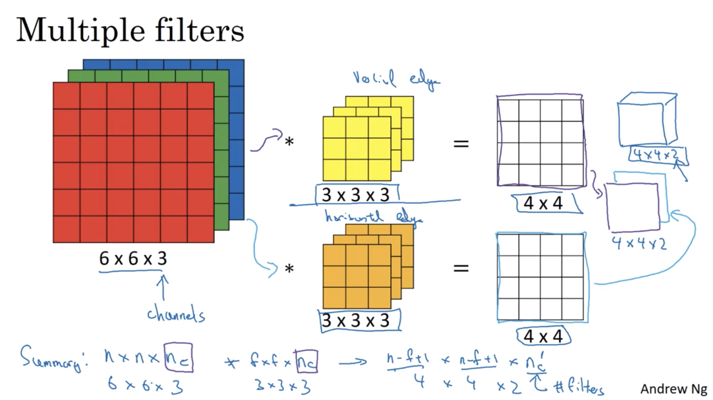
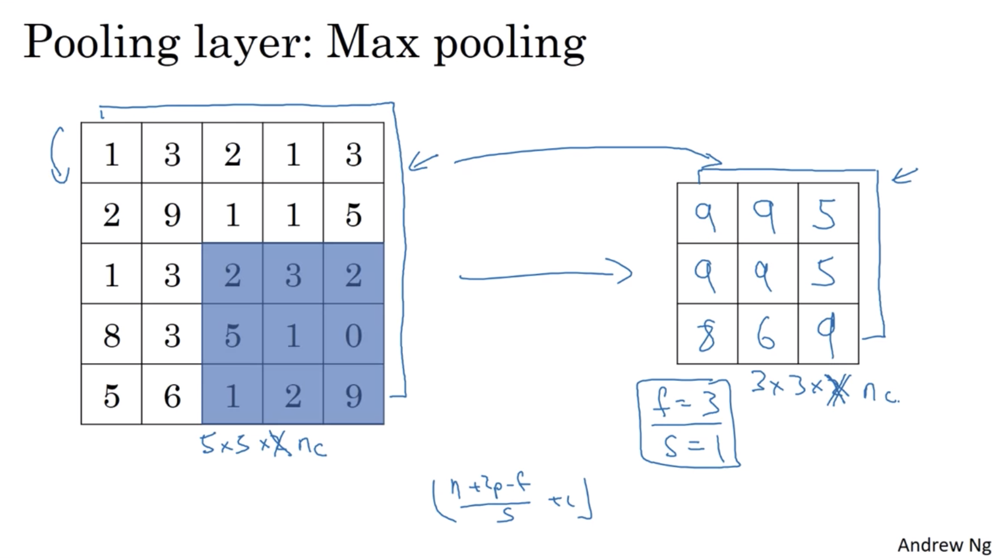
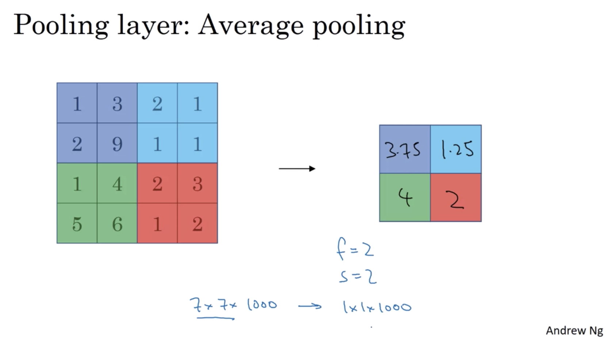

# Convolutional Neural Networks

In CNNs, we try to learn the kernel / filter parameters which will give us the best kernels / filters that detect edges / curves in an image in the earlier parts of the network, and then more complex objects that combine these edges / curves detected like faces... There are a number of architectures that we will go through, for object detection, image segmentation,...

## Convolution
$$
\underbrace{
\begin{bmatrix}
    0 & 0 & 0 & 0 & \dots & 0 & 0 \\
    0 & x_{11} & x_{12} & x_{13} & \dots & x_{1n} & 0 \\
    0 & x_{21} & x_{22} & x_{23} & \dots & x_{2n} & 0 \\
    0 & x_{31} & x_{32} & x_{33} & \dots & x_{3n} & 0 \\
    0 & \vdots & \vdots & \vdots & \ddots & \vdots & 0 \\
    0 & x_{n1} & x_{n2} & x_{n3} & \dots & x_{nn} & 0 \\
    0 & 0 & 0 & 0 & \dots & 0 & 0
\end{bmatrix}
}_{\,{n}_{H}^{[l-1]} \times {n}_{W}^{[l-1]}\,\times {n}_{c}^{[l-1]}=\text{# of Channels (RGB Image: }{n}_{c}^{[l-1]} = 3\,\text{) Image with }\,{p}^{[l]}\,{ Padding} }
\,\circledast\,
\underbrace{
{
\begin{bmatrix}
    w_{11} & \dots & w_{1f} \\
    w_{21} & \dots & w_{2f} \\
    \vdots & \ddots & \vdots \\
    w_{f1} & \dots & w_{ff}
\end{bmatrix}
}
}_{ {f}^{[l]} \times {f}^{[l]}\,\times {n}_{c}^{[l-1]}=\text{# of Channels (RGB Image: }{n}_{c}^{[l-1]} = 3\,\text{) Filter / Kernel} }
=
\underbrace{
{
\begin{bmatrix}
    x'_{11} & x'_{12} & x'_{13} & \dots  & x'_{1 \lfloor\frac{({n}^{[l-1]} + 2{p}^{[l]} - {f}^{[l]})}{ {s}^{[l]} } + 1\rfloor} \\
    x'_{21} & x'_{22} & x'_{23} & \dots  & x'_{2 \lfloor\frac{({n}^{[l-1]} + 2{p}^{[l]} - {f}^{[l]})}{ {s}^{[l]} } + 1\rfloor} \\
    \vdots & \vdots & \vdots & \ddots & \vdots \\
    x'_{\lfloor\frac{({n}^{[l-1]} + 2{p}^{[l]} - {f}^{[l]})}{ {s}^{[l]} } + 1\rfloor 1} & x'_{\lfloor\frac{({n}^{[l-1]} + 2{p}^{[l]} - {f}^{[l]})}{ {s}^{[l]} } + 1\rfloor 2} & x'_{\lfloor\frac{({n}^{[l-1]} + 2{p}^{[l]} - {f}^{[l]})}{ {s}^{[l]} } + 1\rfloor 3} & \dots  & x'_{\lfloor\frac{({n}^{[l-1]} + 2{p}^{[l]} - {f}^{[l]})}{ {s}^{[l]} } + 1\rfloor \lfloor\frac{({n}^{[l-1]} + 2{p}^{[l]} - {f}^{[l]})}{ {s}^{[l]} } + 1\rfloor}
\end{bmatrix}
}
}_{\lfloor\frac{({n}^{[l-1]} + 2{p}^{[l]} - {f}^{[l]})}{ {s}^{[l]} } + 1\rfloor \times \lfloor\frac{({n}^{[l-1]} + 2{p}^{[l]} - {f}^{[l]})}{ {s}^{[l]} } + 1\rfloor\,\times { {n}_{c}^{[l]} = \text{# of Filters / Kernels} }\,\text{ Output Image} }
$$

### Shapes Summary
$$
\begin{aligned}
{f}^{[l]}\,&=\,\text{filter size} \\
{p}^{[l]}\,&=\,\text{padding} \\
{s}^{[l]}\,&=\,\text{stride} \\
{n}^{[l]}_{c}\,&=\,\text{Number of filters / Number of Channels when}\,{l = 1} \\
\text{Size of Output}\,&=\lfloor\frac{({n}^{[l-1]}_{H} + 2{p}^{[l]} - {f}^{[l]})}{ {s}^{[l]} } + 1\rfloor\times\lfloor\frac{({n}^{[l-1]}_{W} + 2{p}^{[l]} - {f}^{[l]})}{ {s}^{[l]} } + 1\rfloor\times{n}^{[l]}_{c}\\
\text{Each filter is}&:{f}^{[l]}\times{f}^{[l]}\times{n}^{[l-1]}_{c} \\
\text{Activations}&:{A}^{[l]} = m\times{n}^{[l]}_{H}\times{n}^{[l]}_{W}\times{n}^{[l]}_{c} \\
\text{Weights}&:{W}^{[l]} = {f}^{[l]}\times{f}^{[l]}\times{n}^{[l-1]}_{c}\times{n}^{[l]}_{c} \\
\text{Bias}&:{b}^{[l]} = 1\times1\times1\times{n}^{[l]}_{c} \\
\end{aligned}
$$

- Valid Convolution: $p=0$
- Same Convolution: Pad so that output size is same as input size, $p=\frac{f-1}{2}$, $f$ is usually odd

### Advantages over Fully Connected Layers
1. Parameter Sharing
    - A feature detector (such as a vertical edge detector) that's useful in one part of the image is probably useful in another part of the image because there are multiple vertical edges in an image
2. Sparsity of Connections
    - In each layer, each output value depends only on a small number of inputs - when you perform a convolution, a single parameter in the filter that you'll want to tune / learn is only dependent on the ${f}^{[l]}\times{f}^{[l]}$ size inputs of the image of the previous layer
3. Translation Invariant 
    - An object in the image shifted should be detected as the same object

## Pooling
Hyperparameters:
- $f$: Filter size
- $s$: Stride
- Max or Average Pooling

### Shapes Summary
$$
\text{Output Size}\,=\,\lfloor\frac{ {n}_{H} - f}{s}+1\rfloor\times\lfloor\frac{ {n}_{W} - f}{s}+1\rfloor\times{n}_{c}
$$

---
# Siamese Network

---
# You Only Look Once (YOLO)

---
## Resources
- [deeplearning.ai](https://www.coursera.org/learn/convolutional-neural-networks/home/welcome)

