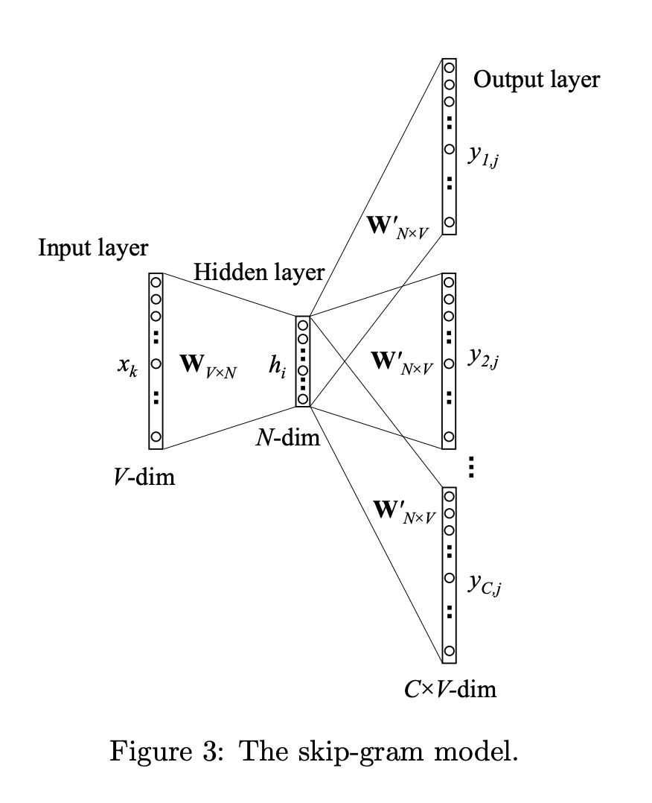

# Skip N-gram

In this notebook, we'll go over the Skipgram implementation of Word2Vec through a code walkthrough adapted from the Keras implemention of Skipgram by Dipanjan Sarkar in his [kdnuggest blogpost](https://www.kdnuggets.com/2018/04/implementing-deep-learning-methods-feature-engineering-text-data-skip-gram.html). The code is sectioned into 3 main parts, namely:

1. Pre-processing Text Corpus
2. Modeling
3. Training


---
# Pre-processing Text Corpus


### 1. Get the Raw Dataset


<div markdown="1" class="cell code_cell">
<div class="input_area" markdown="1">
```python
# from nltk.corpus import gutenberg
# from string import punctuation

# bible = gutenberg.sents('bible-kjv.txt') 
# remove_terms = punctuation + '0123456789'

# norm_bible = [[word.lower() for word in sent if word not in remove_terms] for sent in bible]
# norm_bible = [' '.join(tok_sent) for tok_sent in norm_bible]
# norm_bible = filter(None, normalize_corpus(norm_bible))
# norm_bible = [tok_sent for tok_sent in norm_bible if len(tok_sent.split()) > 2]

# print('Total lines:', len(bible))
# print('\nSample line:', bible[10])
# print('\nProcessed line:', norm_bible[10])

```
</div>

</div>


### 2. Convert words to indices

1. Create a dictionary `word2id` of __key__: index, __value__: the unique word token from the text corpus
2. Create a dictionary `id2word` of __key__: the unique word token from the text corpus, __value__: index
3. Convert entire text corpus from words to indices and store in `wids`


<div markdown="1" class="cell code_cell">
<div class="input_area" markdown="1">
```python
from keras.preprocessing import text
from keras.utils import np_utils
from keras.preprocessing import sequence

tokenizer = text.Tokenizer() # Initialize the Tokenizer instance
tokenizer.fit_on_texts(norm_bible) 

# Step 1
word2id = tokenizer.word_index

# Step 2
id2word = {v:k for k, v in word2id.items()}

# Step 3
wids = [[word2id[w] for w in text.text_to_word_sequence(doc)] for doc in norm_bible]

vocab_size = len(word2id) + 1
embed_size = 100 # size of each vector representation of each unique word in text corpus
window_size = 10 # context window size

print('Vocabulary Size:', vocab_size)
print('Vocabulary Sample:', list(word2id.items())[:10])

```
</div>

</div>


### 3. Create the dataset for Skipgram


<div markdown="1" class="cell code_cell">
<div class="input_area" markdown="1">
```python
from keras.preprocessing.sequence import skipgrams

# Generate skip-gram couples:
# (word, word in the same window), with label 1 (positive samples).
# (word, random word from the vocabulary), with label 0 (negative samples).
skip_grams = [skipgrams(sentence, vocabulary_size=vocab_size, window_size=window_size) for sentence in wids]

# view sample skip-grams
pairs, labels = skip_grams[0][0], skip_grams[0][1]
for i in range(10):
    print("({:s} ({:d}), {:s} ({:d})) -> {:d}".format(
          id2word[pairs[i][0]], pairs[i][0], 
          id2word[pairs[i][1]], pairs[i][1], 
          labels[i]))

```
</div>

</div>


---
# Modeling



Input Layer:
- Input is a $($`1` $\times$ $C=$`window_size*2`$)$ integer matrix, each entry in the matrix being the index of the context word according to the word_index.
- Input Shape: $($`1` $\times$ $C=$`window_size*2`$)$
$$\underbrace{
\begin{bmatrix} x_{0,0} \\ \vdots \\ x_{0,V-1} \end{bmatrix},
\begin{bmatrix} x_{1,0} \\ \vdots \\ x_{1,V-1} \end{bmatrix},
\begin{bmatrix} x_{2,0} \\ \vdots \\ x_{2,V-1} \end{bmatrix},
...,
\begin{bmatrix} x_{C-1,0} \\ \vdots \\ x_{C-1,V-1} \end{bmatrix} }_{\text{Input Layer after Embedding Layer's One hot Encoding } }$$

Embedding Layer :
- Rows of the Embedding Matrix are the vector representation of each unique word in our text corpus
$$
\underbrace{
{\begin{bmatrix} 
{w}_{0,0} & {w}_{0,1} & ... & {w}_{0,N-1} \\
{w}_{1,0} & {w}_{1,1} & ... & {w}_{1,N-1} \\
\vdots & \vdots & \vdots & \vdots \\
{w}_{V-1,0} & {w}_{V-1,1} & ... & {w}_{V-1,N-1} \\
\end{bmatrix} }^\top}_{\text{Embedding Matrix / Layer } \mathbf{W}^\top_{N \times V} }
\cdot
{\begin{bmatrix} x_{0,0} \\ \vdots \\ x_{0,V-1} \end{bmatrix},
\begin{bmatrix} x_{1,0} \\ \vdots \\ x_{1,V-1} \end{bmatrix},
\begin{bmatrix} x_{2,0} \\ \vdots \\ x_{2,V-1} \end{bmatrix},
...,
\begin{bmatrix} x_{C-1,0} \\ \vdots \\ x_{C-1,V-1} \end{bmatrix} }
=
\underbrace{
\begin{bmatrix} {w}_{0,0} \\ \vdots \\ {w}_{0,N-1} \end{bmatrix},
\begin{bmatrix} {w}_{1,0} \\ \vdots \\ {w}_{1,N-1} \end{bmatrix},
\begin{bmatrix} {w}_{2,0} \\ \vdots \\ {w}_{2,N-1} \end{bmatrix},
...,
\begin{bmatrix} {w}_{C-1,0} \\ \vdots \\ {w}_{C-1,N-1} \end{bmatrix} }_{\text{Word embedding vectors for each context word extracted from Embedding matrix} }
$$
- The Embedding Layer in Keras will convert each word index from the input layer to a one-hot binary vector and "look up" the word embedding vector from the Embedding Matrix and pass it to the Lambda Layer.
- Input Shape: $($ $V=$`vocab_size` $\times $ $N=$`embed_size`$)$
- Output Shape: $($`1` $\times $ $N=$`embed_size for each word`$)$

Lambda Layer:
$$h = \frac{1}{C} \mathbf{W}^\top (x_0 + x_1 + x_2 + ... + x_C)$$
- We will take the average of all the word embedding vectors from the output of embedding layer because we don't care about the order / sequence of the context words.
- Output Shape: $($`1` $\times $ $N=$`embed_size`$)$

Dense Layer:
- We feed the output of the lambda layer into a normal Dense layer and pass them through a `softmax` activation to get the probabilities of each word in the vocabulary / word_index. Using `categorical_crossentropy`, we compute the loss and then perform the backpropagation like a standard neural net. Ideally, for a 0 loss situation, the ouput of the dense layer would be a one-hot binary vector with 0s for all words except 1 for the target word's index according to word_index.


<div markdown="1" class="cell code_cell">
<div class="input_area" markdown="1">
```python
from keras.layers import Merge
from keras.layers.core import Dense, Reshape
from keras.layers.embeddings import Embedding
from keras.models import Sequential

# build skip-gram architecture
word_model = Sequential()
word_model.add(Embedding(vocab_size, 
                         embed_size,
                         embeddings_initializer="glorot_uniform",
                         input_length=1))
word_model.add(Reshape((embed_size, )))

context_model = Sequential()
context_model.add(Embedding(vocab_size, 
                            embed_size,
                            embeddings_initializer="glorot_uniform",
                            input_length=1))
context_model.add(Reshape((embed_size,)))

model = Sequential()
model.add(Merge([word_model, context_model], mode="dot"))
model.add(Dense(1, kernel_initializer="glorot_uniform", activation="sigmoid"))
model.compile(loss="mean_squared_error", optimizer="rmsprop")

# view model summary
print(model.summary())

# visualize model structure
from IPython.display import SVG
from keras.utils.vis_utils import model_to_dot

SVG(model_to_dot(model, show_shapes=True, show_layer_names=False, 
                 rankdir='TB').create(prog='dot', format='svg'))

```
</div>

</div>


---
# Training


<div markdown="1" class="cell code_cell">
<div class="input_area" markdown="1">
```python
for epoch in range(1, 6):
    loss = 0
    for i, elem in enumerate(skip_grams):
        pair_first_elem = np.array(list(zip(*elem[0]))[0], dtype='int32')
        pair_second_elem = np.array(list(zip(*elem[0]))[1], dtype='int32')
        labels = np.array(elem[1], dtype='int32')
        X = [pair_first_elem, pair_second_elem]
        Y = labels
        if i % 10000 == 0:
            print('Processed {} (skip_first, skip_second, relevance) pairs'.format(i))
        loss += model.train_on_batch(X,Y)  

    print('Epoch:', epoch, 'Loss:', loss)

```
</div>

</div>


### Get Word Embeddings


<div markdown="1" class="cell code_cell">
<div class="input_area" markdown="1">
```python
merge_layer = model.layers[0]
word_model = merge_layer.layers[0]
word_embed_layer = word_model.layers[0]
weights = word_embed_layer.get_weights()[0][1:]

print(weights.shape)
pd.DataFrame(weights, index=id2word.values()).head()

```
</div>

</div>


<div markdown="1" class="cell code_cell">
<div class="input_area" markdown="1">
```python
from sklearn.metrics.pairwise import euclidean_distances

# compute pairwise distance matrix
distance_matrix = euclidean_distances(weights)
print(distance_matrix.shape)

# view contextually similar words
similar_words = {search_term: [id2word[idx] for idx in distance_matrix[word2id[search_term]-1].argsort()[1:6]+1] 
                   for search_term in ['god', 'jesus', 'noah', 'egypt', 'john', 'gospel', 'moses','famine']}

similar_words

```
</div>

</div>


<div markdown="1" class="cell code_cell">
<div class="input_area" markdown="1">
```python
from sklearn.manifold import TSNE

words = sum([[k] + v for k, v in similar_words.items()], [])
words_ids = [word2id[w] for w in words]
word_vectors = np.array([weights[idx] for idx in words_ids])
print('Total words:', len(words), '\tWord Embedding shapes:', word_vectors.shape)

tsne = TSNE(n_components=2, random_state=0, n_iter=10000, perplexity=3)
np.set_printoptions(suppress=True)
T = tsne.fit_transform(word_vectors)
labels = words

plt.figure(figsize=(14, 8))
plt.scatter(T[:, 0], T[:, 1], c='steelblue', edgecolors='k')
for label, x, y in zip(labels, T[:, 0], T[:, 1]):
    plt.annotate(label, xy=(x+1, y+1), xytext=(0, 0), textcoords='offset points')

```
</div>

</div>


---
## Resources:
- [Word2Vec Training Math explained](https://arxiv.org/pdf/1411.2738.pdf)
- [Skipgram from scratch with Keras](https://www.kdnuggets.com/2018/04/implementing-deep-learning-methods-feature-engineering-text-data-skip-gram.html)
- [Keras Skipgram function](https://keras.io/preprocessing/sequence/#skipgrams)
- [Embedding Layers in Keras](https://machinelearningmastery.com/use-word-embedding-layers-deep-learning-keras/)
- [Categorical Cross-Entropy Loss](https://gombru.github.io/2018/05/23/cross_entropy_loss/#categorical-cross-entropy-loss)

