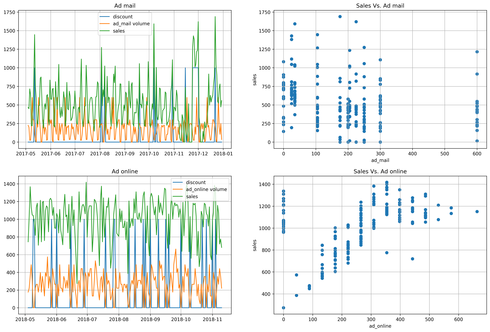
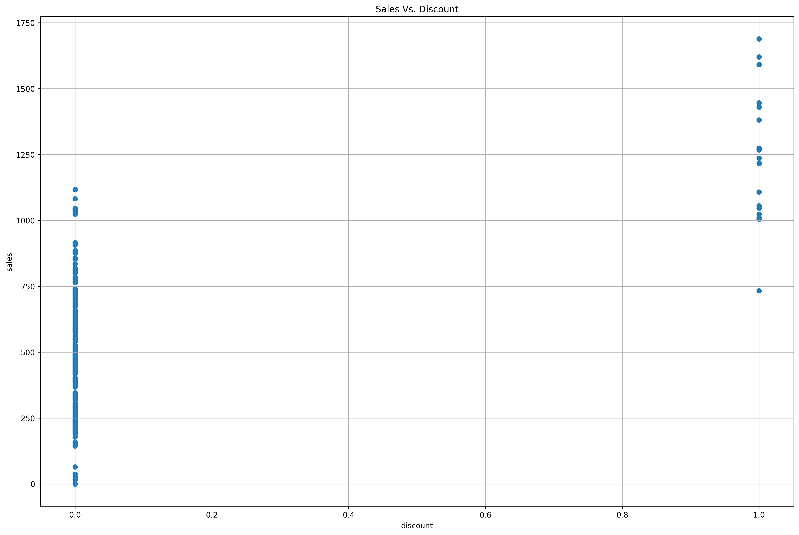
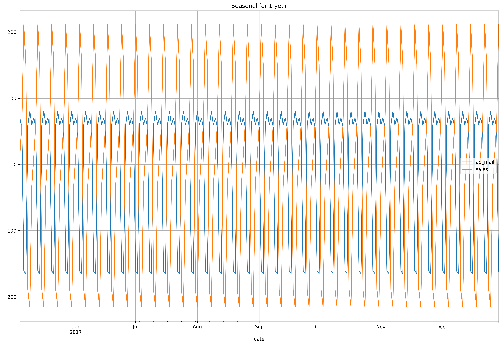
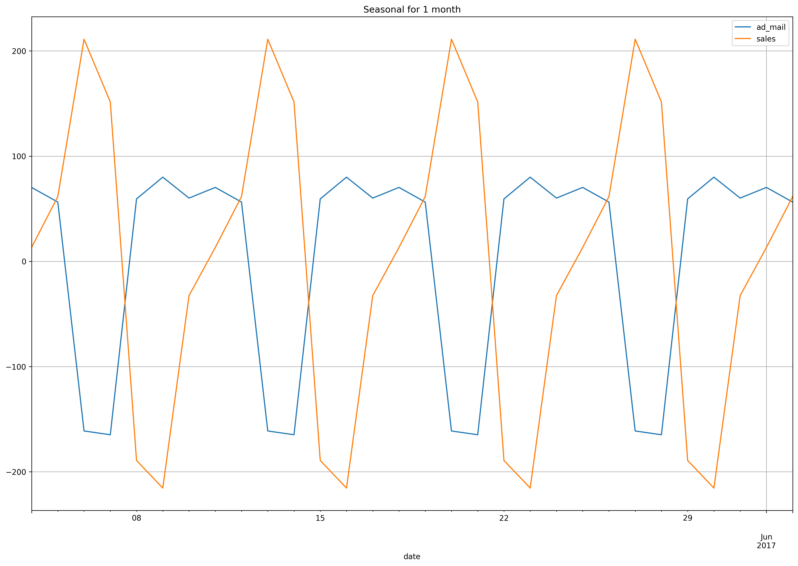
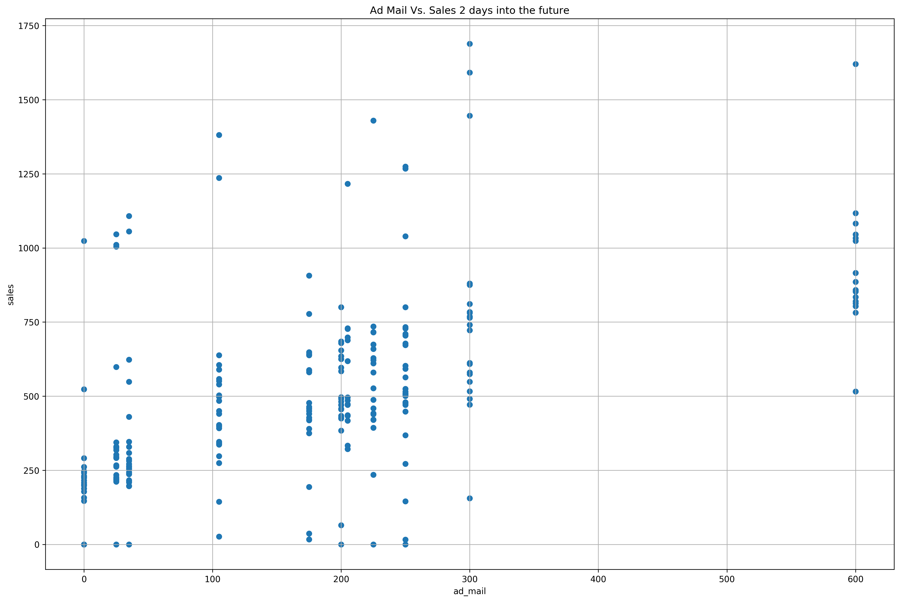
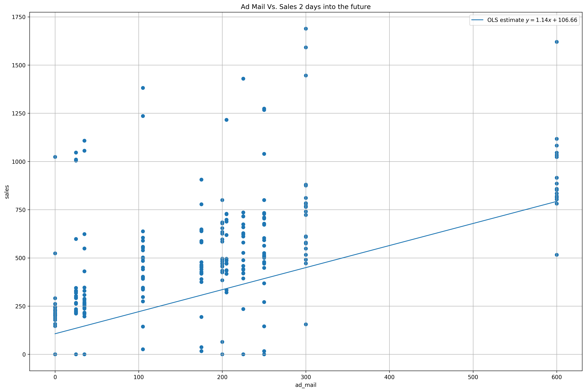

# BUAD 307: Marketing Fundamentals (Fall 2019)

As part of our first class, let's explore a dataset for that shows the amount of money (\\$) that a company has spent on offline mail and online channels, and their sales revenue (\\$) each day.


<div markdown="1" class="cell code_cell">
<div class="input_area" markdown="1">
```python
import numpy as np
import pandas as pd
import matplotlib.pyplot as plt
import seaborn as sns
from statsmodels.api import tsa
from scipy.stats import t

# plotting defaults
plt.rcParams['figure.dpi'] = 300
plt.rcParams['figure.figsize'] = (18, 12)
get_colors = lambda length: plt.get_cmap('Spectral')(np.linspace(0, 1.0, length))

```
</div>

</div>


<div markdown="1" class="cell code_cell">
<div class="input_area" markdown="1">
```python
plt.rcParams['figure.dpi'] = 300
plt.rcParams['figure.figsize'] = (18, 12)

```
</div>

</div>


<div markdown="1" class="cell code_cell">
<div class="input_area" markdown="1">
```python
ads_sales_data_online = pd.read_excel('./data/ads_sales_data_online.xls', index_col=[0])
ads_sales_data_mailing = pd.read_excel('./data/ads_sales_data_mailing.xls', index_col=[0])

```
</div>

</div>


## Exploratory Data Analysis
Let's look at our data to see if there's anything unusual.


<div markdown="1" class="cell code_cell">
<div class="input_area" markdown="1">
```python
ads_sales_data_mailing.index = pd.to_datetime(ads_sales_data_mailing.index)
ads_sales_data_online.index = pd.to_datetime(ads_sales_data_online.index)

```
</div>

</div>


<div markdown="1" class="cell code_cell">
<div class="input_area" markdown="1">
```python
ads_sales_data_mailing.columns

```
</div>

<div class="output_wrapper" markdown="1">
<div class="output_subarea" markdown="1">


{:.output_data_text}
```
Index(['ad_mail', 'discount', 'sales'], dtype='object')
```


</div>
</div>
</div>


<div markdown="1" class="cell code_cell">
<div class="input_area" markdown="1">
```python
ads_sales_data_mailing.head(10)

```
</div>

<div class="output_wrapper" markdown="1">
<div class="output_subarea" markdown="1">


<div markdown="0" class="output output_html">
<div>
<style scoped>
    .dataframe tbody tr th:only-of-type {
        vertical-align: middle;
    }

    .dataframe tbody tr th {
        vertical-align: top;
    }

    .dataframe thead th {
        text-align: right;
    }
</style>
<table border="1" class="dataframe">
  <thead>
    <tr style="text-align: right;">
      <th></th>
      <th>ad_mail</th>
      <th>discount</th>
      <th>sales</th>
    </tr>
    <tr>
      <th>date</th>
      <th></th>
      <th></th>
      <th></th>
    </tr>
  </thead>
  <tbody>
    <tr>
      <th>2017-05-04</th>
      <td>225</td>
      <td>0</td>
      <td>464.92</td>
    </tr>
    <tr>
      <th>2017-05-05</th>
      <td>200</td>
      <td>0</td>
      <td>449.48</td>
    </tr>
    <tr>
      <th>2017-05-06</th>
      <td>25</td>
      <td>0</td>
      <td>715.92</td>
    </tr>
    <tr>
      <th>2017-05-07</th>
      <td>25</td>
      <td>0</td>
      <td>634.45</td>
    </tr>
    <tr>
      <th>2017-05-08</th>
      <td>175</td>
      <td>0</td>
      <td>221.47</td>
    </tr>
    <tr>
      <th>2017-05-09</th>
      <td>600</td>
      <td>0</td>
      <td>218.45</td>
    </tr>
    <tr>
      <th>2017-05-10</th>
      <td>300</td>
      <td>0</td>
      <td>427.94</td>
    </tr>
    <tr>
      <th>2017-05-11</th>
      <td>300</td>
      <td>0</td>
      <td>852.94</td>
    </tr>
    <tr>
      <th>2017-05-12</th>
      <td>105</td>
      <td>1</td>
      <td>1445.92</td>
    </tr>
    <tr>
      <th>2017-05-13</th>
      <td>35</td>
      <td>0</td>
      <td>740.47</td>
    </tr>
  </tbody>
</table>
</div>
</div>


</div>
</div>
</div>


<div markdown="1" class="cell code_cell">
<div class="input_area" markdown="1">
```python
ads_sales_data_online.columns

```
</div>

<div class="output_wrapper" markdown="1">
<div class="output_subarea" markdown="1">


{:.output_data_text}
```
Index(['ad_online', 'discount', 'sales'], dtype='object')
```


</div>
</div>
</div>


<div markdown="1" class="cell code_cell">
<div class="input_area" markdown="1">
```python
ads_sales_data_online.head(10)

```
</div>

<div class="output_wrapper" markdown="1">
<div class="output_subarea" markdown="1">


<div markdown="0" class="output output_html">
<div>
<style scoped>
    .dataframe tbody tr th:only-of-type {
        vertical-align: middle;
    }

    .dataframe tbody tr th {
        vertical-align: top;
    }

    .dataframe thead th {
        text-align: right;
    }
</style>
<table border="1" class="dataframe">
  <thead>
    <tr style="text-align: right;">
      <th></th>
      <th>ad_online</th>
      <th>discount</th>
      <th>sales</th>
    </tr>
    <tr>
      <th>date</th>
      <th></th>
      <th></th>
      <th></th>
    </tr>
  </thead>
  <tbody>
    <tr>
      <th>2018-05-04</th>
      <td>176.86</td>
      <td>0</td>
      <td>745.14</td>
    </tr>
    <tr>
      <th>2018-05-05</th>
      <td>221.07</td>
      <td>0</td>
      <td>1028.43</td>
    </tr>
    <tr>
      <th>2018-05-06</th>
      <td>353.72</td>
      <td>0</td>
      <td>1367.40</td>
    </tr>
    <tr>
      <th>2018-05-07</th>
      <td>486.36</td>
      <td>0</td>
      <td>1133.97</td>
    </tr>
    <tr>
      <th>2018-05-08</th>
      <td>309.50</td>
      <td>0</td>
      <td>1048.09</td>
    </tr>
    <tr>
      <th>2018-05-09</th>
      <td>0.00</td>
      <td>1</td>
      <td>1042.43</td>
    </tr>
    <tr>
      <th>2018-05-10</th>
      <td>0.00</td>
      <td>1</td>
      <td>961.95</td>
    </tr>
    <tr>
      <th>2018-05-11</th>
      <td>221.07</td>
      <td>0</td>
      <td>817.40</td>
    </tr>
    <tr>
      <th>2018-05-12</th>
      <td>265.29</td>
      <td>0</td>
      <td>1135.25</td>
    </tr>
    <tr>
      <th>2018-05-13</th>
      <td>265.29</td>
      <td>0</td>
      <td>1180.71</td>
    </tr>
  </tbody>
</table>
</div>
</div>


</div>
</div>
</div>


<div markdown="1" class="cell code_cell">
<div class="input_area" markdown="1">
```python
fig, ax = plt.subplots(2, 2)

# We'll amplify discount so that it is in scale with the
# rest of the data for visualization
ax[0, 0].plot(ads_sales_data_mailing['discount'] * 1000, label='discount')
ax[0, 0].plot(ads_sales_data_mailing['ad_mail'], label='ad_mail volume')
ax[0, 0].plot(ads_sales_data_mailing['sales'], label='sales')
ax[0, 0].set_title('Ad mail')
ax[0, 0].grid()
ax[0, 0].legend()

ax[0, 1].scatter(
    ads_sales_data_mailing['ad_mail'], 
    ads_sales_data_mailing['sales']
)
ax[0, 1].set_xlabel('ad_mail')
ax[0, 1].set_ylabel('sales')
ax[0, 1].set_title('Sales Vs. Ad mail')
ax[0, 1].grid()

ax[1, 0].plot(ads_sales_data_online['discount'] * 1000, label='discount')
ax[1, 0].plot(ads_sales_data_online['ad_online'], label='ad_online volume')
ax[1, 0].plot(ads_sales_data_online['sales'], label='sales')
ax[1, 0].set_title('Ad online')
ax[1, 0].grid()
ax[1, 0].legend()

ax[1, 1].scatter(
    ads_sales_data_online['ad_online'], 
    ads_sales_data_online['sales']
)
ax[1, 1].set_xlabel('ad_online')
ax[1, 1].set_ylabel('sales')
ax[1, 1].set_title('Sales Vs. Ad online')
ax[1, 1].grid()

plt.show();

```
</div>

<div class="output_wrapper" markdown="1">
<div class="output_subarea" markdown="1">

{:.output_png}


</div>
</div>
</div>


<div markdown="1" class="cell code_cell">
<div class="input_area" markdown="1">
```python
ads_sales_data_mailing[['ad_mail', 'sales']].corr()

```
</div>

<div class="output_wrapper" markdown="1">
<div class="output_subarea" markdown="1">


<div markdown="0" class="output output_html">
<div>
<style scoped>
    .dataframe tbody tr th:only-of-type {
        vertical-align: middle;
    }

    .dataframe tbody tr th {
        vertical-align: top;
    }

    .dataframe thead th {
        text-align: right;
    }
</style>
<table border="1" class="dataframe">
  <thead>
    <tr style="text-align: right;">
      <th></th>
      <th>ad_mail</th>
      <th>sales</th>
    </tr>
  </thead>
  <tbody>
    <tr>
      <th>ad_mail</th>
      <td>1.000000</td>
      <td>-0.278408</td>
    </tr>
    <tr>
      <th>sales</th>
      <td>-0.278408</td>
      <td>1.000000</td>
    </tr>
  </tbody>
</table>
</div>
</div>


</div>
</div>
</div>


There is negative correlation between amount of ad volume through mail and sales


<div markdown="1" class="cell code_cell">
<div class="input_area" markdown="1">
```python
ads_sales_data_online[['ad_online', 'sales']].corr()

```
</div>

<div class="output_wrapper" markdown="1">
<div class="output_subarea" markdown="1">


<div markdown="0" class="output output_html">
<div>
<style scoped>
    .dataframe tbody tr th:only-of-type {
        vertical-align: middle;
    }

    .dataframe tbody tr th {
        vertical-align: top;
    }

    .dataframe thead th {
        text-align: right;
    }
</style>
<table border="1" class="dataframe">
  <thead>
    <tr style="text-align: right;">
      <th></th>
      <th>ad_online</th>
      <th>sales</th>
    </tr>
  </thead>
  <tbody>
    <tr>
      <th>ad_online</th>
      <td>1.000000</td>
      <td>0.443007</td>
    </tr>
    <tr>
      <th>sales</th>
      <td>0.443007</td>
      <td>1.000000</td>
    </tr>
  </tbody>
</table>
</div>
</div>


</div>
</div>
</div>


There is a positive correlation between amount of ad volume through online sources and sales


---
# Ad Mailing

Offline channel of ad delivery


### Do Discounts Help?
We see that on some days, the company has deployed a discount. We're interested in whether this `discount` actually has an impact on `sales`.


<div markdown="1" class="cell code_cell">
<div class="input_area" markdown="1">
```python
fig, ax = plt.subplots(1, 1)
ax.scatter(ads_sales_data_mailing['discount'], ads_sales_data_mailing['sales'])
ax.set_xlabel('discount')
ax.set_ylabel('sales')
ax.grid()
ax.set_title('Sales Vs. Discount')
plt.show();

```
</div>

<div class="output_wrapper" markdown="1">
<div class="output_subarea" markdown="1">

{:.output_png}


</div>
</div>
</div>


<div markdown="1" class="cell code_cell">
<div class="input_area" markdown="1">
```python
mean_sales_no_discount = ads_sales_data_mailing['sales'][ads_sales_data_mailing['discount'] == 0.0].mean()
mean_sales_with_discount = ads_sales_data_mailing['sales'][ads_sales_data_mailing['discount'] == 1.0].mean()

print('Mean Sales (With Discount): ${} \nMean Sales (Without Discount): ${}'.format(
    round(mean_sales_with_discount, 2), 
    round(mean_sales_no_discount, 2)
))

```
</div>

<div class="output_wrapper" markdown="1">
<div class="output_subarea" markdown="1">
{:.output_stream}
```
Mean Sales (With Discount): $1243.17 
Mean Sales (Without Discount): $463.57
```
</div>
</div>
</div>


We observe that when the `discount` is applied, there seems to be a significant increase in the `sales`. Let's use a right-tailed Student's $t$-test to test whether this hypothesis is true at a significance level / false positive rate / Type I error rate of $\alpha = 0.05$.

$$
\begin{aligned}
H_0 &: \mu = \\$463.57 \\
H_\alpha &: \mu > \\$463.57 \\
\end{aligned}
$$


Let's first get the standardized means.


<div markdown="1" class="cell code_cell">
<div class="input_area" markdown="1">
```python
(mean_sales_with_discount - mean_sales_no_discount) / 

```
</div>

</div>


### Error Trend Seasonality Decompose
Let's see what else we can discover from the data like patterns and insights.


<div markdown="1" class="cell code_cell">
<div class="input_area" markdown="1">
```python
ad_mail_sales_decomposed = tsa.seasonal_decompose(ads_sales_data_mailing[['ad_mail', 'sales']]);

```
</div>

</div>


Let's take a look at the seasonal pattern.


<div markdown="1" class="cell code_cell">
<div class="input_area" markdown="1">
```python
ad_mail_sales_decomposed.seasonal.plot().grid()
plt.title('Seasonal for 1 year');

```
</div>

<div class="output_wrapper" markdown="1">
<div class="output_subarea" markdown="1">

{:.output_png}


</div>
</div>
</div>


Let's zoom in into looking at the seasonality in a month.


<div markdown="1" class="cell code_cell">
<div class="input_area" markdown="1">
```python
ad_mail_sales_decomposed.seasonal[:30].plot().grid()
plt.title('Seasonal for 1 month');

```
</div>

<div class="output_wrapper" markdown="1">
<div class="output_subarea" markdown="1">

{:.output_png}


</div>
</div>
</div>


We observe that whenever `ad_mail` increases, `sales` decreases. But that doesn't make sense! Why is that? It might be that there's a lag between when `ad_mail` is deployed and when consumers actually get the ad. Let's explore how big this lag is.


<div markdown="1" class="cell code_cell">
<div class="input_area" markdown="1">
```python
plt.plot(ad_mail_sales_decomposed.seasonal[:30]['ad_mail'], label='ad_mail')
plt.plot(ad_mail_sales_decomposed.seasonal[:30]['sales'].shift(-2), label='sales')
plt.legend()
plt.grid()
plt.show();

```
</div>

<div class="output_wrapper" markdown="1">
<div class="output_subarea" markdown="1">

{:.output_png}


</div>
</div>
</div>


Seems like a shift of about 2 days +/- aligns our peaks and troughs, meaning that there is approximately a 2 day lag between when an ad is launched by the company as well as when it actually takes effect on the consumers. Let's now fit a [simple linear regression (Ordinary Least Squares solution / line)](https://en.wikipedia.org/wiki/Simple_linear_regression) to the new data (with sales shifted into the future by 2 days) and try to interpret it.


<div markdown="1" class="cell code_cell">
<div class="input_area" markdown="1">
```python
fig, ax = plt.subplots(1, 1)
ax.scatter(
    ads_sales_data_mailing_with_sales_2_days_in_future['ad_mail'],
    ads_sales_data_mailing_with_sales_2_days_in_future['sales']
)
ax.set_xlabel('ad_mail')
ax.set_ylabel('sales')
ax.grid()
ax.set_title('Ad Mail Vs. Sales 2 days into the future')
plt.show();

```
</div>

<div class="output_wrapper" markdown="1">
<div class="output_subarea" markdown="1">

{:.output_png}


</div>
</div>
</div>


We see now that there is indeed a positive correlation, let's look at how much they are correlated now.


<div markdown="1" class="cell code_cell">
<div class="input_area" markdown="1">
```python
ads_sales_data_mailing_with_sales_2_days_in_future = pd.concat([
    ads_sales_data_mailing['ad_mail'],
    ads_sales_data_mailing['sales'].shift(-2)
], axis=1)

ads_sales_data_mailing_with_sales_2_days_in_future.corr()

```
</div>

<div class="output_wrapper" markdown="1">
<div class="output_subarea" markdown="1">


<div markdown="0" class="output output_html">
<div>
<style scoped>
    .dataframe tbody tr th:only-of-type {
        vertical-align: middle;
    }

    .dataframe tbody tr th {
        vertical-align: top;
    }

    .dataframe thead th {
        text-align: right;
    }
</style>
<table border="1" class="dataframe">
  <thead>
    <tr style="text-align: right;">
      <th></th>
      <th>ad_mail</th>
      <th>sales</th>
    </tr>
  </thead>
  <tbody>
    <tr>
      <th>ad_mail</th>
      <td>1.000000</td>
      <td>0.546316</td>
    </tr>
    <tr>
      <th>sales</th>
      <td>0.546316</td>
      <td>1.000000</td>
    </tr>
  </tbody>
</table>
</div>
</div>


</div>
</div>
</div>


$\rho = 0.55$, a reasonable level of correlation between `ad_mail` and `sales`, let's find the OLS solution ("best fit line"), AKA:

$$
\hat{\mathbf{y}} = r\frac{s_y}{s_x}\mathbf{x} + (\bar{y} - r\frac{s_y}{s_x}\bar{x})
$$


<div markdown="1" class="cell code_cell">
<div class="input_area" markdown="1">
```python
r = ads_sales_data_mailing_with_sales_2_days_in_future.corr().iloc[0, 1]
s_y = ads_sales_data_mailing_with_sales_2_days_in_future['sales'].std()
s_x = ads_sales_data_mailing_with_sales_2_days_in_future['ad_mail'].std()
y_bar = ads_sales_data_mailing_with_sales_2_days_in_future['sales'].std()
x_bar = ads_sales_data_mailing_with_sales_2_days_in_future['ad_mail'].mean()
gradient = r * s_y / s_x
y_intercept = y_bar - (gradient * x_bar)
x = np.linspace(
    ads_sales_data_mailing_with_sales_2_days_in_future['ad_mail'].min(),
    ads_sales_data_mailing_with_sales_2_days_in_future['ad_mail'].max(),
    num=100
)
y_hat = np.add(np.dot(gradient, x), y_intercept)

fig, ax = plt.subplots(1, 1)
ax.plot(x, y_hat, label='OLS estimate $y = {}x + {}$'.format(round(gradient, 2), round(y_intercept, 2)))
ax.scatter(
    ads_sales_data_mailing_with_sales_2_days_in_future['ad_mail'],
    ads_sales_data_mailing_with_sales_2_days_in_future['sales']
)
ax.set_xlabel('ad_mail')
ax.set_ylabel('sales')
ax.grid()
ax.set_title('Ad Mail Vs. Sales 2 days into the future')
ax.legend()
plt.show();

```
</div>

<div class="output_wrapper" markdown="1">
<div class="output_subarea" markdown="1">

{:.output_png}


</div>
</div>
</div>


### Conclusion

Seems like there's a lag of 2 days + between when the ad is launched and when it has taken effect. Specifically, it looks like the company starts increasing ad mail volume mid-week and sales peak on the weekends and this trend continues throughout the year. This could possibly be because no one is in the office in the weekends or because the company expects ad delivery to reach the customer only after 2 days +. Also, from our OLS estimate, we observe that whenever we increase \\$1 of `ad_mail`, we increase our `sales` revenue by \\$1.14. Furthermore, when we have absolutely no ads at all, our regression prediction is that our base sales revenue would be \\$106.66.


---
## Ad Sales Online


<div markdown="1" class="cell code_cell">
<div class="input_area" markdown="1">
```python
ad_online_sales_decomposed = tsa.seasonal_decompose(ads_sales_data_online[['ad_online', 'sales']]);

```
</div>

</div>


<div markdown="1" class="cell code_cell">
<div class="input_area" markdown="1">
```python
ad_online_sales_decomposed.trend.plot().grid();

```
</div>

<div class="output_wrapper" markdown="1">
<div class="output_subarea" markdown="1">

{:.output_png}


</div>
</div>
</div>

