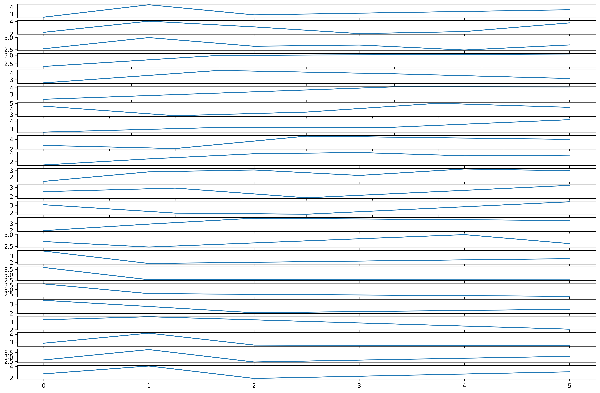

# Quanthub: Review Ratings Challenge

The goal of this case is to wrangle, explore, and model online review ratings from visitors to various locations. The data consists of user ratings ranging from 1 (poor) to 5 (great) and has been aggregated into average ratings per user per location category.


**Task:** Import review_ratings_headers.txt file


<div markdown="1" class="cell code_cell">
<div class="input_area" markdown="1">
```python
import re
from functools import partial
import collections
import numpy as np
import pandas as pd
import matplotlib.pyplot as plt
import graphviz
import pydotplus
from sklearn.model_selection import train_test_split
from sklearn.ensemble import RandomForestRegressor
from sklearn import tree

# plotting defaults
plt.rcParams['figure.dpi'] = 300
plt.rcParams['figure.figsize'] = (18, 12)
get_colors = lambda length: plt.get_cmap('Spectral')(np.linspace(0, 1.0, length))

```
</div>

</div>


<div markdown="1" class="cell code_cell">
<div class="input_area" markdown="1">
```python
plt.rcParams['figure.dpi'] = 300
plt.rcParams['figure.figsize'] = (18, 12)

```
</div>

</div>


<div markdown="1" class="cell code_cell">
<div class="input_area" markdown="1">
```python
review_ratings_headers_raw = [str(header) for header in open('./data/review_ratings_headers.txt', 'r').readlines()] 
review_ratings_headers_raw

```
</div>

<div class="output_wrapper" markdown="1">
<div class="output_subarea" markdown="1">


{:.output_data_text}
```
['Attribute 1 : Unique user id \n',
 'Attribute 2 : Average ratings on churches \n',
 'Attribute 3 : Average ratings on resorts \n',
 'Attribute 4 : Average ratings on beaches \n',
 'Attribute 5 : Average ratings on parks \n',
 'Attribute 6 : Average ratings on theatres \n',
 'Attribute 7 : Average ratings on museums \n',
 'Attribute 8 : Average ratings on malls \n',
 'Attribute 9 : Average ratings on zoo \n',
 'Attribute 10 : Average ratings on restaurants \n',
 'Attribute 11 : Average ratings on pubs/bars \n',
 'Attribute 12 : Average ratings on local services \n',
 'Attribute 13 : Average ratings on burger/pizza shops \n',
 'Attribute 14 : Average ratings on hotels/other lodgings \n',
 'Attribute 15 : Average ratings on juice bars \n',
 'Attribute 16 : Average ratings on art galleries \n',
 'Attribute 17 : Average ratings on dance clubs \n',
 'Attribute 18 : Average ratings on swimming pools \n',
 'Attribute 19 : Average ratings on gyms \n',
 'Attribute 20 : Average ratings on bakeries \n',
 'Attribute 21 : Average ratings on beauty & spas \n',
 'Attribute 22 : Average ratings on cafes \n',
 'Attribute 23 : Average ratings on view points \n',
 'Attribute 24 : Average ratings on monuments \n',
 'Attribute 25 : Average ratings on gardens']
```


</div>
</div>
</div>


**Task:**
1. Extract "user" and "id" from the first line and combine with an underscore.
1. In each line after the first line, extract the word(s) after "on" in each line, removing special characters (e.g. /n, &, etc.). 
1. If there is more than one word, combine the words with a single underscore. 
1. Put the words into a list to use as headers for your dataset later.


<div markdown="1" class="cell code_cell">
<div class="input_area" markdown="1">
```python
review_ratings_headers = []
for header in review_ratings_headers_raw:
    header_cleaned = ''.join([char if char.isalnum() else ' ' for char in header]).strip()
    on_pos = header_cleaned.find('on')
    if on_pos != -1:
        review_ratings_headers.append(
            '_'.join([word.strip() for word in header_cleaned[on_pos+len('on'):].split()])
        )
    else:
        review_ratings_headers.append(
            '_'.join(header_cleaned[header_cleaned.find('user'):].split(' '))
        )

```
</div>

</div>


<div markdown="1" class="cell code_cell">
<div class="input_area" markdown="1">
```python
review_ratings_headers

```
</div>

<div class="output_wrapper" markdown="1">
<div class="output_subarea" markdown="1">


{:.output_data_text}
```
['user_id',
 'churches',
 'resorts',
 'beaches',
 'parks',
 'theatres',
 'museums',
 'malls',
 'zoo',
 'restaurants',
 'pubs_bars',
 'local_services',
 'burger_pizza_shops',
 'hotels_other_lodgings',
 'juice_bars',
 'art_galleries',
 'dance_clubs',
 'swimming_pools',
 'gyms',
 'bakeries',
 'beauty_spas',
 'cafes',
 'view_points',
 'monuments',
 'gardens']
```


</div>
</div>
</div>


Question 1: How many headers are there with 2 or more words combined by an underscore?


<div markdown="1" class="cell code_cell">
<div class="input_area" markdown="1">
```python
np.sum([1 if len(header.split('_')) > 1 else 0 for header in review_ratings_headers])

```
</div>

<div class="output_wrapper" markdown="1">
<div class="output_subarea" markdown="1">


{:.output_data_text}
```
11
```


</div>
</div>
</div>


Question 2: How many underscores are there in all of the headers?


<div markdown="1" class="cell code_cell">
<div class="input_area" markdown="1">
```python
np.sum([len(header.split('_')) - 1 if len(header.split('_')) > 1 else 0 for header in review_ratings_headers])

```
</div>

<div class="output_wrapper" markdown="1">
<div class="output_subarea" markdown="1">


{:.output_data_text}
```
13
```


</div>
</div>
</div>


**Task:** Read in review_ratings.csv, set names as the cleaned headers list from above, skip the first row, and do not include an index column


<div markdown="1" class="cell code_cell">
<div class="input_area" markdown="1">
```python
review_ratings = pd.read_csv(
    './data/review_ratings.csv', 
    header=0, 
    names=review_ratings_headers, 
    index_col=False
)
review_ratings.head()

```
</div>

<div class="output_wrapper" markdown="1">
<div class="output_subarea" markdown="1">


<div markdown="0" class="output output_html">
<div>
<style scoped>
    .dataframe tbody tr th:only-of-type {
        vertical-align: middle;
    }

    .dataframe tbody tr th {
        vertical-align: top;
    }

    .dataframe thead th {
        text-align: right;
    }
</style>
<table border="1" class="dataframe">
  <thead>
    <tr style="text-align: right;">
      <th></th>
      <th>user_id</th>
      <th>churches</th>
      <th>resorts</th>
      <th>beaches</th>
      <th>parks</th>
      <th>theatres</th>
      <th>museums</th>
      <th>malls</th>
      <th>zoo</th>
      <th>restaurants</th>
      <th>...</th>
      <th>art_galleries</th>
      <th>dance_clubs</th>
      <th>swimming_pools</th>
      <th>gyms</th>
      <th>bakeries</th>
      <th>beauty_spas</th>
      <th>cafes</th>
      <th>view_points</th>
      <th>monuments</th>
      <th>gardens</th>
    </tr>
  </thead>
  <tbody>
    <tr>
      <th>0</th>
      <td>User 777</td>
      <td>1.90</td>
      <td>1.93</td>
      <td>1.95</td>
      <td>5.00</td>
      <td>2.02</td>
      <td>2.00</td>
      <td>2.01</td>
      <td>2.00</td>
      <td>2.01</td>
      <td>...</td>
      <td>1.99</td>
      <td>1.62</td>
      <td>1.41</td>
      <td>1.40</td>
      <td>1.41</td>
      <td>1.44</td>
      <td>0.58</td>
      <td>0.99</td>
      <td>1.89</td>
      <td>1.89</td>
    </tr>
    <tr>
      <th>1</th>
      <td>User 5278</td>
      <td>1.37</td>
      <td>1.59</td>
      <td>1.42</td>
      <td>1.81</td>
      <td>1.80</td>
      <td>1.79</td>
      <td>1.81</td>
      <td>2.65</td>
      <td>2.63</td>
      <td>...</td>
      <td>5.00</td>
      <td>5.00</td>
      <td>0.52</td>
      <td>0.50</td>
      <td>0.51</td>
      <td>0.63</td>
      <td>1.43</td>
      <td>1.51</td>
      <td>1.36</td>
      <td>1.35</td>
    </tr>
    <tr>
      <th>2</th>
      <td>User 2374</td>
      <td>0.75</td>
      <td>0.79</td>
      <td>2.03</td>
      <td>2.88</td>
      <td>5.00</td>
      <td>5.00</td>
      <td>1.64</td>
      <td>1.59</td>
      <td>1.56</td>
      <td>...</td>
      <td>0.78</td>
      <td>0.77</td>
      <td>0.78</td>
      <td>0.79</td>
      <td>1.10</td>
      <td>0.73</td>
      <td>0.70</td>
      <td>0.70</td>
      <td>0.70</td>
      <td>0.73</td>
    </tr>
    <tr>
      <th>3</th>
      <td>User 943</td>
      <td>1.22</td>
      <td>5.00</td>
      <td>1.28</td>
      <td>5.00</td>
      <td>5.00</td>
      <td>2.83</td>
      <td>2.58</td>
      <td>1.72</td>
      <td>5.00</td>
      <td>...</td>
      <td>0.96</td>
      <td>1.16</td>
      <td>0.58</td>
      <td>0.58</td>
      <td>0.59</td>
      <td>0.71</td>
      <td>1.27</td>
      <td>5.00</td>
      <td>1.26</td>
      <td>1.21</td>
    </tr>
    <tr>
      <th>4</th>
      <td>User 4082</td>
      <td>1.12</td>
      <td>1.15</td>
      <td>5.00</td>
      <td>3.27</td>
      <td>5.00</td>
      <td>5.00</td>
      <td>5.00</td>
      <td>1.99</td>
      <td>1.79</td>
      <td>...</td>
      <td>1.76</td>
      <td>1.78</td>
      <td>0.51</td>
      <td>0.00</td>
      <td>0.00</td>
      <td>0.00</td>
      <td>0.50</td>
      <td>1.09</td>
      <td>1.08</td>
      <td>1.09</td>
    </tr>
  </tbody>
</table>
<p>5 rows × 25 columns</p>
</div>
</div>


</div>
</div>
</div>


Question 3: How many rows are in the ratings dataset?


<div markdown="1" class="cell code_cell">
<div class="input_area" markdown="1">
```python
review_ratings.shape[0]

```
</div>

<div class="output_wrapper" markdown="1">
<div class="output_subarea" markdown="1">


{:.output_data_text}
```
4456
```


</div>
</div>
</div>


**Task:** Import review_ratings_with_headers.csv


<div markdown="1" class="cell code_cell">
<div class="input_area" markdown="1">
```python
review_ratings_with_headers = pd.read_csv('./data/review_ratings_with_headers.csv')
review_ratings_with_headers.head()

```
</div>

<div class="output_wrapper" markdown="1">
<div class="output_subarea" markdown="1">


<div markdown="0" class="output output_html">
<div>
<style scoped>
    .dataframe tbody tr th:only-of-type {
        vertical-align: middle;
    }

    .dataframe tbody tr th {
        vertical-align: top;
    }

    .dataframe thead th {
        text-align: right;
    }
</style>
<table border="1" class="dataframe">
  <thead>
    <tr style="text-align: right;">
      <th></th>
      <th>user_id</th>
      <th>churches</th>
      <th>resorts</th>
      <th>beaches</th>
      <th>parks</th>
      <th>theatres</th>
      <th>museums</th>
      <th>malls</th>
      <th>zoo</th>
      <th>restaurants</th>
      <th>...</th>
      <th>art_galleries</th>
      <th>dance_clubs</th>
      <th>swimming_pools</th>
      <th>gyms</th>
      <th>bakeries</th>
      <th>beauty_spas</th>
      <th>cafes</th>
      <th>view_points</th>
      <th>monuments</th>
      <th>gardens</th>
    </tr>
  </thead>
  <tbody>
    <tr>
      <th>0</th>
      <td>User 777</td>
      <td>1.90</td>
      <td>1.93</td>
      <td>1.95</td>
      <td>5.00</td>
      <td>2.02</td>
      <td>2.00</td>
      <td>2.01</td>
      <td>2.00</td>
      <td>2.01</td>
      <td>...</td>
      <td>1.99</td>
      <td>1.62</td>
      <td>1.41</td>
      <td>1.40</td>
      <td>1.41</td>
      <td>1.44</td>
      <td>0.58</td>
      <td>0.99</td>
      <td>1.89</td>
      <td>1.89</td>
    </tr>
    <tr>
      <th>1</th>
      <td>User 5278</td>
      <td>1.37</td>
      <td>1.59</td>
      <td>1.42</td>
      <td>1.81</td>
      <td>1.80</td>
      <td>1.79</td>
      <td>1.81</td>
      <td>2.65</td>
      <td>2.63</td>
      <td>...</td>
      <td>5.00</td>
      <td>5.00</td>
      <td>0.52</td>
      <td>0.50</td>
      <td>0.51</td>
      <td>0.63</td>
      <td>1.43</td>
      <td>1.51</td>
      <td>1.36</td>
      <td>1.35</td>
    </tr>
    <tr>
      <th>2</th>
      <td>User 2374</td>
      <td>0.75</td>
      <td>0.79</td>
      <td>2.03</td>
      <td>2.88</td>
      <td>5.00</td>
      <td>5.00</td>
      <td>1.64</td>
      <td>1.59</td>
      <td>1.56</td>
      <td>...</td>
      <td>0.78</td>
      <td>0.77</td>
      <td>0.78</td>
      <td>0.79</td>
      <td>1.10</td>
      <td>0.73</td>
      <td>0.70</td>
      <td>0.70</td>
      <td>0.70</td>
      <td>0.73</td>
    </tr>
    <tr>
      <th>3</th>
      <td>User 943</td>
      <td>1.22</td>
      <td>5.00</td>
      <td>1.28</td>
      <td>5.00</td>
      <td>5.00</td>
      <td>2.83</td>
      <td>2.58</td>
      <td>1.72</td>
      <td>5.00</td>
      <td>...</td>
      <td>0.96</td>
      <td>1.16</td>
      <td>0.58</td>
      <td>0.58</td>
      <td>0.59</td>
      <td>0.71</td>
      <td>1.27</td>
      <td>5.00</td>
      <td>1.26</td>
      <td>1.21</td>
    </tr>
    <tr>
      <th>4</th>
      <td>User 4082</td>
      <td>1.12</td>
      <td>1.15</td>
      <td>5.00</td>
      <td>3.27</td>
      <td>5.00</td>
      <td>5.00</td>
      <td>5.00</td>
      <td>1.99</td>
      <td>1.79</td>
      <td>...</td>
      <td>1.76</td>
      <td>1.78</td>
      <td>0.51</td>
      <td>0.00</td>
      <td>0.00</td>
      <td>0.00</td>
      <td>0.50</td>
      <td>1.09</td>
      <td>1.08</td>
      <td>1.09</td>
    </tr>
  </tbody>
</table>
<p>5 rows × 25 columns</p>
</div>
</div>


</div>
</div>
</div>


**Task:** Explore data types in the dataset


<div markdown="1" class="cell code_cell">
<div class="input_area" markdown="1">
```python
review_ratings_with_headers.dtypes

```
</div>

<div class="output_wrapper" markdown="1">
<div class="output_subarea" markdown="1">


{:.output_data_text}
```
user_id                   object
churches                 float64
resorts                  float64
beaches                  float64
parks                    float64
theatres                 float64
museums                  float64
malls                    float64
zoo                      float64
restaurants              float64
pubs_bars                float64
local_services            object
burger_pizza_shops       float64
hotels_other_lodgings    float64
juice_bars               float64
art_galleries            float64
dance_clubs              float64
swimming_pools           float64
gyms                     float64
bakeries                 float64
beauty_spas              float64
cafes                    float64
view_points              float64
monuments                float64
gardens                  float64
dtype: object
```


</div>
</div>
</div>


<div markdown="1" class="cell code_cell">
<div class="input_area" markdown="1">
```python
review_ratings_with_headers['user_id'].describe()

```
</div>

<div class="output_wrapper" markdown="1">
<div class="output_subarea" markdown="1">


{:.output_data_text}
```
count          4456
unique         4456
top       User 4404
freq              1
Name: user_id, dtype: object
```


</div>
</div>
</div>


Question 4: What data type is user_id?


It is an object data type


**Task:** Find special characters that are in one of the columns, replace with 0, and convert to continuous/float type


Looks like the only feature column that is not a float data type is the `local_services` column, so we'll explore that.


<div markdown="1" class="cell code_cell">
<div class="input_area" markdown="1">
```python
local_services = review_ratings_with_headers['local_services']
review_ratings_with_headers['local_services'] = \
    review_ratings_with_headers['local_services'].apply(
        lambda entry: float(''.join(
            [char if char.isdigit() or char == '.' \
                 else '0' for char in entry])
        )
    )

```
</div>

</div>


<div markdown="1" class="cell code_cell">
<div class="input_area" markdown="1">
```python
review_ratings.dtypes

```
</div>

<div class="output_wrapper" markdown="1">
<div class="output_subarea" markdown="1">


{:.output_data_text}
```
user_id                   object
churches                 float64
resorts                  float64
beaches                  float64
parks                    float64
theatres                 float64
museums                  float64
malls                    float64
zoo                      float64
restaurants              float64
pubs_bars                float64
local_services            object
burger_pizza_shops       float64
hotels_other_lodgings    float64
juice_bars               float64
art_galleries            float64
dance_clubs              float64
swimming_pools           float64
gyms                     float64
bakeries                 float64
beauty_spas              float64
cafes                    float64
view_points              float64
monuments                float64
gardens                  float64
dtype: object
```


</div>
</div>
</div>


Question 5: What was the string that contained the special characters?


<div markdown="1" class="cell code_cell">
<div class="input_area" markdown="1">
```python
for entry in local_services:
    for char in entry:
        if char.isdigit() or char == '.':
            pass
        else:
            print(entry)
            break

```
</div>

<div class="output_wrapper" markdown="1">
<div class="output_subarea" markdown="1">
{:.output_stream}
```
2	2.
```
</div>
</div>
</div>


Question 6: What is the mean of the variable now that it has been converted to type continuous/float?


<div markdown="1" class="cell code_cell">
<div class="input_area" markdown="1">
```python
review_ratings_with_headers['local_services'].describe()

```
</div>

<div class="output_wrapper" markdown="1">
<div class="output_subarea" markdown="1">


{:.output_data_text}
```
count    4456.000000
mean        2.590346
std         3.289532
min         0.780000
25%         1.580000
50%         2.000000
75%         3.172500
max       202.000000
Name: local_services, dtype: float64
```


</div>
</div>
</div>


**Task:** Fill missing values with 0 and run summary statistics on the dataset


<div markdown="1" class="cell code_cell">
<div class="input_area" markdown="1">
```python
review_ratings_with_headers = \
    review_ratings_with_headers.fillna(value=0)
review_ratings_with_headers.describe()

```
</div>

<div class="output_wrapper" markdown="1">
<div class="output_subarea" markdown="1">


<div markdown="0" class="output output_html">
<div>
<style scoped>
    .dataframe tbody tr th:only-of-type {
        vertical-align: middle;
    }

    .dataframe tbody tr th {
        vertical-align: top;
    }

    .dataframe thead th {
        text-align: right;
    }
</style>
<table border="1" class="dataframe">
  <thead>
    <tr style="text-align: right;">
      <th></th>
      <th>churches</th>
      <th>resorts</th>
      <th>beaches</th>
      <th>parks</th>
      <th>theatres</th>
      <th>museums</th>
      <th>malls</th>
      <th>zoo</th>
      <th>restaurants</th>
      <th>pubs_bars</th>
      <th>...</th>
      <th>art_galleries</th>
      <th>dance_clubs</th>
      <th>swimming_pools</th>
      <th>gyms</th>
      <th>bakeries</th>
      <th>beauty_spas</th>
      <th>cafes</th>
      <th>view_points</th>
      <th>monuments</th>
      <th>gardens</th>
    </tr>
  </thead>
  <tbody>
    <tr>
      <th>count</th>
      <td>4456.000000</td>
      <td>4456.000000</td>
      <td>4456.000000</td>
      <td>4456.000000</td>
      <td>4456.000000</td>
      <td>4456.000000</td>
      <td>4456.000000</td>
      <td>4456.000000</td>
      <td>4456.000000</td>
      <td>4456.000000</td>
      <td>...</td>
      <td>4456.000000</td>
      <td>4456.000000</td>
      <td>4456.000000</td>
      <td>4456.000000</td>
      <td>4456.000000</td>
      <td>4456.000000</td>
      <td>4456.000000</td>
      <td>4456.000000</td>
      <td>4456.000000</td>
      <td>4456.000000</td>
    </tr>
    <tr>
      <th>mean</th>
      <td>1.452987</td>
      <td>2.304504</td>
      <td>2.483409</td>
      <td>2.790247</td>
      <td>2.966690</td>
      <td>2.908746</td>
      <td>3.378438</td>
      <td>2.542897</td>
      <td>3.125222</td>
      <td>2.832208</td>
      <td>...</td>
      <td>2.224661</td>
      <td>1.189217</td>
      <td>0.950121</td>
      <td>0.828218</td>
      <td>0.966405</td>
      <td>0.994675</td>
      <td>0.962089</td>
      <td>1.734473</td>
      <td>1.523761</td>
      <td>1.549632</td>
    </tr>
    <tr>
      <th>std</th>
      <td>0.829420</td>
      <td>1.418781</td>
      <td>1.246003</td>
      <td>1.304826</td>
      <td>1.339469</td>
      <td>1.288723</td>
      <td>1.414961</td>
      <td>1.116005</td>
      <td>1.357130</td>
      <td>1.306910</td>
      <td>...</td>
      <td>1.727771</td>
      <td>1.109464</td>
      <td>0.984810</td>
      <td>0.963599</td>
      <td>1.198750</td>
      <td>1.183759</td>
      <td>0.919017</td>
      <td>1.585888</td>
      <td>1.313043</td>
      <td>1.165424</td>
    </tr>
    <tr>
      <th>min</th>
      <td>0.000000</td>
      <td>0.000000</td>
      <td>0.000000</td>
      <td>0.830000</td>
      <td>1.120000</td>
      <td>1.110000</td>
      <td>1.120000</td>
      <td>0.860000</td>
      <td>0.840000</td>
      <td>0.810000</td>
      <td>...</td>
      <td>0.000000</td>
      <td>0.000000</td>
      <td>0.000000</td>
      <td>0.000000</td>
      <td>0.000000</td>
      <td>0.000000</td>
      <td>0.000000</td>
      <td>0.000000</td>
      <td>0.000000</td>
      <td>0.000000</td>
    </tr>
    <tr>
      <th>25%</th>
      <td>0.920000</td>
      <td>1.360000</td>
      <td>1.530000</td>
      <td>1.737500</td>
      <td>1.780000</td>
      <td>1.790000</td>
      <td>1.940000</td>
      <td>1.620000</td>
      <td>1.800000</td>
      <td>1.630000</td>
      <td>...</td>
      <td>0.860000</td>
      <td>0.690000</td>
      <td>0.580000</td>
      <td>0.530000</td>
      <td>0.520000</td>
      <td>0.540000</td>
      <td>0.570000</td>
      <td>0.740000</td>
      <td>0.790000</td>
      <td>0.880000</td>
    </tr>
    <tr>
      <th>50%</th>
      <td>1.340000</td>
      <td>1.880000</td>
      <td>2.065000</td>
      <td>2.450000</td>
      <td>2.670000</td>
      <td>2.700000</td>
      <td>3.230000</td>
      <td>2.170000</td>
      <td>2.800000</td>
      <td>2.680000</td>
      <td>...</td>
      <td>1.330000</td>
      <td>0.800000</td>
      <td>0.740000</td>
      <td>0.690000</td>
      <td>0.690000</td>
      <td>0.690000</td>
      <td>0.770000</td>
      <td>1.020000</td>
      <td>1.070000</td>
      <td>1.290000</td>
    </tr>
    <tr>
      <th>75%</th>
      <td>1.810000</td>
      <td>2.670000</td>
      <td>2.740000</td>
      <td>4.062500</td>
      <td>4.330000</td>
      <td>3.910000</td>
      <td>5.000000</td>
      <td>3.192500</td>
      <td>5.000000</td>
      <td>3.492500</td>
      <td>...</td>
      <td>4.900000</td>
      <td>1.150000</td>
      <td>0.910000</td>
      <td>0.840000</td>
      <td>0.860000</td>
      <td>0.860000</td>
      <td>1.000000</td>
      <td>2.060000</td>
      <td>1.540000</td>
      <td>1.650000</td>
    </tr>
    <tr>
      <th>max</th>
      <td>5.000000</td>
      <td>5.000000</td>
      <td>5.000000</td>
      <td>5.000000</td>
      <td>5.000000</td>
      <td>5.000000</td>
      <td>5.000000</td>
      <td>5.000000</td>
      <td>5.000000</td>
      <td>5.000000</td>
      <td>...</td>
      <td>5.000000</td>
      <td>5.000000</td>
      <td>5.000000</td>
      <td>5.000000</td>
      <td>5.000000</td>
      <td>5.000000</td>
      <td>5.000000</td>
      <td>5.000000</td>
      <td>5.000000</td>
      <td>5.000000</td>
    </tr>
  </tbody>
</table>
<p>8 rows × 24 columns</p>
</div>
</div>


</div>
</div>
</div>


Question 7: What is the IQR of ratings for malls?


<div markdown="1" class="cell code_cell">
<div class="input_area" markdown="1">
```python
review_ratings_with_headers['malls'].quantile(0.75) \
    - review_ratings_with_headers['malls'].quantile(0.25)

```
</div>

<div class="output_wrapper" markdown="1">
<div class="output_subarea" markdown="1">


{:.output_data_text}
```
3.06
```


</div>
</div>
</div>


**Task:** Import review_ratings_processed.csv


<div markdown="1" class="cell code_cell">
<div class="input_area" markdown="1">
```python
review_ratings_processed = \
    pd.read_csv('./data/review_ratings_processed.csv')
review_ratings_processed.head()

```
</div>

<div class="output_wrapper" markdown="1">
<div class="output_subarea" markdown="1">


<div markdown="0" class="output output_html">
<div>
<style scoped>
    .dataframe tbody tr th:only-of-type {
        vertical-align: middle;
    }

    .dataframe tbody tr th {
        vertical-align: top;
    }

    .dataframe thead th {
        text-align: right;
    }
</style>
<table border="1" class="dataframe">
  <thead>
    <tr style="text-align: right;">
      <th></th>
      <th>user_id</th>
      <th>churches</th>
      <th>resorts</th>
      <th>beaches</th>
      <th>parks</th>
      <th>theatres</th>
      <th>museums</th>
      <th>malls</th>
      <th>zoo</th>
      <th>restaurants</th>
      <th>...</th>
      <th>art_galleries</th>
      <th>dance_clubs</th>
      <th>swimming_pools</th>
      <th>gyms</th>
      <th>bakeries</th>
      <th>beauty_spas</th>
      <th>cafes</th>
      <th>view_points</th>
      <th>monuments</th>
      <th>gardens</th>
    </tr>
  </thead>
  <tbody>
    <tr>
      <th>0</th>
      <td>User 777</td>
      <td>1.90</td>
      <td>1.93</td>
      <td>1.95</td>
      <td>5.00</td>
      <td>2.02</td>
      <td>2.00</td>
      <td>2.01</td>
      <td>2.00</td>
      <td>2.01</td>
      <td>...</td>
      <td>1.99</td>
      <td>1.62</td>
      <td>1.41</td>
      <td>1.40</td>
      <td>1.41</td>
      <td>1.44</td>
      <td>0.58</td>
      <td>0.99</td>
      <td>1.89</td>
      <td>1.89</td>
    </tr>
    <tr>
      <th>1</th>
      <td>User 5278</td>
      <td>1.37</td>
      <td>1.59</td>
      <td>1.42</td>
      <td>1.81</td>
      <td>1.80</td>
      <td>1.79</td>
      <td>1.81</td>
      <td>2.65</td>
      <td>2.63</td>
      <td>...</td>
      <td>5.00</td>
      <td>5.00</td>
      <td>0.52</td>
      <td>0.50</td>
      <td>0.51</td>
      <td>0.63</td>
      <td>1.43</td>
      <td>1.51</td>
      <td>1.36</td>
      <td>1.35</td>
    </tr>
    <tr>
      <th>2</th>
      <td>User 2374</td>
      <td>0.75</td>
      <td>0.79</td>
      <td>2.03</td>
      <td>2.88</td>
      <td>5.00</td>
      <td>5.00</td>
      <td>1.64</td>
      <td>1.59</td>
      <td>1.56</td>
      <td>...</td>
      <td>0.78</td>
      <td>0.77</td>
      <td>0.78</td>
      <td>0.79</td>
      <td>1.10</td>
      <td>0.73</td>
      <td>0.70</td>
      <td>0.70</td>
      <td>0.70</td>
      <td>0.73</td>
    </tr>
    <tr>
      <th>3</th>
      <td>User 943</td>
      <td>1.22</td>
      <td>5.00</td>
      <td>1.28</td>
      <td>5.00</td>
      <td>5.00</td>
      <td>2.83</td>
      <td>2.58</td>
      <td>1.72</td>
      <td>5.00</td>
      <td>...</td>
      <td>0.96</td>
      <td>1.16</td>
      <td>0.58</td>
      <td>0.58</td>
      <td>0.59</td>
      <td>0.71</td>
      <td>1.27</td>
      <td>5.00</td>
      <td>1.26</td>
      <td>1.21</td>
    </tr>
    <tr>
      <th>4</th>
      <td>User 4082</td>
      <td>1.12</td>
      <td>1.15</td>
      <td>5.00</td>
      <td>3.27</td>
      <td>5.00</td>
      <td>5.00</td>
      <td>5.00</td>
      <td>1.99</td>
      <td>1.79</td>
      <td>...</td>
      <td>1.76</td>
      <td>1.78</td>
      <td>0.51</td>
      <td>0.00</td>
      <td>0.00</td>
      <td>0.00</td>
      <td>0.50</td>
      <td>1.09</td>
      <td>1.08</td>
      <td>1.09</td>
    </tr>
  </tbody>
</table>
<p>5 rows × 25 columns</p>
</div>
</div>


</div>
</div>
</div>


**Task:** Find the variables that are most correlated with each other


<div markdown="1" class="cell code_cell">
<div class="input_area" markdown="1">
```python
review_ratings_processed_corr_mat = review_ratings_processed.iloc[:, 1:].corr()
review_ratings_processed_corr_mat

```
</div>

<div class="output_wrapper" markdown="1">
<div class="output_subarea" markdown="1">


<div markdown="0" class="output output_html">
<div>
<style scoped>
    .dataframe tbody tr th:only-of-type {
        vertical-align: middle;
    }

    .dataframe tbody tr th {
        vertical-align: top;
    }

    .dataframe thead th {
        text-align: right;
    }
</style>
<table border="1" class="dataframe">
  <thead>
    <tr style="text-align: right;">
      <th></th>
      <th>churches</th>
      <th>resorts</th>
      <th>beaches</th>
      <th>parks</th>
      <th>theatres</th>
      <th>museums</th>
      <th>malls</th>
      <th>zoo</th>
      <th>restaurants</th>
      <th>pubs_bars</th>
      <th>...</th>
      <th>art_galleries</th>
      <th>dance_clubs</th>
      <th>swimming_pools</th>
      <th>gyms</th>
      <th>bakeries</th>
      <th>beauty_spas</th>
      <th>cafes</th>
      <th>view_points</th>
      <th>monuments</th>
      <th>gardens</th>
    </tr>
  </thead>
  <tbody>
    <tr>
      <th>churches</th>
      <td>1.000000</td>
      <td>0.260257</td>
      <td>0.156641</td>
      <td>0.073435</td>
      <td>0.039801</td>
      <td>-0.092727</td>
      <td>-0.265487</td>
      <td>-0.185384</td>
      <td>-0.294143</td>
      <td>-0.275124</td>
      <td>...</td>
      <td>-0.137725</td>
      <td>0.067658</td>
      <td>0.130032</td>
      <td>0.161656</td>
      <td>0.179255</td>
      <td>0.204207</td>
      <td>0.309205</td>
      <td>0.372235</td>
      <td>0.411541</td>
      <td>0.486649</td>
    </tr>
    <tr>
      <th>resorts</th>
      <td>0.260257</td>
      <td>1.000000</td>
      <td>0.317444</td>
      <td>0.166368</td>
      <td>0.152136</td>
      <td>0.049450</td>
      <td>-0.059706</td>
      <td>0.006087</td>
      <td>-0.062348</td>
      <td>-0.097929</td>
      <td>...</td>
      <td>-0.065658</td>
      <td>-0.041750</td>
      <td>-0.070500</td>
      <td>-0.019084</td>
      <td>0.031711</td>
      <td>0.092644</td>
      <td>0.095150</td>
      <td>0.026616</td>
      <td>0.093188</td>
      <td>0.135329</td>
    </tr>
    <tr>
      <th>beaches</th>
      <td>0.156641</td>
      <td>0.317444</td>
      <td>1.000000</td>
      <td>0.399979</td>
      <td>0.323741</td>
      <td>0.153930</td>
      <td>-0.074089</td>
      <td>-0.180444</td>
      <td>-0.223845</td>
      <td>-0.175301</td>
      <td>...</td>
      <td>-0.137319</td>
      <td>-0.027532</td>
      <td>-0.085583</td>
      <td>-0.116461</td>
      <td>-0.082800</td>
      <td>-0.013352</td>
      <td>0.007740</td>
      <td>0.148735</td>
      <td>0.123528</td>
      <td>0.085184</td>
    </tr>
    <tr>
      <th>parks</th>
      <td>0.073435</td>
      <td>0.166368</td>
      <td>0.399979</td>
      <td>1.000000</td>
      <td>0.623595</td>
      <td>0.307184</td>
      <td>-0.075504</td>
      <td>-0.127226</td>
      <td>-0.170477</td>
      <td>-0.118112</td>
      <td>...</td>
      <td>-0.276030</td>
      <td>0.010401</td>
      <td>-0.132519</td>
      <td>-0.181254</td>
      <td>-0.197990</td>
      <td>-0.094858</td>
      <td>-0.056405</td>
      <td>0.288137</td>
      <td>0.175580</td>
      <td>0.090223</td>
    </tr>
    <tr>
      <th>theatres</th>
      <td>0.039801</td>
      <td>0.152136</td>
      <td>0.323741</td>
      <td>0.623595</td>
      <td>1.000000</td>
      <td>0.481160</td>
      <td>0.081622</td>
      <td>0.002951</td>
      <td>-0.168624</td>
      <td>-0.098473</td>
      <td>...</td>
      <td>-0.330776</td>
      <td>-0.067829</td>
      <td>-0.192170</td>
      <td>-0.241485</td>
      <td>-0.259324</td>
      <td>-0.197368</td>
      <td>-0.135495</td>
      <td>0.126214</td>
      <td>0.132492</td>
      <td>0.099770</td>
    </tr>
    <tr>
      <th>museums</th>
      <td>-0.092727</td>
      <td>0.049450</td>
      <td>0.153930</td>
      <td>0.307184</td>
      <td>0.481160</td>
      <td>1.000000</td>
      <td>0.390207</td>
      <td>0.203442</td>
      <td>0.116491</td>
      <td>-0.021917</td>
      <td>...</td>
      <td>-0.185366</td>
      <td>-0.156462</td>
      <td>-0.233413</td>
      <td>-0.269439</td>
      <td>-0.267716</td>
      <td>-0.228659</td>
      <td>-0.191088</td>
      <td>-0.082948</td>
      <td>-0.083190</td>
      <td>-0.063072</td>
    </tr>
    <tr>
      <th>malls</th>
      <td>-0.265487</td>
      <td>-0.059706</td>
      <td>-0.074089</td>
      <td>-0.075504</td>
      <td>0.081622</td>
      <td>0.390207</td>
      <td>1.000000</td>
      <td>0.394529</td>
      <td>0.426686</td>
      <td>0.250479</td>
      <td>...</td>
      <td>0.100706</td>
      <td>-0.145954</td>
      <td>-0.208489</td>
      <td>-0.223856</td>
      <td>-0.280185</td>
      <td>-0.234097</td>
      <td>-0.255272</td>
      <td>-0.353092</td>
      <td>-0.217277</td>
      <td>-0.243462</td>
    </tr>
    <tr>
      <th>zoo</th>
      <td>-0.185384</td>
      <td>0.006087</td>
      <td>-0.180444</td>
      <td>-0.127226</td>
      <td>0.002951</td>
      <td>0.203442</td>
      <td>0.394529</td>
      <td>1.000000</td>
      <td>0.527385</td>
      <td>0.554738</td>
      <td>...</td>
      <td>-0.061247</td>
      <td>-0.120274</td>
      <td>-0.205291</td>
      <td>-0.236918</td>
      <td>-0.277632</td>
      <td>-0.249765</td>
      <td>-0.274409</td>
      <td>-0.250012</td>
      <td>-0.160518</td>
      <td>-0.133380</td>
    </tr>
    <tr>
      <th>restaurants</th>
      <td>-0.294143</td>
      <td>-0.062348</td>
      <td>-0.223845</td>
      <td>-0.170477</td>
      <td>-0.168624</td>
      <td>0.116491</td>
      <td>0.426686</td>
      <td>0.527385</td>
      <td>1.000000</td>
      <td>0.564639</td>
      <td>...</td>
      <td>0.144566</td>
      <td>-0.111435</td>
      <td>-0.230312</td>
      <td>-0.268960</td>
      <td>-0.279472</td>
      <td>-0.165755</td>
      <td>-0.183172</td>
      <td>-0.267634</td>
      <td>-0.256989</td>
      <td>-0.321528</td>
    </tr>
    <tr>
      <th>pubs_bars</th>
      <td>-0.275124</td>
      <td>-0.097929</td>
      <td>-0.175301</td>
      <td>-0.118112</td>
      <td>-0.098473</td>
      <td>-0.021917</td>
      <td>0.250479</td>
      <td>0.554738</td>
      <td>0.564639</td>
      <td>1.000000</td>
      <td>...</td>
      <td>0.043559</td>
      <td>-0.028163</td>
      <td>-0.213184</td>
      <td>-0.274719</td>
      <td>-0.320691</td>
      <td>-0.246146</td>
      <td>-0.230700</td>
      <td>-0.178047</td>
      <td>-0.200229</td>
      <td>-0.260093</td>
    </tr>
    <tr>
      <th>local_services</th>
      <td>-0.213748</td>
      <td>-0.216978</td>
      <td>-0.149672</td>
      <td>-0.111567</td>
      <td>-0.127916</td>
      <td>-0.152196</td>
      <td>0.086101</td>
      <td>0.284999</td>
      <td>0.256589</td>
      <td>0.468026</td>
      <td>...</td>
      <td>-0.030249</td>
      <td>0.009539</td>
      <td>-0.047526</td>
      <td>-0.106741</td>
      <td>-0.177825</td>
      <td>-0.290280</td>
      <td>-0.332300</td>
      <td>-0.086805</td>
      <td>-0.112042</td>
      <td>-0.172560</td>
    </tr>
    <tr>
      <th>burger_pizza_shops</th>
      <td>-0.261007</td>
      <td>-0.153223</td>
      <td>-0.234546</td>
      <td>-0.165158</td>
      <td>-0.106484</td>
      <td>-0.176046</td>
      <td>0.030725</td>
      <td>-0.000841</td>
      <td>-0.014563</td>
      <td>0.124566</td>
      <td>...</td>
      <td>0.149973</td>
      <td>-0.041825</td>
      <td>0.027918</td>
      <td>0.062554</td>
      <td>0.028578</td>
      <td>-0.130239</td>
      <td>-0.279820</td>
      <td>-0.322592</td>
      <td>-0.199042</td>
      <td>-0.182565</td>
    </tr>
    <tr>
      <th>hotels_other_lodgings</th>
      <td>-0.184472</td>
      <td>-0.215513</td>
      <td>-0.182863</td>
      <td>-0.150100</td>
      <td>-0.099016</td>
      <td>-0.139604</td>
      <td>0.020157</td>
      <td>-0.013338</td>
      <td>0.012185</td>
      <td>0.062938</td>
      <td>...</td>
      <td>0.195134</td>
      <td>-0.043409</td>
      <td>0.028786</td>
      <td>0.074589</td>
      <td>0.070236</td>
      <td>-0.062174</td>
      <td>-0.204284</td>
      <td>-0.197843</td>
      <td>-0.157287</td>
      <td>-0.133865</td>
    </tr>
    <tr>
      <th>juice_bars</th>
      <td>-0.243937</td>
      <td>-0.132225</td>
      <td>-0.170421</td>
      <td>-0.315786</td>
      <td>-0.294933</td>
      <td>-0.156470</td>
      <td>0.090363</td>
      <td>-0.020749</td>
      <td>0.039322</td>
      <td>0.000711</td>
      <td>...</td>
      <td>0.379167</td>
      <td>0.001872</td>
      <td>0.083316</td>
      <td>0.104003</td>
      <td>0.121428</td>
      <td>0.027830</td>
      <td>-0.101469</td>
      <td>-0.294537</td>
      <td>-0.297034</td>
      <td>-0.209297</td>
    </tr>
    <tr>
      <th>art_galleries</th>
      <td>-0.137725</td>
      <td>-0.065658</td>
      <td>-0.137319</td>
      <td>-0.276030</td>
      <td>-0.330776</td>
      <td>-0.185366</td>
      <td>0.100706</td>
      <td>-0.061247</td>
      <td>0.144566</td>
      <td>0.043559</td>
      <td>...</td>
      <td>1.000000</td>
      <td>0.096673</td>
      <td>0.065841</td>
      <td>0.066518</td>
      <td>0.060404</td>
      <td>0.067295</td>
      <td>0.054528</td>
      <td>-0.182792</td>
      <td>-0.163647</td>
      <td>-0.212845</td>
    </tr>
    <tr>
      <th>dance_clubs</th>
      <td>0.067658</td>
      <td>-0.041750</td>
      <td>-0.027532</td>
      <td>0.010401</td>
      <td>-0.067829</td>
      <td>-0.156462</td>
      <td>-0.145954</td>
      <td>-0.120274</td>
      <td>-0.111435</td>
      <td>-0.028163</td>
      <td>...</td>
      <td>0.096673</td>
      <td>1.000000</td>
      <td>0.382165</td>
      <td>0.216150</td>
      <td>0.021838</td>
      <td>0.055917</td>
      <td>0.152969</td>
      <td>0.100050</td>
      <td>0.046174</td>
      <td>0.029601</td>
    </tr>
    <tr>
      <th>swimming_pools</th>
      <td>0.130032</td>
      <td>-0.070500</td>
      <td>-0.085583</td>
      <td>-0.132519</td>
      <td>-0.192170</td>
      <td>-0.233413</td>
      <td>-0.208489</td>
      <td>-0.205291</td>
      <td>-0.230312</td>
      <td>-0.213184</td>
      <td>...</td>
      <td>0.065841</td>
      <td>0.382165</td>
      <td>1.000000</td>
      <td>0.524064</td>
      <td>0.288696</td>
      <td>0.090945</td>
      <td>0.163218</td>
      <td>0.103084</td>
      <td>0.123821</td>
      <td>0.140419</td>
    </tr>
    <tr>
      <th>gyms</th>
      <td>0.161656</td>
      <td>-0.019084</td>
      <td>-0.116461</td>
      <td>-0.181254</td>
      <td>-0.241485</td>
      <td>-0.269439</td>
      <td>-0.223856</td>
      <td>-0.236918</td>
      <td>-0.268960</td>
      <td>-0.274719</td>
      <td>...</td>
      <td>0.066518</td>
      <td>0.216150</td>
      <td>0.524064</td>
      <td>1.000000</td>
      <td>0.433683</td>
      <td>0.200059</td>
      <td>0.199875</td>
      <td>0.089943</td>
      <td>0.136902</td>
      <td>0.169948</td>
    </tr>
    <tr>
      <th>bakeries</th>
      <td>0.179255</td>
      <td>0.031711</td>
      <td>-0.082800</td>
      <td>-0.197990</td>
      <td>-0.259324</td>
      <td>-0.267716</td>
      <td>-0.280185</td>
      <td>-0.277632</td>
      <td>-0.279472</td>
      <td>-0.320691</td>
      <td>...</td>
      <td>0.060404</td>
      <td>0.021838</td>
      <td>0.288696</td>
      <td>0.433683</td>
      <td>1.000000</td>
      <td>0.318972</td>
      <td>0.189102</td>
      <td>0.066652</td>
      <td>0.091027</td>
      <td>0.133147</td>
    </tr>
    <tr>
      <th>beauty_spas</th>
      <td>0.204207</td>
      <td>0.092644</td>
      <td>-0.013352</td>
      <td>-0.094858</td>
      <td>-0.197368</td>
      <td>-0.228659</td>
      <td>-0.234097</td>
      <td>-0.249765</td>
      <td>-0.165755</td>
      <td>-0.246146</td>
      <td>...</td>
      <td>0.067295</td>
      <td>0.055917</td>
      <td>0.090945</td>
      <td>0.200059</td>
      <td>0.318972</td>
      <td>1.000000</td>
      <td>0.315288</td>
      <td>0.195345</td>
      <td>0.150462</td>
      <td>0.127314</td>
    </tr>
    <tr>
      <th>cafes</th>
      <td>0.309205</td>
      <td>0.095150</td>
      <td>0.007740</td>
      <td>-0.056405</td>
      <td>-0.135495</td>
      <td>-0.191088</td>
      <td>-0.255272</td>
      <td>-0.274409</td>
      <td>-0.183172</td>
      <td>-0.230700</td>
      <td>...</td>
      <td>0.054528</td>
      <td>0.152969</td>
      <td>0.163218</td>
      <td>0.199875</td>
      <td>0.189102</td>
      <td>0.315288</td>
      <td>1.000000</td>
      <td>0.364347</td>
      <td>0.350605</td>
      <td>0.301366</td>
    </tr>
    <tr>
      <th>view_points</th>
      <td>0.372235</td>
      <td>0.026616</td>
      <td>0.148735</td>
      <td>0.288137</td>
      <td>0.126214</td>
      <td>-0.082948</td>
      <td>-0.353092</td>
      <td>-0.250012</td>
      <td>-0.267634</td>
      <td>-0.178047</td>
      <td>...</td>
      <td>-0.182792</td>
      <td>0.100050</td>
      <td>0.103084</td>
      <td>0.089943</td>
      <td>0.066652</td>
      <td>0.195345</td>
      <td>0.364347</td>
      <td>1.000000</td>
      <td>0.471765</td>
      <td>0.311373</td>
    </tr>
    <tr>
      <th>monuments</th>
      <td>0.411541</td>
      <td>0.093188</td>
      <td>0.123528</td>
      <td>0.175580</td>
      <td>0.132492</td>
      <td>-0.083190</td>
      <td>-0.217277</td>
      <td>-0.160518</td>
      <td>-0.256989</td>
      <td>-0.200229</td>
      <td>...</td>
      <td>-0.163647</td>
      <td>0.046174</td>
      <td>0.123821</td>
      <td>0.136902</td>
      <td>0.091027</td>
      <td>0.150462</td>
      <td>0.350605</td>
      <td>0.471765</td>
      <td>1.000000</td>
      <td>0.452118</td>
    </tr>
    <tr>
      <th>gardens</th>
      <td>0.486649</td>
      <td>0.135329</td>
      <td>0.085184</td>
      <td>0.090223</td>
      <td>0.099770</td>
      <td>-0.063072</td>
      <td>-0.243462</td>
      <td>-0.133380</td>
      <td>-0.321528</td>
      <td>-0.260093</td>
      <td>...</td>
      <td>-0.212845</td>
      <td>0.029601</td>
      <td>0.140419</td>
      <td>0.169948</td>
      <td>0.133147</td>
      <td>0.127314</td>
      <td>0.301366</td>
      <td>0.311373</td>
      <td>0.452118</td>
      <td>1.000000</td>
    </tr>
  </tbody>
</table>
<p>24 rows × 24 columns</p>
</div>
</div>


</div>
</div>
</div>


<div markdown="1" class="cell code_cell">
<div class="input_area" markdown="1">
```python
# Retrieves correlations of distinct
# feature pairs, removed correlations of
# features with themselves because they will
# be 1
corr_sorted_pairs = \
    review_ratings_processed_corr_mat \
        .unstack() \
        .sort_values(ascending=False)

corr_sorted_pairs = \
    corr_sorted_pairs[corr_sorted_pairs != 1][::2]

print('Most Positively-correlated pairs: \n{}\n'.format(corr_sorted_pairs[:10]))
print('Most Negatively-correlated pairs: \n{}\n'.format(corr_sorted_pairs[-10:][::-1]))

```
</div>

<div class="output_wrapper" markdown="1">
<div class="output_subarea" markdown="1">
{:.output_stream}
```
Most Positively-correlated pairs: 
parks               theatres                 0.623595
pubs_bars           restaurants              0.564639
zoo                 pubs_bars                0.554738
restaurants         zoo                      0.527385
gyms                swimming_pools           0.524064
juice_bars          hotels_other_lodgings    0.511304
churches            gardens                  0.486649
museums             theatres                 0.481160
view_points         monuments                0.471765
burger_pizza_shops  hotels_other_lodgings    0.470846
dtype: float64

Most Negatively-correlated pairs: 
view_points     malls                -0.353092
local_services  cafes                -0.332300
art_galleries   theatres             -0.330776
view_points     burger_pizza_shops   -0.322592
gardens         restaurants          -0.321528
bakeries        pubs_bars            -0.320691
parks           juice_bars           -0.315786
monuments       juice_bars           -0.297034
theatres        juice_bars           -0.294933
view_points     juice_bars           -0.294537
dtype: float64

```
</div>
</div>
</div>


Question 8: What variables is the most negatively correlated with **restaurants**?


<div markdown="1" class="cell code_cell">
<div class="input_area" markdown="1">
```python
review_ratings_processed_corr_mat['restaurants'][review_ratings_processed_corr_mat['restaurants'] < 0].idxmin()

```
</div>

<div class="output_wrapper" markdown="1">
<div class="output_subarea" markdown="1">


{:.output_data_text}
```
'gardens'
```


</div>
</div>
</div>


**Task:** Group each variable into 10 equal-width bins and calculate the **mean malls** rating for each bin


<div markdown="1" class="cell code_cell">
<div class="input_area" markdown="1">
```python
review_ratings_processed_bins = \
    review_ratings_processed.iloc[:,1:].apply(
        partial(
            lambda col, bins: pd.cut(col, bins=bins, retbins=True)
            , bins=10
        )
        , 
        axis=0
    )
review_ratings_processed_bins

```
</div>

<div class="output_wrapper" markdown="1">
<div class="output_subarea" markdown="1">


{:.output_data_text}
```
churches                 ([(1.5, 2.0], (1.0, 1.5], (0.5, 1.0], (1.0, 1....
resorts                  ([(1.5, 2.0], (1.5, 2.0], (0.5, 1.0], (4.5, 5....
beaches                  ([(1.5, 2.0], (1.0, 1.5], (2.0, 2.5], (1.0, 1....
parks                    ([(4.583, 5.0], (1.664, 2.081], (2.498, 2.915]...
theatres                 ([(1.896, 2.284], (1.508, 1.896], (4.612, 5.0]...
museums                  ([(1.888, 2.277], (1.499, 1.888], (4.611, 5.0]...
malls                    ([(1.896, 2.284], (1.508, 1.896], (1.508, 1.89...
zoo                      ([(1.688, 2.102], (2.516, 2.93], (1.274, 1.688...
restaurants              ([(1.672, 2.088], (2.504, 2.92], (1.256, 1.672...
pubs_bars                ([(2.067, 2.486], (2.486, 2.905], (1.229, 1.64...
local_services           ([(1.5, 2.0], (2.0, 2.5], (1.5, 2.0], (0.5, 1....
burger_pizza_shops       ([(1.5, 2.0], (2.0, 2.5], (1.5, 2.0], (0.5, 1....
hotels_other_lodgings    ([(1.616, 2.039], (2.039, 2.462], (1.616, 2.03...
juice_bars               ([(1.608, 2.032], (2.88, 3.304], (4.576, 5.0],...
art_galleries            ([(1.5, 2.0], (4.5, 5.0], (0.5, 1.0], (0.5, 1....
dance_clubs              ([(1.5, 2.0], (4.5, 5.0], (0.5, 1.0], (1.0, 1....
swimming_pools           ([(1.0, 1.5], (0.5, 1.0], (0.5, 1.0], (0.5, 1....
gyms                     ([(1.0, 1.5], (-0.005, 0.5], (0.5, 1.0], (0.5,...
bakeries                 ([(1.0, 1.5], (0.5, 1.0], (1.0, 1.5], (0.5, 1....
beauty_spas              ([(1.0, 1.5], (0.5, 1.0], (0.5, 1.0], (0.5, 1....
cafes                    ([(0.5, 1.0], (1.0, 1.5], (0.5, 1.0], (1.0, 1....
view_points              ([(0.5, 1.0], (1.5, 2.0], (0.5, 1.0], (4.5, 5....
monuments                ([(1.5, 2.0], (1.0, 1.5], (0.5, 1.0], (1.0, 1....
gardens                  ([(1.5, 2.0], (1.0, 1.5], (0.5, 1.0], (1.0, 1....
dtype: object
```


</div>
</div>
</div>


<div markdown="1" class="cell code_cell">
<div class="input_area" markdown="1">
```python
mean_mall_ratings_for_bins = pd.concat([
    pd.Series(review_ratings_processed_bins['malls'][0], name='interval'),
    review_ratings_processed['malls']
], axis=1).groupby('interval').mean()
mean_mall_ratings_for_bins

```
</div>

<div class="output_wrapper" markdown="1">
<div class="output_subarea" markdown="1">


<div markdown="0" class="output output_html">
<div>
<style scoped>
    .dataframe tbody tr th:only-of-type {
        vertical-align: middle;
    }

    .dataframe tbody tr th {
        vertical-align: top;
    }

    .dataframe thead th {
        text-align: right;
    }
</style>
<table border="1" class="dataframe">
  <thead>
    <tr style="text-align: right;">
      <th></th>
      <th>malls</th>
    </tr>
    <tr>
      <th>interval</th>
      <th></th>
    </tr>
  </thead>
  <tbody>
    <tr>
      <th>(1.116, 1.508]</th>
      <td>1.346801</td>
    </tr>
    <tr>
      <th>(1.508, 1.896]</th>
      <td>1.710608</td>
    </tr>
    <tr>
      <th>(1.896, 2.284]</th>
      <td>2.060397</td>
    </tr>
    <tr>
      <th>(2.284, 2.672]</th>
      <td>2.499139</td>
    </tr>
    <tr>
      <th>(2.672, 3.06]</th>
      <td>2.868571</td>
    </tr>
    <tr>
      <th>(3.06, 3.448]</th>
      <td>3.230837</td>
    </tr>
    <tr>
      <th>(3.448, 3.836]</th>
      <td>3.774444</td>
    </tr>
    <tr>
      <th>(3.836, 4.224]</th>
      <td>4.099579</td>
    </tr>
    <tr>
      <th>(4.224, 4.612]</th>
      <td>4.384667</td>
    </tr>
    <tr>
      <th>(4.612, 5.0]</th>
      <td>4.990544</td>
    </tr>
  </tbody>
</table>
</div>
</div>


</div>
</div>
</div>


Question 9: The chart on quanthub.com shows mean **mall** ratings by which variable?


<div markdown="1" class="cell code_cell">
<div class="input_area" markdown="1">
```python
variables = review_ratings_processed.columns.drop(['user_id', 'malls'])

fig, ax = plt.subplots(len(variables), 1)
for idx, variable in enumerate(variables):
    mall_mean_ratings_by_var = \
        review_ratings_processed[[variable, 'malls']]\
                [review_ratings_processed[variable]\
                     .isin(np.arange(0.0, 9.0, 1.0))]\
                        .groupby(by=variable).mean()
    
    ax[idx].plot(mall_mean_ratings_by_var.index, mall_mean_ratings_by_var.values)
plt.show();

```
</div>

<div class="output_wrapper" markdown="1">
<div class="output_subarea" markdown="1">

{:.output_png}


</div>
</div>
</div>


**Task:** Split the dataset into features that include all variables except **juice_bars** and user_id


<div markdown="1" class="cell code_cell">
<div class="input_area" markdown="1">
```python
X = review_ratings_processed.drop(['user_id', 'juice_bars'], axis=1)
y = review_ratings_processed['juice_bars']

```
</div>

</div>


**Task:** Set your seed to 42 and split the data into **80%** training and **20%** test sets 


<div markdown="1" class="cell code_cell">
<div class="input_area" markdown="1">
```python
X_train, X_test, y_train, y_test = train_test_split(X, y, test_size=0.2, random_state=42)

```
</div>

</div>


**Task:** Set seed to 42 and fit a Random Forest with **10 trees/estimators** to the training set


<div markdown="1" class="cell code_cell">
<div class="input_area" markdown="1">
```python
rf_model = RandomForestRegressor(n_estimators=10, random_state=42)
rf_model.fit(X_train, y_train)

```
</div>

<div class="output_wrapper" markdown="1">
<div class="output_subarea" markdown="1">


{:.output_data_text}
```
RandomForestRegressor(bootstrap=True, criterion='mse', max_depth=None,
                      max_features='auto', max_leaf_nodes=None,
                      min_impurity_decrease=0.0, min_impurity_split=None,
                      min_samples_leaf=1, min_samples_split=2,
                      min_weight_fraction_leaf=0.0, n_estimators=10,
                      n_jobs=None, oob_score=False, random_state=42, verbose=0,
                      warm_start=False)
```


</div>
</div>
</div>


Question 10: What R-Squared value did the model achieve on the test set?


<div markdown="1" class="cell code_cell">
<div class="input_area" markdown="1">
```python
rf_model.score(X_test, y_test)

```
</div>

<div class="output_wrapper" markdown="1">
<div class="output_subarea" markdown="1">


{:.output_data_text}
```
0.7336734749500864
```


</div>
</div>
</div>


**Task:** Predict **juice_bars** ratings for the full dataset (training and test combined) and append predictions to the table


<div markdown="1" class="cell code_cell">
<div class="input_area" markdown="1">
```python
data = pd.concat([
    X,
    review_ratings_processed['user_id'],
    y,
    pd.Series(rf_model.predict(X), name='juice_bars_rf_pred')
], axis=1)
data.head()

```
</div>

<div class="output_wrapper" markdown="1">
<div class="output_subarea" markdown="1">


<div markdown="0" class="output output_html">
<div>
<style scoped>
    .dataframe tbody tr th:only-of-type {
        vertical-align: middle;
    }

    .dataframe tbody tr th {
        vertical-align: top;
    }

    .dataframe thead th {
        text-align: right;
    }
</style>
<table border="1" class="dataframe">
  <thead>
    <tr style="text-align: right;">
      <th></th>
      <th>churches</th>
      <th>resorts</th>
      <th>beaches</th>
      <th>parks</th>
      <th>theatres</th>
      <th>museums</th>
      <th>malls</th>
      <th>zoo</th>
      <th>restaurants</th>
      <th>pubs_bars</th>
      <th>...</th>
      <th>gyms</th>
      <th>bakeries</th>
      <th>beauty_spas</th>
      <th>cafes</th>
      <th>view_points</th>
      <th>monuments</th>
      <th>gardens</th>
      <th>user_id</th>
      <th>juice_bars</th>
      <th>juice_bars_rf_pred</th>
    </tr>
  </thead>
  <tbody>
    <tr>
      <th>0</th>
      <td>1.90</td>
      <td>1.93</td>
      <td>1.95</td>
      <td>5.00</td>
      <td>2.02</td>
      <td>2.00</td>
      <td>2.01</td>
      <td>2.00</td>
      <td>2.01</td>
      <td>2.11</td>
      <td>...</td>
      <td>1.40</td>
      <td>1.41</td>
      <td>1.44</td>
      <td>0.58</td>
      <td>0.99</td>
      <td>1.89</td>
      <td>1.89</td>
      <td>User 777</td>
      <td>1.83</td>
      <td>1.830</td>
    </tr>
    <tr>
      <th>1</th>
      <td>1.37</td>
      <td>1.59</td>
      <td>1.42</td>
      <td>1.81</td>
      <td>1.80</td>
      <td>1.79</td>
      <td>1.81</td>
      <td>2.65</td>
      <td>2.63</td>
      <td>2.63</td>
      <td>...</td>
      <td>0.50</td>
      <td>0.51</td>
      <td>0.63</td>
      <td>1.43</td>
      <td>1.51</td>
      <td>1.36</td>
      <td>1.35</td>
      <td>User 5278</td>
      <td>2.92</td>
      <td>2.933</td>
    </tr>
    <tr>
      <th>2</th>
      <td>0.75</td>
      <td>0.79</td>
      <td>2.03</td>
      <td>2.88</td>
      <td>5.00</td>
      <td>5.00</td>
      <td>1.64</td>
      <td>1.59</td>
      <td>1.56</td>
      <td>1.55</td>
      <td>...</td>
      <td>0.79</td>
      <td>1.10</td>
      <td>0.73</td>
      <td>0.70</td>
      <td>0.70</td>
      <td>0.70</td>
      <td>0.73</td>
      <td>User 2374</td>
      <td>5.00</td>
      <td>5.000</td>
    </tr>
    <tr>
      <th>3</th>
      <td>1.22</td>
      <td>5.00</td>
      <td>1.28</td>
      <td>5.00</td>
      <td>5.00</td>
      <td>2.83</td>
      <td>2.58</td>
      <td>1.72</td>
      <td>5.00</td>
      <td>4.94</td>
      <td>...</td>
      <td>0.58</td>
      <td>0.59</td>
      <td>0.71</td>
      <td>1.27</td>
      <td>5.00</td>
      <td>1.26</td>
      <td>1.21</td>
      <td>User 943</td>
      <td>0.93</td>
      <td>0.928</td>
    </tr>
    <tr>
      <th>4</th>
      <td>1.12</td>
      <td>1.15</td>
      <td>5.00</td>
      <td>3.27</td>
      <td>5.00</td>
      <td>5.00</td>
      <td>5.00</td>
      <td>1.99</td>
      <td>1.79</td>
      <td>2.58</td>
      <td>...</td>
      <td>0.00</td>
      <td>0.00</td>
      <td>0.00</td>
      <td>0.50</td>
      <td>1.09</td>
      <td>1.08</td>
      <td>1.09</td>
      <td>User 4082</td>
      <td>1.72</td>
      <td>1.721</td>
    </tr>
  </tbody>
</table>
<p>5 rows × 26 columns</p>
</div>
</div>


</div>
</div>
</div>


**Task:** Compute the squared residual for each user id, append to table and sort descending by squared residual 


<div markdown="1" class="cell code_cell">
<div class="input_area" markdown="1">
```python
data = pd.concat([
    data,
    pd.Series((data['juice_bars_rf_pred']-data['juice_bars'])**2, name='squared_residual')
], axis=1).sort_values('squared_residual', ascending=False)
data.head()

```
</div>

<div class="output_wrapper" markdown="1">
<div class="output_subarea" markdown="1">


<div markdown="0" class="output output_html">
<div>
<style scoped>
    .dataframe tbody tr th:only-of-type {
        vertical-align: middle;
    }

    .dataframe tbody tr th {
        vertical-align: top;
    }

    .dataframe thead th {
        text-align: right;
    }
</style>
<table border="1" class="dataframe">
  <thead>
    <tr style="text-align: right;">
      <th></th>
      <th>churches</th>
      <th>resorts</th>
      <th>beaches</th>
      <th>parks</th>
      <th>theatres</th>
      <th>museums</th>
      <th>malls</th>
      <th>zoo</th>
      <th>restaurants</th>
      <th>pubs_bars</th>
      <th>...</th>
      <th>bakeries</th>
      <th>beauty_spas</th>
      <th>cafes</th>
      <th>view_points</th>
      <th>monuments</th>
      <th>gardens</th>
      <th>user_id</th>
      <th>juice_bars</th>
      <th>juice_bars_rf_pred</th>
      <th>squared_residual</th>
    </tr>
  </thead>
  <tbody>
    <tr>
      <th>3151</th>
      <td>2.64</td>
      <td>2.63</td>
      <td>2.61</td>
      <td>2.62</td>
      <td>1.80</td>
      <td>1.79</td>
      <td>1.28</td>
      <td>1.28</td>
      <td>1.25</td>
      <td>1.26</td>
      <td>...</td>
      <td>0.91</td>
      <td>0.88</td>
      <td>0.87</td>
      <td>5.00</td>
      <td>4.42</td>
      <td>3.67</td>
      <td>User 3636</td>
      <td>5.00</td>
      <td>0.827</td>
      <td>17.413929</td>
    </tr>
    <tr>
      <th>2937</th>
      <td>2.02</td>
      <td>2.39</td>
      <td>2.38</td>
      <td>2.40</td>
      <td>5.00</td>
      <td>3.85</td>
      <td>4.21</td>
      <td>2.77</td>
      <td>2.35</td>
      <td>2.78</td>
      <td>...</td>
      <td>0.91</td>
      <td>0.92</td>
      <td>0.93</td>
      <td>0.94</td>
      <td>5.00</td>
      <td>1.60</td>
      <td>User 1197</td>
      <td>5.00</td>
      <td>0.931</td>
      <td>16.556761</td>
    </tr>
    <tr>
      <th>203</th>
      <td>1.36</td>
      <td>1.39</td>
      <td>1.41</td>
      <td>2.54</td>
      <td>3.17</td>
      <td>3.18</td>
      <td>5.00</td>
      <td>5.00</td>
      <td>5.00</td>
      <td>5.00</td>
      <td>...</td>
      <td>0.53</td>
      <td>0.57</td>
      <td>0.84</td>
      <td>1.47</td>
      <td>1.37</td>
      <td>1.36</td>
      <td>User 1516</td>
      <td>5.00</td>
      <td>0.935</td>
      <td>16.524225</td>
    </tr>
    <tr>
      <th>676</th>
      <td>2.08</td>
      <td>2.28</td>
      <td>1.68</td>
      <td>1.27</td>
      <td>1.24</td>
      <td>1.23</td>
      <td>1.24</td>
      <td>1.41</td>
      <td>1.64</td>
      <td>1.30</td>
      <td>...</td>
      <td>2.48</td>
      <td>5.00</td>
      <td>2.50</td>
      <td>5.00</td>
      <td>2.46</td>
      <td>2.45</td>
      <td>User 5356</td>
      <td>1.01</td>
      <td>5.000</td>
      <td>15.920100</td>
    </tr>
    <tr>
      <th>2314</th>
      <td>1.39</td>
      <td>1.42</td>
      <td>1.44</td>
      <td>2.54</td>
      <td>3.18</td>
      <td>3.18</td>
      <td>5.00</td>
      <td>5.00</td>
      <td>5.00</td>
      <td>5.00</td>
      <td>...</td>
      <td>0.55</td>
      <td>0.57</td>
      <td>1.39</td>
      <td>1.37</td>
      <td>1.36</td>
      <td>1.37</td>
      <td>User 1505</td>
      <td>5.00</td>
      <td>1.064</td>
      <td>15.492096</td>
    </tr>
  </tbody>
</table>
<p>5 rows × 27 columns</p>
</div>
</div>


</div>
</div>
</div>


Question 11: How many users had a squared-residual **over 5.0**?


<div markdown="1" class="cell code_cell">
<div class="input_area" markdown="1">
```python
len(data[data['squared_residual'] > 5.0])

```
</div>

<div class="output_wrapper" markdown="1">
<div class="output_subarea" markdown="1">


{:.output_data_text}
```
49
```


</div>
</div>
</div>


**Task:** Extract the first tree/estimator from the Random Forest Model


<div markdown="1" class="cell code_cell">
<div class="input_area" markdown="1">
```python
first_tree = rf_model.estimators_[0]

```
</div>

</div>


**Task:** Plot the decision tree with **max depth of 3**


<div markdown="1" class="cell code_cell">
<div class="input_area" markdown="1">
```python
# Visualize data
dot_data = tree.export_graphviz(first_tree,
                                feature_names=X.columns,
                                out_file=None,
                                max_depth=3,
                                filled=True,
                                rounded=True)
graph = pydotplus.graph_from_dot_data(dot_data)

colors = ('turquoise', 'orange')
edges = collections.defaultdict(list)

for edge in graph.get_edge_list():
    edges[edge.get_source()].append(int(edge.get_destination()))

for edge in edges:
    edges[edge].sort()    
    for i in range(2):
        dest = graph.get_node(str(edges[edge][i]))[0]
        dest.set_fillcolor(colors[i])

graph.write_png('./data/first_tree.png')

```
</div>

<div class="output_wrapper" markdown="1">
<div class="output_subarea" markdown="1">


{:.output_data_text}
```
True
```


</div>
</div>
</div>


Question 12: What is the predicted rating for the path shown on quanthub.com [`hotels_other_lodgings <= 1.755`], [`art_galleries <= 3.645`]?


Predicted Rating: $2.57$ (2 d.p.)


**Task:** Create a sparse matrix with Location (e.g. resorts, beauty_spas, swimming_pools, etc.) on the rows and UserID on the columns with ratings as the values (fill any missing ratings for users with 0)


<div markdown="1" class="cell code_cell">
<div class="input_area" markdown="1">
```python
# Convert the user ids to int
review_ratings_processed['user_id'] = \
    review_ratings_processed['user_id'].apply(lambda entry: int(entry.split(' ')[-1]))

```
</div>

</div>


<div markdown="1" class="cell code_cell">
<div class="input_area" markdown="1">
```python
review_ratings_sparse_mat = \
    review_ratings_processed.set_index('user_id').transpose()
review_ratings_sparse_mat.head()

```
</div>

<div class="output_wrapper" markdown="1">
<div class="output_subarea" markdown="1">


<div markdown="0" class="output output_html">
<div>
<style scoped>
    .dataframe tbody tr th:only-of-type {
        vertical-align: middle;
    }

    .dataframe tbody tr th {
        vertical-align: top;
    }

    .dataframe thead th {
        text-align: right;
    }
</style>
<table border="1" class="dataframe">
  <thead>
    <tr style="text-align: right;">
      <th>user_id</th>
      <th>777</th>
      <th>5278</th>
      <th>2374</th>
      <th>943</th>
      <th>4082</th>
      <th>574</th>
      <th>2343</th>
      <th>1131</th>
      <th>110</th>
      <th>4910</th>
      <th>...</th>
      <th>1430</th>
      <th>280</th>
      <th>994</th>
      <th>995</th>
      <th>1063</th>
      <th>2739</th>
      <th>344</th>
      <th>3066</th>
      <th>4944</th>
      <th>4857</th>
    </tr>
  </thead>
  <tbody>
    <tr>
      <th>churches</th>
      <td>1.90</td>
      <td>1.37</td>
      <td>0.75</td>
      <td>1.22</td>
      <td>1.12</td>
      <td>0.90</td>
      <td>0.74</td>
      <td>0.61</td>
      <td>1.25</td>
      <td>1.08</td>
      <td>...</td>
      <td>0.87</td>
      <td>2.33</td>
      <td>0.54</td>
      <td>0.54</td>
      <td>1.45</td>
      <td>2.58</td>
      <td>1.28</td>
      <td>2.17</td>
      <td>0.92</td>
      <td>2.11</td>
    </tr>
    <tr>
      <th>resorts</th>
      <td>1.93</td>
      <td>1.59</td>
      <td>0.79</td>
      <td>5.00</td>
      <td>1.15</td>
      <td>0.93</td>
      <td>2.53</td>
      <td>1.54</td>
      <td>1.27</td>
      <td>1.31</td>
      <td>...</td>
      <td>0.89</td>
      <td>2.27</td>
      <td>0.58</td>
      <td>0.58</td>
      <td>1.83</td>
      <td>2.60</td>
      <td>2.42</td>
      <td>2.16</td>
      <td>5.00</td>
      <td>2.63</td>
    </tr>
    <tr>
      <th>beaches</th>
      <td>1.95</td>
      <td>1.42</td>
      <td>2.03</td>
      <td>1.28</td>
      <td>5.00</td>
      <td>1.67</td>
      <td>2.73</td>
      <td>1.55</td>
      <td>1.32</td>
      <td>2.63</td>
      <td>...</td>
      <td>2.89</td>
      <td>5.00</td>
      <td>5.00</td>
      <td>5.00</td>
      <td>1.83</td>
      <td>2.37</td>
      <td>2.42</td>
      <td>2.17</td>
      <td>5.00</td>
      <td>2.62</td>
    </tr>
    <tr>
      <th>parks</th>
      <td>5.00</td>
      <td>1.81</td>
      <td>2.88</td>
      <td>5.00</td>
      <td>3.27</td>
      <td>2.22</td>
      <td>5.00</td>
      <td>1.81</td>
      <td>1.33</td>
      <td>2.63</td>
      <td>...</td>
      <td>5.00</td>
      <td>1.88</td>
      <td>1.28</td>
      <td>1.28</td>
      <td>1.85</td>
      <td>1.23</td>
      <td>2.63</td>
      <td>5.00</td>
      <td>4.13</td>
      <td>2.64</td>
    </tr>
    <tr>
      <th>theatres</th>
      <td>2.02</td>
      <td>1.80</td>
      <td>5.00</td>
      <td>5.00</td>
      <td>5.00</td>
      <td>3.07</td>
      <td>5.00</td>
      <td>2.02</td>
      <td>4.09</td>
      <td>2.75</td>
      <td>...</td>
      <td>5.00</td>
      <td>2.32</td>
      <td>1.25</td>
      <td>1.25</td>
      <td>3.18</td>
      <td>1.44</td>
      <td>2.64</td>
      <td>3.07</td>
      <td>4.14</td>
      <td>3.26</td>
    </tr>
  </tbody>
</table>
<p>5 rows × 4456 columns</p>
</div>
</div>


</div>
</div>
</div>


<div markdown="1" class="cell code_cell">
<div class="input_area" markdown="1">
```python
# Check if any features have
# missing values
review_ratings_sparse_mat.isna().sum(axis=1)

```
</div>

<div class="output_wrapper" markdown="1">
<div class="output_subarea" markdown="1">


{:.output_data_text}
```
churches                 0
resorts                  0
beaches                  0
parks                    0
theatres                 0
museums                  0
malls                    0
zoo                      0
restaurants              0
pubs_bars                0
local_services           0
burger_pizza_shops       0
hotels_other_lodgings    0
juice_bars               0
art_galleries            0
dance_clubs              0
swimming_pools           0
gyms                     0
bakeries                 0
beauty_spas              0
cafes                    0
view_points              0
monuments                0
gardens                  0
dtype: int64
```


</div>
</div>
</div>


All missing values were removed.


**Task:** Apply a brute-force K-Nearest Neighbors algorithm to the matrix with a cosine metric 


<div markdown="1" class="cell code_cell">
<div class="input_area" markdown="1">
```python
# Brute-force kNN for the features
K = 5
nearest_neighbors = {}
cos_similarity = lambda a, b: np.dot(a, b) / (np.linalg.norm(a) * np.linalg.norm(b))
for feat, feat_val in review_ratings_sparse_mat.iterrows():
    similar_neighbors = []
    for neighbor, neighbor_val in review_ratings_sparse_mat.drop(feat, axis=0).iterrows():
        similar_neighbors.append((neighbor, cos_similarity(feat_val, neighbor_val)))
    nearest_neighbors[feat] = sorted(similar_neighbors, 
                                     key=lambda entry: entry[1], 
                                     reverse=True)[:K] 

```
</div>

</div>


Question 13: Which categories are included in the top 5 nearest neighbors to **cafes**?


<div markdown="1" class="cell code_cell">
<div class="input_area" markdown="1">
```python
nearest_neighbors['cafes']

```
</div>

<div class="output_wrapper" markdown="1">
<div class="output_subarea" markdown="1">


{:.output_data_text}
```
[('churches', 0.733911223681981),
 ('monuments', 0.7059099389499416),
 ('view_points', 0.70351930147899),
 ('gardens', 0.7030691351907236),
 ('resorts', 0.6502699735647091)]
```


</div>
</div>
</div>

