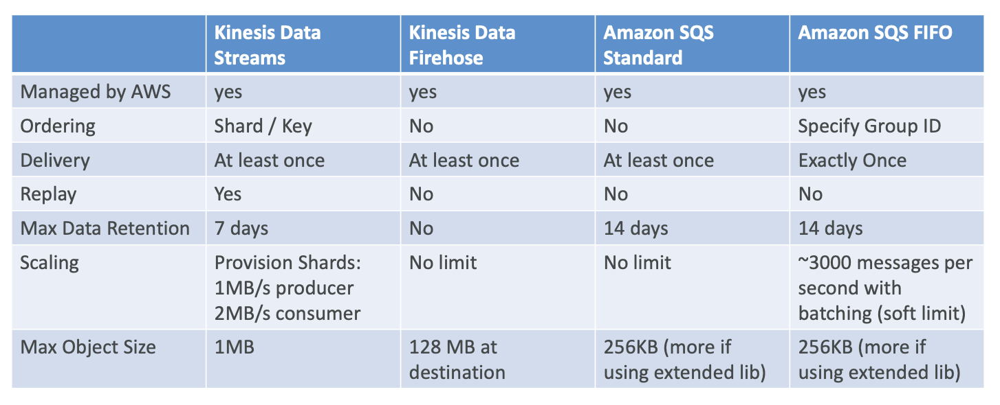

# AWS Big Data Specialty Exam Notes

Requirements:
1. Order history App
    1. Server logs 
    2. Amazon Kinesis Data Streams 
    3. AWS Lambda 
    4. Amazon DynamoDB
    5. Client App
2. Product Recommendations
    1. Server logs 
    2. Amazon Kinesis Data Firehose
    3. Amazon S3
    4. Amazon EMR
3. Predicting order quantities
    1. Server logs
    2. Amazon Kinesis Data Firehose
    3. Amazon S3
    4. Amazon ML / Sagemaker
4. Transaction Rate Alarm
    1. Server logs
    2. Amazon Kinesis Data Streams
    3. Amazon Kinesis Data Analytics
    4. Amazon Kinesis Data Streams
    5. AWS Lambda
    6. Amazon SMS
5. Near-real-time log analysis
    1. Server logs
    2. Amazon Kinesis Data Firehose
    3. Amazon Elasticsearch Service
6. Data warehousing & visualization
    1. Server logs
    2. Amazon Kinesis Data Firehose
    3. Amazon S3
        - Serverless
            1. AWS Glue
            2. Amazon Athena
        - Managaged
            1. Amazon Redshift
            2. Amazon QuickSight

---
# Collection

Real Time - Immediate Actions
- Kinesis Data Streams (KDS)
- Simple Queue Service (SQS)
- Internet of Things (IoT)

Near-real Time - Reactive Actions
- Kinesis Data Firehose (KDF)

Batch - Historical Analysis
- Snowball
- Data pipeline

## AWS Kinesis

Advantages:
- Similar to Apache Kafka
- Great for application logs, metrics, IoT, clickstreams
- Great for "real-time" big data
- Great for streaming processing frameworks (Spark, NiFi, etc...)
- Data is automatically replicated synchronously up to 3 AZ

Services:
1. Kinesis Streams: Low Latency streaming ingest at scale
2. Kinesis Analytics: Perform real-time analytics on streams using SQL
3. Kinesis Firehose: Load streams into S3, Redshift, ElasticSearch & Splunk

### 1. Kinesis Streams

</img>

- **What does a Kinesis Stream contain?** 
    - Multiple ordered Shards / Partitions
        1. Data retention is 24 hours by default, up to 7 days
        2. Producers load data into Shards
            - Can only produce 1MB per Shard OR 1,000 records/s per Shard (10 Shards $\rightarrow$ 10MB/s OR 10,000 records/s)
            - Else: `ProvisionedThroughputExceededException`
                - **How to deal with `ProvisionedThroughputExceededException`?**
                    - Prevention:
                        - Ensure you don't have a "hot shard" by choosing a good Record Key (Choosing a bad Record Key like device id (iphone, android, ...) such that 90% of devices are iphones and all iphone records go to a single shard)
                    - Solution:
                        1. Retries with Backoff (Retry after 2s, then retry after 4s, ...)
                        2. Increase Shards
            - **What are Kinesis Producer APIs?**
                1. Kinesis Producer SDK
                    - Write code to send data directly to Streams
                    - **How?**
                        - `PutRecord` (One record)
                        - `PutRecords` (Multiple records)
                            - Uses Batching and increases throughput $\because$ less HTTP requests (Send many records as part of one HTTP request)
                            - `ProvisionedThroughputExceededException` if limit exceeded
                    - Can be used on applications and mobile devices too
                    - Use case:
                        - low throughput
                        - high latency
                        - simple API
                        - Working straight from AWS Lambda
                    - Managed AWS Sources that use the Producer SDK behind the scenes:
                        - CloudWatch Logs
                        - AWS IoT
                        - Kinesis Data Analytics
                2. Kinesis Producer Library (KPL)
                    - Write better code (C++ / Java) to get enhanced throughput to streams
                    - Use Case:
                        - high performance
                        - long-running
                    - Automated and configurable retry mechanism in case of `ProvisionedThroughputExceededException`, while SDK has to deal with it yourself
                    - Synchronous and Asynchronous API (Async performs better)
                        - *KPL is the best way to send data asynchronously to Kinesis Data streams*
                    - Submits metrics to CloudWatch for monitoring
                        - Whenever you write application with KPL, you can monitor it directly in CloudWatch
                    - Supports Batching
                        - **How does it increase thoughput and decrease cost?**
                            1. Collect Records and Write to multiple Shards in the same PutRecords API call 
                            2. Aggregate - Increased Latency
                                - Capability to store multiple records in one record and go over 1,000 records/s limit
                                - Increase payload size to improve throughput, maximizing 1MB/s limit
                                - E.g. when we send a record of 2KB, KPL doesn't send it immediately. It waits and if another 40KB, and then 500KB record comes in, it'll then send it to maximize the 1MB limit / shard, hence aggregation. Once we have collected enough of these aggregated records, we can instead make a single `PutRecords` API call instead of multiple `PutRecord` API calls, hence collection.
                                - We can control how long KPL waits to Batch these records via setting `RecordMaxBufferedTime` which is by default 100ms (This introduces more latency because you're fixing the wait times, but increasing your batching efficiency)
                    - Compression must be implemented by user
                    - KPL Records must be decoded with KCL / special helper library (KPL Records can't be read through CLI)
                3. Kinesis Agent
                    - A Linux program (Java-based agent) that is installed and runs on Linux-based server environments to get log file and send to Streams
                    - Features:
                        - Write from multiple directories and multiple streams
                        - Routing based on directory / log file
                        - Preprocess data before sending to streams (convert csv to json, ...)
                        - Handles file rotation, checkpointing, retry upon failures, and emits metrics to CloudWatch because it uses the KPL Library
                    - Use Case:
                        - Aggregation of logs in mass in *almost* real timereal time
                4. Use 3rd party libraries
                    - Apache Spark
                    - Kafka Connect
                    - NiFi, etc...
        3. Consumers read in data from Shards
            - **What are Kinesis Consumers?**
                1. Consumer Classic:
                    - Records are polled by consumers from a shard
                        - **What are Kinesis Consumer APIs?**
                            1. Kinesis SDK
                                - **How?**
                                    - `GetRecords`
                                        - 2MB/s at read per Shard across all consumers
                                        - Returns up to 10MB of data per shard per call, but because limit is 2MB/s, it'll take 5s until you can make another `GetRecords` API call OR it'll return a maximum of 10,000 records per shard per call, meaning each record will need to be <1KB.
                                        - Maximum of 5 `GetRecords` API calls/s per Shard across all consumers $\rightarrow$ $\frac{1}{5}$s = 200ms latency (200ms on average for each of the 5 consumers to access a single shard)
                                            - If a call to GetRecords returns 10 MB, subsequent calls made within the next 5 seconds throw an exception.
                                        - Because we can only read 2MB = 2000KB per Shard per second, if we have 5 consumers, they'll each receive < 400KB per second.
                            2. Kinesis Client Library (KCL)
                                - Java-first library but supports other languages too
                                - Able to read KPL records (de-aggregating) which are specially encoded
                                - Share multiple shards with multiple consumers in one "group" via Shard Discovery Mechanism (Streams can be consumed by multiple applications acting as a group)
                                - Checkpointing feature 
                                    - Uses Amazon Dynamo DB table to checkpoint the progress over time and synchronize who's going to read which shard so that we can easily resume progress even when application is down (One row for each shard to consume from)
                                    - $\therefore$ we need to provision enough WCU (Write Capacity Units) and RCU (Read Capacity Units) or use On-demand Dynamo DB to make sure we have enough capacity for this feature.
                                        - *If there is insufficient capacity, DynamoDB will throttle and slow down KCL because it can't checkpoint fast enough and hence cannot consume fast enough*
                                    - Record Processors to process the data, making it convenient to treat messages one by one.
                            3. Kinesis Connector Library (Soon Deprecated)
                                - Older Java library, leverages KCL
                                - Use Case:
                                    - Write data to Amazon S3, DynamoDB, RedShift, ElasticSearch but Connector library must be running on an EC2 Instance that's sole purpose is to take data from streams and send to all these destinations
                                        - We can also do this with Kinesis Firehose or AWS Lambda
                            4. Use 3rd party libraries
                                - Apache Spark
                                - Kafka Connect
                                - NiFi, etc...
                            5. Kinesis Firehose
                            6. AWS Lambda
                                - Contains library to de-aggregate KPL Records, so can be used with KPL instead of KCL
                                - Configurable batch size to set how much data at a time Lmabda should read from Kinesis which helps to regulate throughput
                                - Use Case:
                                    - Run lightweight ETL to Amazon S3, DynamoDB, RedShift, ElasticSearch
                                    - Trigger notifications / send emails in real time
                2. Consumer Enhanced Fan-Out:
                    - 2MB/s at read per Shard per Enhanced Consumer
                    - No API calls needed (push model)
                    - Works with KCL 2.0 or AWS Lambda
                    - Either KCL 2.0 or AWS Lambda subscribes to the shard and the shard would automatically push data at 2MB/s
                        - $\therefore$ 20 consumers will receive 40MB/s in total 
                        - With the normal SDK, we're only getting 2MB per second per shard, but now we have 2MB per second per shard per consumer, so we'll have reduced latency and increased ability to scale.
                            - This is done by pushing data over HTTP/2
                            - We get 70ms latency on average compared to 200ms with normal SDK
                            - More expensive though
                            - Default limit of 5 consumers using enhanced fan-out / data stream
        4. Billing is per Shard
            - Batching
            - Per Record Calls
        5. Number of Shards can evolve over time (reshard / merge)
            - **What does each Shard contain?**
                - Records that are ordered per shard (Ordered inside the shard based on when they're received)
                - Each shard can support up to 5 API calls per second for reads, up to a maximum total data read rate of 2 MB per second and up to 1,000 records per second for writes, up to a maximum total data write rate of 1 MB per second (including partition keys).
                - **What do Kinesis Streams Records contain?**
                    1. Record / Partition Key
                        - Groups records in Shards 
                        - Same Key = Same Shard
                        - Uses a highly distributed key to avoid "hot partition" problem (All records does to the same shard)
                    2. Sequence Number
                        - Unique ID 
                            - Created by Kinesis after data has been injested
                    3. Data Blob
                        - Serialized as bytes, up to **1MB**
    - As long as the data is still retained, we can reprocess / replay the data as many times by as many applications as we want from the same stream
        - Real-time processing with scale of throughput
        - A temporary database that is immutable
        - Kinesis Resharding Operations:
            - Add Shards, AKA Shard Splitting
                - If we have a hot shard, we can split it into 2 so that instead of having a Stream capacity of 1MB/s per shard, we have double.
            - Merge Shards
                - Decrease Stream Capcity and save costs by grouping 2 shards with low traffic
            - Auto Scaling
                - Implement Auto-scaling with AWS Lambda to make API call to `UpdateShardCount`
            - Limitations:
                - Resharding cannot be done in parallel
                - Can only perform one resharding operation at a time
                - For 1,000 shards it'll take 8.3 hours to double
        - Kinesis Security:
            - Control access using IAM (Identity and Access Management) policies
            - Encryption in flight using HTTPS endpoints
            - Encryption at rest using KMS
            - Client side encryption must be manually implemented
            - Virtual Private Cloud (VPC) Endpoints available for Kinesis to access within VPC

### 2. Kinesis Firehose

</img>

- Fully Managed Service, no administration
- Near Real Time (60 seconds latency minimum for non full batches)
- Load data into Redshift / Amazon S3 / ElasticSearch / Splunk
- Automatic scaling
- Supports many data formats
- Data Conversions from JSON to Parquet / ORC (only for S3)
- Data Transformation through AWS Lambda (ex: CSV => JSON)
- Supports compression when target is Amazon S3 (GZIP, ZIP, and SNAPPY)
- Only GZIP is the data is further loaded into Redshift
- Pay for the amount of data going through Firehose
- Spark / KCL do not read from KDF

Firehose Input Sources:
- KPL
- Kinesis Agent
- Kinesis Data Streams
- CloudWatch Logs & Events
- IoT rules actions

Firehose Output Sources (ARES):
- Amazon S3
- Redshift
- ElasticSearch
- Splunk

1. Get data from input sources
2. Transform data with AWS Lambda
3. Source Records, Transformation failures, Delivery failures can all be stored into Amazon S3 buckets
4. Output to either one of the Output sources

Configuration:
- Firehose Buffer Sizing
    - Firehose accumulates records in a buffer
    - The buffer is flushed based on time and size rules
    - Buffer Size (ex: 32MB): if that buffer size is reached, it’s flushed
        - Min: 1MB
        - Max: 128MB
    - Buffer Time (ex: 2 minutes): if that time is reached, it’s flushed
        - Min: 60s
        - Max: 900s
        - *If you need to deliver data on a 1s basis, you'll need to use a Kinesis Streams, Firehose is only near real time*
    - Firehose can automatically increase the buffer size to increase
    throughput
    - High throughput => Buffer Size will be hit
    - Low throughput => Buffer Time will be hit
    
Kinesis Streams VS Firehose
- Streams
    - Going to write custom code (producer / consumer)
    - Real time (~200 ms latency for classic, ~70 ms latency for enhanced fan-out)
    - Must manage scaling (shard splitting / merging)
    - Data Storage for 1 to 7 days, replay capability, multi consumers
    - Use with Lambda to insert data in real-time to ElasticSearch (for example)
    - **Use Streams when you want to use KCL, SDK, Apache Spark for your application**
- Firehose
    - Fully managed, send to S3, Splunk, Redshift, ElasticSearch
    - Serverless data transformations with Lambda
    - Near real time (lowest buffer time is 1 minute)
    - Automated Scaling
    - No data storage
    - **Use Firehose when your primary goal is to take data and store it in a database because once you get the data you only have 1 option of what to do with it after transformation, which is to store it in 1 of the 4 supported databases**

---
# Order history App

Build mobile app accesss to a user being able to access a history of their order as on cadabra.com

1. Server logs 
2. Amazon Kinesis Data Streams
3. AWS Lambda 
4. Amazon DynamoDB
5. Client App

## Firehose Tutorial

We will first create fake orders using a python script and test out the processing of creating a delivery stream using Kinesis Firehose, afterwards we'll switch over to using Kinesis Data Streams which will cost actual money, but will be real-time rather than firehose which is near real time.

Overview:
$$\text{Create EC2 instance} \rightarrow \text{Create Fake Server Logs} \rightarrow \text{Create Firehose Delivery Stream and S3 Bucket} \rightarrow \text{Configure Kinesis Agent} \rightarrow \text{Check S3 Bucket}$$

1. Go to Firehose and create a new delivery stream, name it `"PurchaseLogs"`
2. Select which S3 bucket you want to store in or create new
3. Configure the buffer size (how much data you need to receive before you flush) / time (how fast you want to flush the data)
4. Create new IAM role and check policy document to see that we're granting permission to S3 and Lambda
5. Set up an EC2 instance to publish order information into firehose stream which will send it to S3
    1. Choose Amazon Linux AMI, not Linux 2 AMI because it comes with more pre-installed AWS tools
    2. Choose T2 Micro instance
    3. Create new key pair so that we can SSH directly to the instance
    4. Select the EC2 instance created and click `Connect`
        1. Open Terminal and `cd` to folder with `.pem` file
        2. Use command `chmod 400 BigData.pem` to make key not publicly viewable for SSH to work so only the root user can read it
        3. Use command `ssh -i "BigData.pem" ec2-user@ec2-18-138-248-72.ap-southeast-1.compute.amazonaws.com` to connect to the virtual server instance
        4. Run `sudo yum install -y aws-kinesis-agent` to install the Kinesis Client application so that we can actually send log data into Kinesis firehose
        5. Download the fake log data using `wget http://media.sundog-soft.com/AWSBigData/LogGenerator.zip`
        6. Unzip the file with `unzip LogGenerator.zip`
        7. Change permissions on the `.py` script so that all (`a`) can run / execute (`x`) it by `chmod a+x LogGenerator.py`
        8. Examine script in Terminal via `less LogGenerator.py`
        9. Examine `.csv` file via `less OnlineRetail.csv`
        10. Create log directory to put everything inside by `sudo mkdir /var/log/cadabra` (`cadabra` is the fake name of our company)
        11. Configure Kinesis to write our stuff into there
            1. `cd /etc/aws-kinesis/`
            2. `sudo nano agent.json` to access config file for Kinesis agent, one of the Producer APIs
            3. We need a public key and secret access key to get into account from that agent
                1. Go to IAM console
                2. Create new user
                    - Set username
                    - Check `Programmatic access`
                    - Attach existing policies directly and next
                    - Skip Adding the tag
                    - Get Access key ID and Secret access key
            4. Add `"awsAccessKeyId": "XXXXXX", "awsSecretAccessKey": "XXXXXX",` between `firehose.endpoint` and `flows`
            5. Specify Firehose endpoint `"firehose.endpoint": "firehose.ap-southeast-1.amazonaws.com"`
            6. Add a flow for Kinesis firehose
                - We want a delivery stream, so we can delete `{"filePattern": "/tmp/app.log*","kinesisStream": "yourkinesisstream", "partitionKeyOption": "RANDOM"},`
                - Change `"filePattern"` to `"/var/log/cadabra/*.log"`
                - Change `"deliveryStream"` to `"PurchaseLogs"`
            7. Write out, Enter, Exit out of Nano
            8. So everything is now configured properly to actually monitor our var log cadabra folder and any new data that the Kinesis agent finds is going to shove into Kinesis firehose which in turn will shove it into S3 for us.
            9. Start Kinesis Agent with `sudo service aws-kinesis-agent start`
            10. Configure so that Kinesis Agent starts up automatically when we start our instance here by `sudo chkconfig aws-kinesis-agent on`
            11. `cd ~` back to home directory
            12. `sudo ./LogGenerator.py 500000` to generate 500,000 orders in our log directory and see if it successfully puts it in S3
            13. `cd /var/log/cadabra` to check if a log file exists
            14. Let's take a look at what Kinesis is doing to monitor its progress by `tail -f /var/log/aws-kinesis-agent/aws-kinesis-agent.log`
            15. When it says `Progress: 500000 records parsed, and 500000 records sent successfully...`, we're done
            16. Control + C to get out and check if data is in S3 on the website
                - You should see the data in chunks of either 5MB or come in every 60s which was what we set our buffer conditions to
                
## Amazon Kinesis Data Streams

1. Create Kinesis Stream called `CadabraOrders`
2. Choose Number of Shards to be 1 and create the stream (**Billing has started**)
    - Remember that for 1 Shard, Write: 1MB/s & 1000 Records/s, Read: 2MB/s
3. `cd /etc/aws-kinesis/`
4. `sudo nano agent.json`
    - Add a new flow and tell client to convert CSV data into JSON by inserting `{"filePattern": "/var/log/cadabra/*.log","kinesisStream": "CadabraOrders","partitionKeyOption": "RANDOM","dataProcessingOptions": [{"optionName": "CSVTOJSON","customFieldNames": ["InvoiceNo", "StockCode", "Description", "Quantity", "InvoiceDate", "UnitPrice", "Customer", "Country"]}]}, ` above the old flow
    - The Agent will wait for the logs to come in
    - It will partition the logs randomly to evenly distribute the processing of that data and we will specify `dataProcessingOptions` to use `CSVTOJSON` and also the fieldnames
5. Restart the agent by `sudo service aws-kinesis-agent restart`
6. `cd ~` back to home
7. `sudo ./LogGenerator.py`
8. `cd /var/log/cadabra` and `tail -f /var/log/aws-kinesis-agent/aws-kinesis-agent.log`
    - Now we're processing and sending the log data to both Kinesis Data Streams and also Firehose

---
# AWS Simple Queue Service (SQS)

Producers send messages to SQS Queue and Consumers poll messages from SQS Queue

Producing Messages
- Oldest offering (over 10 years old)
- Fully managed
- Scales from 1 message per second to 10,000s per second
- Default retention of messages: 4 days, maximum of 14 days
- No limit to how many messages can be in the queue
- Low latency (<10 ms on publish and receive)
- Horizontal scaling in terms of number of consumers
- Can have duplicate messages (at least once delivery, occasionally)
- Can have out of order messages (best effort ordering)
- Limitation of 256KB per message sent

**What is inside a Producing Message?**
- Define Message Body (Strings of 256KB as opposed to Records which are serialized as bytes of 1MB)
- Add message attributes (metadata - optional)
- Provide Delay Delivery (optional)
- Get back
    - Message identifier
    - MD5 hash of the body
    
Consuming Messages
- Poll SQS for messages (receive up to 10 messages at a time)
- Process the message within the visibility timeout
- Delete the message using the message ID & receipt handle
    - **Once messages are consumed, they will be deleted**

AWS SQS - FIFO Queue
- Newer offering (First In First out)
- not available in all regions!
- Name of the queue must end in .fifo
- Lower throughput (up to 3,000 per second with batching, 300/s without)
- Messages are processed in order by the consumer
- Messages are sent exactly once • 5-minute interval de-duplication using “Duplication ID”

**How to circumvent 256KB limit?**
SQS Extended Client
- Message size limit is 256KB, how to send large messages?
- Using the SQS Extended Client (Java Library)
    - Send large message to S3 and small metadata about the message to SQS Queue
    - Consume the small meta data though SQS Queue and based on that information, retrieve the data from S3
    
AWS SQS Use Cases
- Decouple applications (for example to handle payments asynchronously)
- Buffer writes to a database (for example a voting application)
- Handle large loads of messages coming in (for example an email sender)
- SQS can be integrated with Auto Scaling through CloudWatch!

SQS Limits
- Maximum of 120,000 in-flight messages being processed by consumers
- Batch Request has a maximum of 10 messages – max 256KB
- Message content is XML, JSON, Unformatted text
- Standard queues have an unlimited TPS
- FIFO queues support up to 3,000 messages per second (using batching)
- Max message size is 256KB (or use Extended Client)
- Data retention from 1 minute to 14 days
- Pricing:
    - Pay per API Request
    - Pay per network usage
    
AWS SQS Security
- Encryption in flight using the HTTPS endpoint
- Can enable SSE (Server Side Encryption) using KMS • Can set the CMK (Customer Master Key) we want to use • SSE only encrypts the body, not the metadata (message ID, timestamp, attributes)
- IAM policy must allow usage of SQS
- SQS queue access policy
    - Finer grained control over IP
    - Control over the time the requests come in
    
Kinesis Data Stream vs SQS
- Kinesis Data Stream:
    - Data can be consumed many times
    - Data is deleted after the retention period
    - Ordering of records is preserved (at the shard level) – even during replays
    - Build multiple applications reading from the same stream independently (Pub/Sub)
    - “Streaming MapReduce” querying capability
    - Checkpointing needed to track progress of consumption
        - check pointing feature that you can use with the KCL that interacts with DynamoDB
    - Shards (capacity) must be provided ahead of time
        - Shard splitting and merging to increase / decrease capacity
    - **Max Payload Size: 1MB**
- SQS:
    - Queue, decouple applications
    - One application per queue
    - Records are deleted after consumption (ack / fail)
    - Messages are processed independently for standard queue $\therefore$ no guarantee of order
    - Ordering for FIFO queues
        - But decreased throughput up to 3,000 messages/s
    - Capability to “delay” messages
    - Dynamic scaling of load (noops)
    - **Max Payload Size: 256KB**
    
</img>

SQS Use cases :
- Order processing
- Image Processing
- Auto scaling queues according to messages
- Buffer and Batch messages for future processing
- Request Offloading

Amazon Kinesis Data Streams Use cases :
- Fast log and event data collection and processing
- Real Time metrics and reports
- Mobile data capture
- Real Time data analytics
- Gaming data feed
- Complex Stream Processing
- Data Feed from “Internet of Things”

---
# AWS IOT

Workflow for linking IoT device with AWS
- An IoT device is first registered into the "Thing Registry".
- IoT device uses the "Device Gateway" to communicate with AWS cloud
- When events happen in the IoT device, messages are sent to the "IoT Message Broker"
- "IoT Message Broker" then sends the messages to the "IoT Rules Engine" which will then send the data to Kinesis, SQS, Lambda, ... and / or return Rule Actions on what to do
- A "Device Shadow" tracks those messages if the IoT device is not currently online and will send those messages when it comes online

IoT Device Gateway
- Serves as the entry point for IoT devices connecting to AWS
- Allows devices to securely and efficiently communicate with AWS IoT
- Supports the MQTT, WebSockets, and HTTP 1.1 protocols
- Fully managed and scales automatically to support over a billion devices
- No need to manage any infrastructure

Rules Engine
- Rules are defined on the MQTT topics
- Rules = when it’s triggered | Action = what is does
- Rules use cases:
- Augment or filter data received from a device
- Write data received from a device to a DynamoDB database
- Save a file to S3
- Send a push notification to all users using SNS
- Publish data to a SQS queue
- Invoke a Lambda function to extract data
- Process messages from a large number of devices using Amazon Kinesis
- Send data to the Amazon Elasticsearch Service
- Capture a CloudWatch metric and Change a CloudWatch alarm
- Send the data from an MQTT message to Amazon Machine Learning to make predictions based on an Amazon ML model & more Rules need IAM Roles to perform their actions
    - **When exam asks how to get IoT devices to send data to Kinesis, never directly put a record on the device, but send it to the IoT topic and define a rule action to send data all the way to Kinesis**

---
# Database Migration Service

Quickly and securely migrate databases to AWS, resilient, self healing
- The source database remains available during the migration
- Supports:
    - Homogeneous migrations: ex Oracle to Oracle
    - Heterogeneous migrations: ex Microsoft SQL Server to Aurora
- Continuous Data Replication using CDC
- You must create an EC2 instance to perform the replication tasks

DMS Sources and Targets

SOURCES:
- On-Premise and EC2 instances databases: *Oracle, MS SQL Server, MySQL, MariaDB, PostgreSQL, MongoDB, SAP, DB2*
- Azure: Azure SQL Database
- Amazon RDS: all including Aurora
- Amazon S3

TARGETS:
- On-Premise and EC2 instances databases: *Oracle, MS SQL Server, MySQL, MariaDB, PostgreSQL, SAP*
- Amazon RDS
- Amazon Redshift
- Amazon DynamoDB
- Amazon S3
- ElasticSearch Service
- Kinesis Data Streams
- DocumentDB

AWS Schema Conversion Tool (SCT):
- Convert your Database’s Schema from one engine to another

---
# Direct Connect

Sets up the networking between your on-premise infrastructure into your VPC on a private dedicated connection
- Allows you to have a dedicated 10Gbps network connection which would allow you to transfer data very quickly from your on-premise environment to AWS Cloud

---
# Snowball

Physical data transport solution that helps moving TBs or PBs of data in or out of AWS

---
# Collections

1. You are accumulating data from IoT devices and you must send data within 10 seconds to Amazon ElasticSearch service. That data should also be consumed by other services when needed. Which service do you recommend using?
    - Kinesis Data Streams

2. You need a managed service that can deliver data to Amazon S3 and scale automatically for you. You want to be billed only for the actual usage of the service and be able to handle peak loads. Which service do you recommend?
    - Kinesis Data Firehose

3. You are sending a lot of 100B data records and would like to ensure you can use Kinesis to receive your data. What should you use to ensure optimal throughput, that has asynchronous features ?
    - KPL Through batching (collection and aggregation), we can achieve maximum throughput using the KPL. KPL is also supporting an asynchronous API
    
    
4. You would like to collect log files in mass from your Linux servers running on premise. You need a retry mechanism embedded and monitoring through CloudWatch. Logs should end up in Kinesis. What will help you accomplish this?
    - Kinesis Agent
    
  
5. You would like to perform batch compression before sending data to Kinesis, in order to maximize the throughput. What should you use?
    - KPL + Implement Compression Yourself
    
    
6. You have 10 consumers applications consuming concurrently from one shard, in classic mode by issuing GetRecords() commands. What is the average latency for consuming these records for each application?
    - You can issue up to 5 GetRecords API calls per second, so it'll take 2 seconds for each consuming application before they can issue their next call
    

7. You have 10 consumers applications consuming concurrently from one shard, in enhanced fan out mode. What is the average latency for consuming these records for each application?
    - here, no matter how many consumers you have, in enhanced fan out mode, each consumer will receive 2MB per second of throughput and have an average latency of 70ms
    
    
8. You would like to have data delivered in near real time to Amazon ElasticSearch, and the data delivery to be managed by AWS. What should you use?
    - Kinesis Firehose
    
    
9. You are consuming from a Kinesis stream with 10 shards that receives on average 8 MB/s of data from various producers using the KPL. You are therefore using the KCL to consume these records, and observe through the CloudWatch metrics that the throughput is 2 MB/s, and therefore your application is lagging. What's the most likely root cause for this issue?
    - Because it's under provisioned, checkpointing does not happen fast enough and results in a lower throughput for your KCL based application. Make sure to increase the RCU / WCU
    
    
10. You would like to increase the capacity of your Kinesis streams. What should you do?
    - Split Shards, else implement your own auto-scaling with Lambda
    
    
11. Which of the following statement is wrong?
    - Spark Streaming can read from Firehose (Firehose supports output to only 4 things ARES - Amazon S3 Redshift ElasticSearch Splunk)
    
    
12. Which of the following Kinesis Data Firehose does not write to?
    - DynamoDB
    
    
13. You are looking to decouple jobs and ensure data is deleted after being processes. Which technology would you choose?
    - SQS
    
    
14. You are collecting data from IoT devices at scale and would like to forward that data into Kinesis Data Firehose. How should you proceed?
    - Send data into an IoT topic and define a rule action
    
    
15. Which protocol is not supported by the IoT Device Gateway?
    - FTP (MQTT, Websockets, HTTP are supported)
    
    
16. You would like to control the target temperature of your room using an IoT thing thermostat. How can you change its state for target temperature even in the case it's temporarily offline?
    - That's precisely the purposes of the device shadow, which gets synchronized with the device when it comes back online
    
    
17. You are looking to continuously replicate a MySQL database that's on premise to Aurora. Which service will allow you to do so securely?
    - DMS is fully secure
    
    
18. You have setup Direct Connect on one location to ensure your traffic into AWS is going over a private network. You would like to setup a failover connection, that must be as reliable and as redundant as possible, as you cannot afford to be down for too long. What backup connection do you recommend?
    - Site to Site VPN. Although this is not as private as another Direct Connect setup, it is definitely more reliable as it leverages the public web. It is the correct answer here
    
  
19. You would like to transfer data in AWS in less than two days from now. What should you use?
    - Use the Public Internet

---
## Resources:

- [Kinesis Data Streams](https://docs.aws.amazon.com/streams/latest/dev/key-concepts.html)

