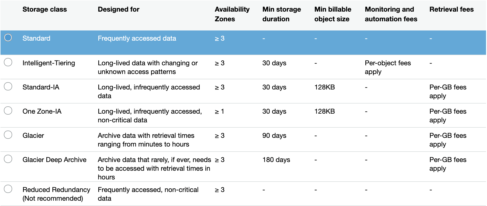

# AWS Big Data Specialty Exam Notes

Requirements:
1. Order history App
    1. Server logs 
    2. Amazon Kinesis Data Streams 
    3. AWS Lambda 
    4. Amazon DynamoDB
    5. Client App
2. Product Recommendations
    1. Server logs 
    2. Amazon Kinesis Data Firehose
    3. Amazon S3
    4. Amazon EMR
3. Predicting order quantities
    1. Server logs
    2. Amazon Kinesis Data Firehose
    3. Amazon S3
    4. Amazon ML / Sagemaker
4. Transaction Rate Alarm
    1. Server logs
    2. Amazon Kinesis Data Streams
    3. Amazon Kinesis Data Analytics
    4. Amazon Kinesis Data Streams
    5. AWS Lambda
    6. Amazon SMS
5. Near-real-time log analysis
    1. Server logs
    2. Amazon Kinesis Data Firehose
    3. Amazon Elasticsearch Service
6. Data warehousing & visualization
    1. Server logs
    2. Amazon Kinesis Data Firehose
    3. Amazon S3
        - Serverless
            1. AWS Glue
            2. Amazon Athena
        - Managaged
            1. Amazon Redshift
            2. Amazon QuickSight


---
# Storage

## AWS S3 Overview
- Buckets
    - Must define a globally unique name
    - Defined at region level
- Objects
    - No concept of directories but UI can contain slashes to make it seem like theres a directory hierarchy
    - Max size of object is 5TB
    - Uploading more than 5GB should use "multi-part upload"
- Consistency Model
    - As soon as you write an object you can retrieve it unless you first make a `GET` request for the non-existent object, then `PUT` it, and then try to `GET` it again, but will eventually be consistent
    - Eventual consistency for `DELETES` and `PUTS` of existing objects
        - If read an object after updating we might get the old version
        - If we delete object we might still be able to retrieve it for a short time
- S3 Storage Tier
</img>
- S3 Lifecycle Rules
    - Set of rules to move data between different tiers, to save storage cost
    - Example: General Purpose => Infrequent Access => Glacier
    - Transition actions: 
        - It defines when objects are transitioned to another storage class. Eg: We can choose to move objects to Standard IA class 60 days after you created them or can move to Glacier for archiving after 6 months
    - Expiration actions: 
        - Helps to configure objects to expire after a certain time period. S3 deletes expired objects on our behalf Eg: Access log files can be set to delete after a specified period of time, Moving to Glacier is helpful for backup / long term retention / regulatory needs
- S3 Versioning
    - When a new object is added it'll get a version of null which will be overidden when the latest same object is added
- S3 Cross-Region Replication
    - Go to `Management > Replication` and add a new Rule to choose replicating data from one S3 Bucket into another in a different region so that team-mates in a different region can access it quick.
    - The replication happens asynchronously.
- S3 Entity Tag
    - It is an MD5 Hash of the object stored in S3. You can verify that all your objects are the same if they have the exact same ETag.
- S3 Performance
    - Historically, randomizing prefixes for your object names help to better performance so that S3 can partition the best
    - Recently, S3's request rate has increased and now requires no need to randomize object prefices to achive faster performance.
    - For objects that are >5GB, use multipart upload
        - Parallelizes `PUT`s for greater throughput
        - Maximize netowrk bandwidth
        - Decrease time to retry
    - Use CloudFront to cache S3 objects around the world (improves  reads)
    - S3 Transfer Acceleration (uses edge locations) – just need to change the endpoint you write to, not the code.
    - If using SSE-KMS encryption, you may be limited to your AWS limits for KMS usage (~100s – 1000s downloads / uploads per second)
- S3 Encryption
    - Server Side Encryption (SSE) -S3: encrypts S3 objects using keys handled & managed by AWS
    - SSE-KMS: leverage AWS Key Management Service to manage encryption keys
    - SSE-C: when you want to manage your own encryption keys
        - HTTPS must be used
        - Encryption key must provided in HTTP headers, for every HTTP request made
    - Client Side Encryption 
        - Client is responsible for both  encrypting and decrypting objects
- S3 Security
    - S3 Cross-Origin Resource Sharing (CORS)
        - If you request data from another website, you need to enable CORS
        - Cross Origin Resource Sharing allows you to limit the number of websites that can request your files in S3 (and limit your costs)
    - S3 Access Logs
    - Security
        - User based
            - IAM policies - which API calls should be allowed for a specific user from IAM console
        - Resource Based
            - Bucket Policies - bucket wide rules from the S3 console - allows cross account
            - Object Access Control List (ACL) – finer grain
            - Bucket Access Control List (ACL) – less common
- S3 Glacier
    - Low cost object storage meant for archiving / backup
    - Data is retained for the longer term (10s of years)
    - Alternative to on-premise magnetic tape storage 
    - Average annual durability is 99.999999999%
    - Cost per storage per month (0.004 / GB) + retrieval cost
    - Each item in Glacier is called “Archive” (up to 40TB)
    - Archives are stored in ”Vaults”
    - Exam tip: archival from S3 after XXX days => use Glacier
    - Vault Policies (similar to Bucket Policies that control who can have access)
    - Vault Locks (Specify a rule that can never be changed for compliance and regulation purposes)

## AWS DynamoDB Overview
- Primary Keys
    - Can use only a partition key (HASH) or both partition key and sort key
    - E.g. Out of movie_id, producer_name, leader_actor_name, movie_language, the movie_id would be the most suitable for a partition key because it has the highest cardinality
- Common use cases include:
    - Mobile apps
    - Gaming
    - Digital ad serving
    - Live voting
    - Audience interaction for live events
    - Sensor networks
    - Log ingestion
    - Access control for web-based content
    - Metadata storage for Amazon S3 objects
    - E-commerce shopping carts
    - Web session management
- Anti Pattern (When DynamoDB is a bad choice)
    - Prewritten application tied to a traditional relational database: use RDS instead
    - Joins or complex transactions
    - Binary Large Object (BLOB) data: store data in S3 & metadata in DynamoDB
    - Large data with low I/O rate: use S3 instead
    - Use DynamoDB when data is hot and you need to read from it consistently and fast
- Provisioned Throughput
    - RCU
    - WCU
- Can only query the partition key and sort key, cannot search by whether a feature = to a certain value
    - Unless we define a Local Secondary Index but this must be done when table is created.
    - We can also define a Global Secondary Index by going to `Indexes > Create Index`. This creates a new table but with a different primary key that you specify so that we have an alternative way of querying the table. We must define RCU and WCU for this though.
- DynamoDB Accelerator (DAX)
    - Solves hot partition key problem (too many reads on a single partition when a bad partition key is chosen)
    - Use it if you have high read throughput and most reads are always the same in this case it's really nice because recent reads are cached.
- DynamoDB Streams (Similar to Kinesis Streams)
    - Used with Lambda to react to changes in table like when a new user is added, we can use this change to send a welcome email using lambda
    - Can use the KCL to consume from this stream by adding a Kinesis Adapter library 
        - Alternative to using AWS Lambda
- DynamoDB TTL (Time to Live)
    - Service inside DyanmoDB
    - Used to automatically delete items after their specified expiry data (maybe for regulation purposes like user data will be deleted after 7 days)
    - Can recover deleted items within 24 hours from DynamoDB Streams
        1. Create epoch number from date to expire item
        2. Edit the item in DynamoDB with a new attribute of type number called `expire_on`
        3. Go to `Overview` in console and click `Manage TTL` beside `Time to live attribute`
        4. Type in which column to use for expiry, `expire_on`
- DynamoDB Security


---
# Order History App Continued

1. Create new DynamoDB table
    - Table name: `CadabraOrders`
    - Partition key: `CustomerID`, Number
    - Sort key: `OrderID`, String
2. Login to EC2 Instance
    1. `sudo pip install boto3`
    2. Create Credentials file so that Boto3 knows how to log in to AWS using your account credentials and what region it will be in
        - `cd ~`
        - `mkdir .aws` and `cd .aws/`
        - `nano credentials`
        - Type `[default]`
        - Below that, type `aws_access_key_id=XXXXXX`
        - Below that, type `aws_secret_access_key=XXXXXX`
        - Control + O, Enter, Control + X
    3. Create Configuration file
        - `nano config`
        - Type `[default]`
        - Below that, type `region=southeast-1`
        - Control + O, Enter, Control + X
        - `cd ~`
    4. Download consumer script (A python script that will continuously run, waiting to consume from a specified Kinesis Data Stream)
        - `wget http://media.sundog-soft.com/AWSBigData/Consumer.py`
        - `nano Consumer.py` to see that we're importing boto3 and creating a client for Kinesis that is connected to `CadabraOrders` Kinesis stream we created earlier and also a client for DynamoDB that's tied to CadabraOrders table. 
        - We then sit in a loop until we get new records from Kinesis from CadabraOrders Stream
            - If a new record is found, it parses out all the information that was already in JSON form after the Kinesis Agent comnverted everything from CSVTOJSON in the `datapreprocssing` options
            - Create fake `OrderID` for our unique sort key in DynamoDB
    5. Make script executable by `chmod a+x Consumer.py`
    6. `./Consumer.py` (Waiting for log data to come in from Kinesis Agent)
    7. Open new Terminal and login to same EC2 instance, run `sudo ./LogGenerator.py 10` to start creating the fake orders, Kinesis Agent (Producer), configured in `agent.json`, will send the records to the Shards in our Kinesis Data Stream, CadabraOrders, and also Firehose (specified in the `flow` attribute in `agent.json`) which the running `Consumer.py` script will consume from the data stream
    8. Check the DynamoDB table to see the new orders that have come in
    9. We will later convert `Consumer.py` into a AWS Lambda function

### Consumer.py
```python
#!/usr/bin/python

import boto3
import time
import json
import decimal

# Kinesis setup
kinesis = boto3.client("kinesis")
shard_id = "shardId-000000000000" 
# Configures which delivery stream we're listening to: Kinesis Data Streams (CadabraOrders)
pre_shard_it = kinesis.get_shard_iterator(StreamName="CadabraOrders", ShardId=shard_id, ShardIteratorType="LATEST")
shard_it = pre_shard_it["ShardIterator"]

# DynamoDB setup
dynamodb = boto3.resource('dynamodb')
table = dynamodb.Table('CadabraOrders')

while 1==1:
	out = kinesis.get_records(ShardIterator=shard_it, Limit=100)
	for record in out['Records']:
		print record
		data = json.loads(record['Data'])
		if (data['Customer'].isdigit()):
			invoice = data['InvoiceNo']
			customer = int(data['Customer'])
			orderDate = data['InvoiceDate']
			quantity = data['Quantity']
			description = data['Description']
			unitPrice = data['UnitPrice']
			country = data['Country'].rstrip()
			stockCode = data['StockCode']

			# Construct a unique sort key for this line item
			orderID = invoice + "-" + stockCode

			response = table.put_item(
				Item = {
					'CustomerID': decimal.Decimal(customer),
					'OrderID': orderID,
					'OrderDate': orderDate,
					'Quantity': decimal.Decimal(quantity),
					'UnitPrice': decimal.Decimal(unitPrice),
					'Description': description,
					'Country': country
				}
			)

	shard_it = out["NextShardIterator"]
	time.sleep(1.0)
```


---
# AWS ElastiCache

Overview
- Just like how we use AWS Relational Database Service (RDS) to get a managed relational database, we use ElastiCache to get and manage Redis / Memcached

Redis
- Redis is an in-memory key-value store
- Super low latency (sub ms)
- Cache survive reboots by default (it’s called persistence)
- Great to host
- User sessions
- Leaderboard (for gaming)
- Distributed states
- Relieve pressure on databases (such as RDS)
- Pub / Sub capability for messaging
- Multi AZ with Automatic Failover for disaster recovery if you don’t want to lose your cache data
- Support for Read Replicas


---
# Storage Quiz

1. Your big data application is taking a lot of files from your local on-premise NFS storage and inserting them into S3. As part of the data integrity verification process, the application downloads the files right after they've been uploaded. What will happen?
    - The application will receive a 200 as S3 for new `PUT` is strongly consistent
    - Read after write consistency for PUTS of new objects
    - As soon as an object is written, we can retrieve it
        - ex: (PUT 200 -> GET 200)
    - This is true, except if we did a GET before to see if the object existed
        - ex: (GET 404 -> PUT 200 -> GET 404) – eventually consistent


2. You are gathering various files from providers and plan on analyzing them once every month using Athena, which must return the query results immediately. You do not want to run a high risk of losing files and want to minimise costs. Which storage type do you recommend?
    - S3 Infrequent Access (Critical Data), use 1 zone for Non-critical


3. As part of your compliance as a bank, you must archive all logs created by all applications and ensure they cannot be modified or deleted for at least 7 years. Which solution should you use?
    - Glacier with Vault Lock Policy


4. You are generating thumbnails in S3 from images. Images are in the images/ directory while thumbnails in the thumbnails/ directory. After running some analytics, you realized that images are rarely read and you could optimise your costs by moving them to another S3 storage tiers. What do you recommend that requires the least amount of changes?
    - Create a Lifecycle Rule for the images/prefix so that they can become Infrequent Access after a period of time when they aren't used


5. In order to perform fast big data analytics, it has been recommended by your analysts in Japan to continuously copy data from your S3 bucket in us-east-1. How do you recommend doing this at a minimal cost?
    - Enable Cross Region Replication


6. Your big data application is taking a lot of files from your local on-premise NFS storage and inserting them into S3. As part of the data integrity verification process, you would like to ensure the files have been properly uploaded at minimal cost. How do you proceed?
    - Compute the local ETag using the MD5 Hash algo for each file and compare them with AWS S3's ETag


7. Your application plans to have 15,000 reads and writes per second to S3 from thousands of device ids. Which naming convention do you recommend?
    - <device-id>/yyyy-mm-dd/...
    - you get about 3k reads per second per prefix, so using the device-id will help having many prefixes and parallelize your writes


8. You are looking to have your files encrypted in S3 and do not want to manage the encryption yourself. You would like to have control over the encryption keys and ensure they're securely stored in AWS. What encryption do you recommend?
    - SSE-KMS


9. Your website is deployed and sources its images from an S3 bucket. Everything works fine on the internet, but when you start the website locally to do some development, the images are not getting loaded. What's the problem?
    - S3 Cross Origin Resource Sharing


10. What's the maximum number of fields that can make a primary key in DynamoDB?
    - 2 (Partition Key + Sort Key)


11. What's the maximum size of a row in DynamoDB ?
    - 400KB


12. You are writing item of 8 KB in size at the rate of 12 per seconds. What WCU do you need?
    - 8 * 12 = 96 WCU


13. You are doing strongly consistent read of 10 KB items at the rate of 10 per second. What RCU do you need?
    - 10 KB gets rounded to 12 KB, divided by 4KB = 3, times 10 per second = 30 RCU


14. You are doing 12 eventually consistent reads per second, and each item has a size of 16 KB. What RCU do you need?
    - we can do 2 eventually consistent reads per seconds for items of 4 KB with 1 RCU
    - $\frac{12}{2} + \text{ceil(}\frac{16}{4}\text{)} = 24$ RCU


15. We are getting a ProvisionedThroughputExceededExceptions but after checking the metrics, we see we haven't exceeded the total RCU we had provisioned. What happened?
    - We have a hot partition / hot key
    - remember RCU and WCU are spread across all partitions


16. You are about to enter the Christmas sale and you know a few items in your website are very popular and will be read often. Last year you had a ProvisionedThroughputExceededException. What should you do this year?
    - Create a DAX Cluster


17. You would like to react in real-time to users de-activating their account and send them an email to try to bring them back. The best way of doing it is to...
    - Integrate Lambda with a DynamoDB stream


18. You would like to have DynamoDB automatically delete old data for you. What should you use?
    - Use TTL


19. You are looking to improve the performance of your RDS database by caching some of the most common rows and queries. Which technology do you recommend?
    - ElastiCache


---
## Resources:


