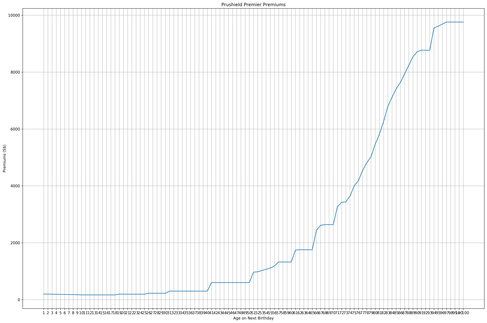
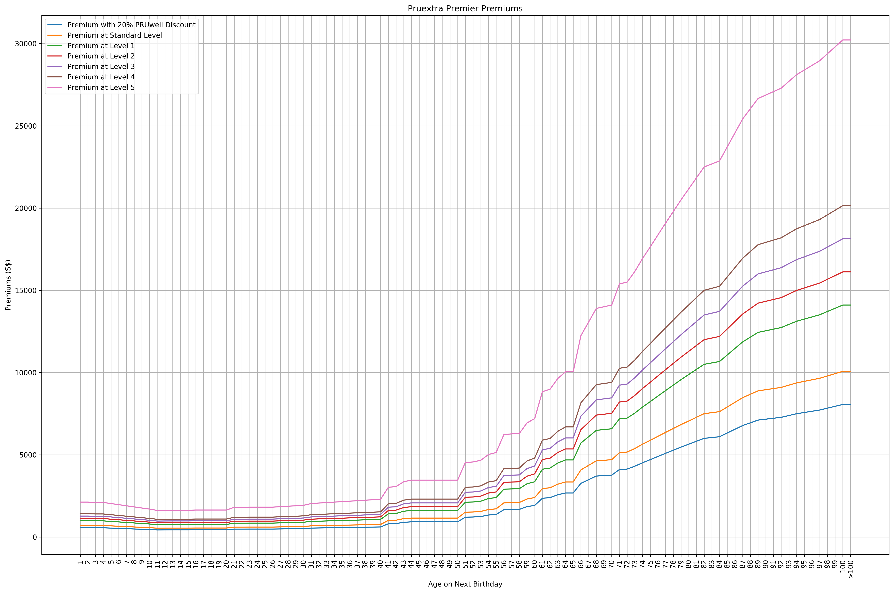

# Prudential Insurance


<div markdown="1" class="cell code_cell">
<div class="input_area" markdown="1">
```python
# import libraries
# General Utilities for Web Scraping
import re
import sys
import os
from os import listdir
from os.path import isfile, join, isdir
import requests
import urllib.request
import time
from bs4 import BeautifulSoup
from tqdm import tqdm
from datetime import date, datetime
from dateutil import relativedelta
import csv
import json
import collections
from collections import defaultdict
from collections import Counter

# Read pdf modules
from tabula import wrapper
from pdfminer import pdfparser
from PyPDF2 import PdfFileReader
from io import BytesIO
import pdftables_api
pdftables_api_key = 'l8xmb9y624xz' # API Key to use pdftables_api

# Machine Learning Utitilies
import numpy as np
import pandas as pd
import matplotlib
import matplotlib.pyplot as plt
import matplotlib.cm as cm
import matplotlib.font_manager as fm
import matplotlib.patches as mpatches
from mpl_toolkits.axes_grid1.anchored_artists import AnchoredSizeBar
import seaborn as sns

# plotting defaults
plt.rcParams['figure.dpi'] = 300
plt.rcParams['figure.figsize'] = (18, 12)
get_colors = lambda length: plt.get_cmap('Spectral')(np.linspace(0, 1.0, length))

```
</div>

</div>


<div markdown="1" class="cell code_cell">
<div class="input_area" markdown="1">
```python
plt.rcParams['figure.dpi'] = 300
plt.rcParams['figure.figsize'] = (18, 12)

```
</div>

</div>


---
## Questions:

- How long is a policy year?
- None of these plans cover non-emergency overseas treatment right? Nope
- How long after signing can I make my first claim?
    - Almost immendiately when the policy is enforced
        - Accident & Emergency but no hospitalization have to manually claim
        - just tell her then manually claim 
- What’s the flexibility like in adding the supplementary plans and downgrading / upgrading my integrated shield plans?
    - Just simply downgrade through a form, but upgrading is very hard
- Is the Claims-based pricing only for the **PRU**extra Premier CoPay Supplementary Plan?
- When they say up to ${\$1,750}$ per policy year for PRUextra Premier Lite CoPay, they mean ${\$1,750}$ is the max they will pay per policy year?


---
## Premiums:

Restructured & Private:
- PRUshield Premier 
- Supplementary Plans
    1. PRUextra Premier CoPay
    2. PRUextra Premier Lite Copay


### Extract Data from Prudential Hospitalization Insurance policies


<div markdown="1" class="cell code_cell">
<div class="input_area" markdown="1">
```python
# # Links to the pdf for Prudential 
# # Integrated Shield & CoPay premiums
# prushield_premium_url = 'https://www.prudential.com.sg/-/media/prudential/pdf/ebrochures/prushieldpremiumstable_reprice.ashx?la=en&hash=120774C051686BA41B7C034B8B50130F33DCECE53EF72DCCA7BF52E256AF9BDF'
# pruextra_premium_url = 'https://www.prudential.com.sg/-/media/prudential/pdf/ebrochures/prushieldpremiumstable_copay.ashx?la=en&hash=E708BDE7B4AACDA28998E9E33C6741990EE31C034F130CC4DABCDCD8A83D8320' 

```
</div>

</div>


<div markdown="1" class="cell code_cell">
<div class="input_area" markdown="1">
```python
# # Save the online pdfs to pdfs 
# # on local machine
# prushield_premium_res = requests.get(prushield_premium_url)
# if prushield_premium_res.ok:
#     open('./data/prushield_premium.pdf', 'wb') \
#         .write(prushield_premium_res.content)
# else:
#     print('Failed to request {}'.format(prushield_premium_url))
    
# pruextra_premium_res = requests.get(pruextra_premium_url)
# if pruextra_premium_res.ok:
#     open('./data/pruextra_premium.pdf', 'wb') \
#         .write(pruextra_premium_res.content)
# else:
#     print('Failed to request {}'.format(pruextra_premium_url))

```
</div>

</div>


<div markdown="1" class="cell code_cell">
<div class="input_area" markdown="1">
```python
# Convert the .pdf to .csv using pdftables_api
# c = pdftables_api.Client(pdftables_api_key)
# c.csv('./data/prushield_premium.pdf', './data/prushield_premium.csv')
# c.csv('./data/pruextra_premium.pdf', './data/pruextra_premium.csv')

```
</div>

</div>


### PRUshield Premier Premiums


<div markdown="1" class="cell code_cell">
<div class="input_area" markdown="1">
```python
# Read in prushield_premium.csv
prushield_premium_df = pd.read_csv('./data/prushield_premium.csv', header=None)
prushield_premium_df.head()

```
</div>

<div class="output_wrapper" markdown="1">
<div class="output_subarea" markdown="1">


<div markdown="0" class="output output_html">
<div>
<style scoped>
    .dataframe tbody tr th:only-of-type {
        vertical-align: middle;
    }

    .dataframe tbody tr th {
        vertical-align: top;
    }

    .dataframe thead th {
        text-align: right;
    }
</style>
<table border="1" class="dataframe">
  <thead>
    <tr style="text-align: right;">
      <th></th>
      <th>0</th>
      <th>1</th>
      <th>2</th>
      <th>3</th>
      <th>4</th>
    </tr>
  </thead>
  <tbody>
    <tr>
      <th>0</th>
      <td>PRUshield Standard Plan Annual Premiums (S$)</td>
      <td>NaN</td>
      <td>NaN</td>
      <td>NaN</td>
      <td>NaN</td>
    </tr>
    <tr>
      <th>1</th>
      <td>(Inclusive of 7% GST)</td>
      <td>NaN</td>
      <td>NaN</td>
      <td>NaN</td>
      <td>NaN</td>
    </tr>
    <tr>
      <th>2</th>
      <td>For Singaporeans and Permanent Residents of Si...</td>
      <td>NaN</td>
      <td>NaN</td>
      <td>NaN</td>
      <td>NaN</td>
    </tr>
    <tr>
      <th>3</th>
      <td>Age Next</td>
      <td>MediShield LifePremiums</td>
      <td>NaN</td>
      <td>Additional Private Insurance Coverage</td>
      <td>NaN</td>
    </tr>
    <tr>
      <th>4</th>
      <td>Birthday</td>
      <td>(fully payable by Medisave 2)</td>
      <td>Premiums</td>
      <td>Additional Withdr3awal</td>
      <td>Cash Outlay4</td>
    </tr>
  </tbody>
</table>
</div>
</div>


</div>
</div>
</div>


<div markdown="1" class="cell code_cell">
<div class="input_area" markdown="1">
```python
# Get the Prushield premier plans
# for Singaporeans
prushield_premier_start_idx = [idx for idx, val in enumerate(prushield_premium_df[0]) if 'premier' in str(val).lower()][0]
prushield_premier_end_idx = [idx for idx, val in enumerate(prushield_premium_df[0]) if '>' in str(val)][0] + 1
prushield_premier_df = prushield_premium_df \
    .iloc[prushield_premier_start_idx:prushield_premier_end_idx, :]
prushield_premier_df.tail()

```
</div>

<div class="output_wrapper" markdown="1">
<div class="output_subarea" markdown="1">


<div markdown="0" class="output output_html">
<div>
<style scoped>
    .dataframe tbody tr th:only-of-type {
        vertical-align: middle;
    }

    .dataframe tbody tr th {
        vertical-align: top;
    }

    .dataframe thead th {
        text-align: right;
    }
</style>
<table border="1" class="dataframe">
  <thead>
    <tr style="text-align: right;">
      <th></th>
      <th>0</th>
      <th>1</th>
      <th>2</th>
      <th>3</th>
      <th>4</th>
    </tr>
  </thead>
  <tbody>
    <tr>
      <th>162</th>
      <td>976</td>
      <td>1,530</td>
      <td>9,759</td>
      <td>900</td>
      <td>8,859</td>
    </tr>
    <tr>
      <th>163</th>
      <td>986</td>
      <td>1,530</td>
      <td>9,759</td>
      <td>900</td>
      <td>8,859</td>
    </tr>
    <tr>
      <th>164</th>
      <td>996</td>
      <td>1,530</td>
      <td>9,759</td>
      <td>900</td>
      <td>8,859</td>
    </tr>
    <tr>
      <th>165</th>
      <td>1006</td>
      <td>1,530</td>
      <td>9,759</td>
      <td>900</td>
      <td>8,859</td>
    </tr>
    <tr>
      <th>166</th>
      <td>&gt; 1006</td>
      <td>1,530</td>
      <td>9,759</td>
      <td>900</td>
      <td>8,859</td>
    </tr>
  </tbody>
</table>
</div>
</div>


</div>
</div>
</div>


Let's clean the prushield_premier dataframe


<div markdown="1" class="cell code_cell">
<div class="input_area" markdown="1">
```python
# Only keep the numerical rows for first column
prushield_premier_df = prushield_premier_df[
    prushield_premier_df[0] \
        .apply(lambda val: str(val).isnumeric() or '>' in str(val))
]

# Clean age next birthday to ensure age only goes up to 2 digits
prushield_premier_df[0] = prushield_premier_df[0] \
    .apply(lambda val: val[:-1] if len(val) > 2 else val)

# Set the column names
prushield_premier_df.columns = [
    'age_next_birthday',
    'medishieldlife_premiums',
    'prushield_premiums',
    'awls',
    'cash_outlay'
]

# Set the index to the age on next birthday
prushield_premier_df.index = prushield_premier_df['age_next_birthday'].astype(str)
prushield_premier_df = prushield_premier_df.drop('age_next_birthday', axis=1)
prushield_premier_df.tail()

```
</div>

<div class="output_wrapper" markdown="1">
<div class="output_subarea" markdown="1">


<div markdown="0" class="output output_html">
<div>
<style scoped>
    .dataframe tbody tr th:only-of-type {
        vertical-align: middle;
    }

    .dataframe tbody tr th {
        vertical-align: top;
    }

    .dataframe thead th {
        text-align: right;
    }
</style>
<table border="1" class="dataframe">
  <thead>
    <tr style="text-align: right;">
      <th></th>
      <th>medishieldlife_premiums</th>
      <th>prushield_premiums</th>
      <th>awls</th>
      <th>cash_outlay</th>
    </tr>
    <tr>
      <th>age_next_birthday</th>
      <th></th>
      <th></th>
      <th></th>
      <th></th>
    </tr>
  </thead>
  <tbody>
    <tr>
      <th>97</th>
      <td>1,530</td>
      <td>9,759</td>
      <td>900</td>
      <td>8,859</td>
    </tr>
    <tr>
      <th>98</th>
      <td>1,530</td>
      <td>9,759</td>
      <td>900</td>
      <td>8,859</td>
    </tr>
    <tr>
      <th>99</th>
      <td>1,530</td>
      <td>9,759</td>
      <td>900</td>
      <td>8,859</td>
    </tr>
    <tr>
      <th>100</th>
      <td>1,530</td>
      <td>9,759</td>
      <td>900</td>
      <td>8,859</td>
    </tr>
    <tr>
      <th>&gt; 100</th>
      <td>1,530</td>
      <td>9,759</td>
      <td>900</td>
      <td>8,859</td>
    </tr>
  </tbody>
</table>
</div>
</div>


</div>
</div>
</div>


<div markdown="1" class="cell code_cell">
<div class="input_area" markdown="1">
```python
# Let's take a look
# at the prushield premiums over time
fig, ax = plt.subplots(1, 1)
ax.plot(
    prushield_premier_df.index,
    prushield_premier_df['prushield_premiums'] \
        .apply(lambda val: int(str(val).replace(',', '')))
)
ax.grid()
ax.set_xlabel('Age on Next Birthday')
ax.set_xticklabels(prushield_premier_df.index, rotation=90)
ax.set_ylabel('Premiums (S$)')
ax.set_title('Prushield Premier Premiums')
plt.tight_layout()
plt.show();

```
</div>

<div class="output_wrapper" markdown="1">
<div class="output_subarea" markdown="1">

{:.output_png}


</div>
</div>
</div>


### PRUextra Premier Premiums


<div markdown="1" class="cell code_cell">
<div class="input_area" markdown="1">
```python
# Read in pruextra_premium.csv
pruextra_premium_df = pd.read_csv('./data/pruextra_premium.csv', header=None)
pruextra_premium_df.head()

```
</div>

<div class="output_wrapper" markdown="1">
<div class="output_subarea" markdown="1">


<div markdown="0" class="output output_html">
<div>
<style scoped>
    .dataframe tbody tr th:only-of-type {
        vertical-align: middle;
    }

    .dataframe tbody tr th {
        vertical-align: top;
    }

    .dataframe thead th {
        text-align: right;
    }
</style>
<table border="1" class="dataframe">
  <thead>
    <tr style="text-align: right;">
      <th></th>
      <th>0</th>
      <th>1</th>
      <th>2</th>
      <th>3</th>
      <th>4</th>
    </tr>
  </thead>
  <tbody>
    <tr>
      <th>0</th>
      <td>PRUExtra Premier CoPay (S$)</td>
      <td>NaN</td>
      <td>NaN</td>
      <td>NaN</td>
      <td>NaN</td>
    </tr>
    <tr>
      <th>1</th>
      <td>(Inclusive of 7% GST)</td>
      <td>NaN</td>
      <td>NaN</td>
      <td>NaN</td>
      <td>NaN</td>
    </tr>
    <tr>
      <th>2</th>
      <td>For Singapore Citizens / Singapore Permanent R...</td>
      <td>NaN</td>
      <td>NaN</td>
      <td>NaN</td>
      <td>NaN</td>
    </tr>
    <tr>
      <th>3</th>
      <td>who are dependants of Singapore Citizens or Si...</td>
      <td>NaN</td>
      <td>NaN</td>
      <td>NaN</td>
      <td>NaN</td>
    </tr>
    <tr>
      <th>4</th>
      <td>Age Next</td>
      <td>Annual</td>
      <td>NaN</td>
      <td>Monthly1</td>
      <td>NaN</td>
    </tr>
  </tbody>
</table>
</div>
</div>


</div>
</div>
</div>


<div markdown="1" class="cell code_cell">
<div class="input_area" markdown="1">
```python
# Get the Pruextra premier plans
# for Singaporeans
pruextra_premier_start_idx = [idx for idx, val in enumerate(pruextra_premium_df[0]) if 'premier' in str(val).lower()][0]
pruextra_premier_end_idx = [idx for idx, val in enumerate(pruextra_premium_df[0]) if '>' in str(val)][0] + 1
pruextra_premier_df = pruextra_premium_df \
    .iloc[pruextra_premier_start_idx:pruextra_premier_end_idx, :]
pruextra_premier_df.tail()

```
</div>

<div class="output_wrapper" markdown="1">
<div class="output_subarea" markdown="1">


<div markdown="0" class="output output_html">
<div>
<style scoped>
    .dataframe tbody tr th:only-of-type {
        vertical-align: middle;
    }

    .dataframe tbody tr th {
        vertical-align: top;
    }

    .dataframe thead th {
        text-align: right;
    }
</style>
<table border="1" class="dataframe">
  <thead>
    <tr style="text-align: right;">
      <th></th>
      <th>0</th>
      <th>1</th>
      <th>2</th>
      <th>3</th>
      <th>4</th>
    </tr>
  </thead>
  <tbody>
    <tr>
      <th>108</th>
      <td>972,3</td>
      <td>7721.60</td>
      <td>9652</td>
      <td>656.34</td>
      <td>820.42</td>
    </tr>
    <tr>
      <th>109</th>
      <td>982,3</td>
      <td>7835.20</td>
      <td>9794</td>
      <td>665.99</td>
      <td>832.49</td>
    </tr>
    <tr>
      <th>110</th>
      <td>992,3</td>
      <td>7946.40</td>
      <td>9933</td>
      <td>675.44</td>
      <td>844.31</td>
    </tr>
    <tr>
      <th>111</th>
      <td>1002,3</td>
      <td>8059.20</td>
      <td>10074</td>
      <td>685.03</td>
      <td>856.29</td>
    </tr>
    <tr>
      <th>112</th>
      <td>&gt;1002,3</td>
      <td>8059.20</td>
      <td>10074</td>
      <td>685.03</td>
      <td>856.29</td>
    </tr>
  </tbody>
</table>
</div>
</div>


</div>
</div>
</div>


<div markdown="1" class="cell code_cell">
<div class="input_area" markdown="1">
```python
# Only keep the numerical rows for first column
pruextra_premier_df = pruextra_premier_df[
    pruextra_premier_df[0] \
        .apply(lambda val: str(val).isnumeric() or '>' in str(val) or ',' in str(val))
]

# Clean age next birthday to ensure age only goes up to 2 digits
pruextra_premier_df[0] = pruextra_premier_df[0] \
    .apply(lambda val: \
           val.replace(',', '')[:-2] if len(val.replace(',', '')) > 3 \
               else (val.replace(',', '')[:-1] if len(val.replace(',', '')) > 2 \
                   else val.replace(',', '') \
                  ) \
          )

# Set the column names
pruextra_premier_df.columns = [
    'age_next_birthday',
    'pruwell_reward_premiums_per_annum',
    'standard_level_premiums_per_annum',
    'pruwell_reward_premiums_per_month',
    'standard_level_premiums_per_month'
]

# Set the index to the age on next birthday
pruextra_premier_df.index = pruextra_premier_df['age_next_birthday'].astype(str)
pruextra_premier_df = pruextra_premier_df.drop('age_next_birthday', axis=1)
pruextra_premier_df.tail()

```
</div>

<div class="output_wrapper" markdown="1">
<div class="output_subarea" markdown="1">


<div markdown="0" class="output output_html">
<div>
<style scoped>
    .dataframe tbody tr th:only-of-type {
        vertical-align: middle;
    }

    .dataframe tbody tr th {
        vertical-align: top;
    }

    .dataframe thead th {
        text-align: right;
    }
</style>
<table border="1" class="dataframe">
  <thead>
    <tr style="text-align: right;">
      <th></th>
      <th>pruwell_reward_premiums_per_annum</th>
      <th>standard_level_premiums_per_annum</th>
      <th>pruwell_reward_premiums_per_month</th>
      <th>standard_level_premiums_per_month</th>
    </tr>
    <tr>
      <th>age_next_birthday</th>
      <th></th>
      <th></th>
      <th></th>
      <th></th>
    </tr>
  </thead>
  <tbody>
    <tr>
      <th>97</th>
      <td>7721.60</td>
      <td>9652</td>
      <td>656.34</td>
      <td>820.42</td>
    </tr>
    <tr>
      <th>98</th>
      <td>7835.20</td>
      <td>9794</td>
      <td>665.99</td>
      <td>832.49</td>
    </tr>
    <tr>
      <th>99</th>
      <td>7946.40</td>
      <td>9933</td>
      <td>675.44</td>
      <td>844.31</td>
    </tr>
    <tr>
      <th>100</th>
      <td>8059.20</td>
      <td>10074</td>
      <td>685.03</td>
      <td>856.29</td>
    </tr>
    <tr>
      <th>&gt;100</th>
      <td>8059.20</td>
      <td>10074</td>
      <td>685.03</td>
      <td>856.29</td>
    </tr>
  </tbody>
</table>
</div>
</div>


</div>
</div>
</div>


<div markdown="1" class="cell code_cell">
<div class="input_area" markdown="1">
```python
# Let's take a look
# at the pruextra premiums over time
fig, ax = plt.subplots(1, 1)
ax.plot(
    pruextra_premier_df.index,
    pruextra_premier_df['pruwell_reward_premiums_per_annum'] \
        .apply(lambda val: float(str(val).replace(',', ''))),
    label='Premium with 20% PRUwell Discount'
)
ax.plot(
    pruextra_premier_df.index,
    pruextra_premier_df['standard_level_premiums_per_annum'] \
        .apply(lambda val: float(str(val).replace(',', ''))),
    label='Premium at Standard Level'
)
ax.plot(
    pruextra_premier_df.index,
    pruextra_premier_df['standard_level_premiums_per_annum'] \
        .apply(lambda val: float(str(val).replace(',', '')) * 1.4),
    label='Premium at Level 1'
)
ax.plot(
    pruextra_premier_df.index,
    pruextra_premier_df['standard_level_premiums_per_annum'] \
        .apply(lambda val: float(str(val).replace(',', '')) * 1.6),
    label='Premium at Level 2'
)
ax.plot(
    pruextra_premier_df.index,
    pruextra_premier_df['standard_level_premiums_per_annum'] \
        .apply(lambda val: float(str(val).replace(',', '')) * 1.8),
    label='Premium at Level 3'
)
ax.plot(
    pruextra_premier_df.index,
    pruextra_premier_df['standard_level_premiums_per_annum'] \
        .apply(lambda val: float(str(val).replace(',', '')) * 2),
    label='Premium at Level 4'
)
ax.plot(
    pruextra_premier_df.index,
    pruextra_premier_df['standard_level_premiums_per_annum'] \
        .apply(lambda val: float(str(val).replace(',', '')) * 3),
    label='Premium at Level 5'
)
ax.grid()
ax.set_xlabel('Age on Next Birthday')
ax.set_xticklabels(pruextra_premier_df.index, rotation=90)
ax.set_ylabel('Premiums (S$)')
ax.set_title('Pruextra Premier Premiums')
ax.legend()
plt.tight_layout()
plt.show();

```
</div>

<div class="output_wrapper" markdown="1">
<div class="output_subarea" markdown="1">

{:.output_png}


</div>
</div>
</div>


---
## Claims-based Pricing (*Only for PRUextra Premier CoPay Supplementary Plan*):

Level 1: ${\$ 606}$


<div markdown="1" class="cell code_cell">
<div class="input_area" markdown="1">
```python
606 * 0.2 + 387

```
</div>

<div class="output_wrapper" markdown="1">
<div class="output_subarea" markdown="1">


{:.output_data_text}
```
508.2
```


</div>
</div>
</div>


monday, wednesday lunch


---
## Resources:
- [Prudential Hospitalization Insurance Brochure](https://www.prudential.com.sg/-/media/prudential/pdf/ebrochures/prushield_ebrochure_english.ashx)
- [PRUshield Premiums](https://www.prudential.com.sg/-/media/prudential/pdf/ebrochures/prushieldpremiumstable_reprice.ashx?la=en&hash=120774C051686BA41B7C034B8B50130F33DCECE53EF72DCCA7BF52E256AF9BDF)
- [PRUextra Premiums](https://www.prudential.com.sg/-/media/prudential/pdf/ebrochures/prushieldpremiumstable_copay.ashx?la=en&hash=E708BDE7B4AACDA28998E9E33C6741990EE31C034F130CC4DABCDCD8A83D8320)

