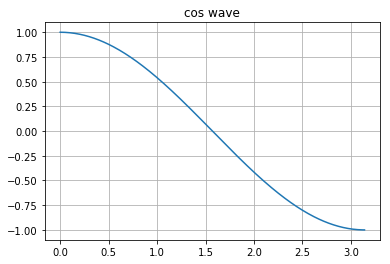

# Linear Algebra Review

In this notebook, we'll keep all the miscellaneous linear algebra things that are good to know.


<div markdown="1" class="cell code_cell">
<div class="input_area" markdown="1">
```python
import numpy as np
import matplotlib.pyplot as plt

```
</div>

</div>


---
# Dot Products and Projections

Euclidean Norm:
- $\|\vec{x}\|_2 = \sqrt{x_1^2 + \cdots + x_n^2}$

Cosine similarity:
- $cos\theta = \frac{\vec{a} \cdot \vec{b}}{\|\vec{a}\|_2 \|\vec{b}\|_2}$

Dot Product:
- $\vec{a} \cdot \vec{b} = \mathbf{a}^\top \mathbf{b}$

Inner Product:
- $\left\langle
    \begin{bmatrix} a_0 \\ \vdots \\ a_n \end{bmatrix},
    \begin{bmatrix} b_0 \\ \vdots \\ b_n \end{bmatrix}
    \right\rangle$
    
$$\therefore \text{Un-normalized Cosine Similarity} <=> \text{Dot Product} <=> \text{Inner Product}$$

Projections:
- Scalar Projection of $\vec{b}$ onto $\vec{a}$, AKA component of $\vec{b}$ in direction of $\vec{a}$ $\rightarrow comp_{\vec{a}}\vec{b} = \|\vec{b}\|_2cos\theta = \frac{\vec{a} \cdot \vec{b}}{\|\vec{a}\|_2}$
- Vector Projection of $\vec{b}$ onto $\vec{a}$ is just the scalar projection multiplied by the unit vector of $\vec{a}$ $\rightarrow projection_{\vec{a}}\vec{b} = \|\vec{b}\|_2cos\theta * \frac{\vec{a}}{\|\vec{a}\|_2} = \frac{\vec{a} \cdot \vec{b}}{\|\vec{a}\|_2} * \frac{\vec{a}}{\|\vec{a}\|_2}$


<div markdown="1" class="cell code_cell">
<div class="input_area" markdown="1">
```python
plt.plot(np.arange(0, np.pi, 0.01), np.cos(np.arange(0, np.pi, 0.01)))
plt.grid()
plt.title('cos wave')
plt.show();

```
</div>

<div class="output_wrapper" markdown="1">
<div class="output_subarea" markdown="1">

{:.output_png}


</div>
</div>
</div>


---
# Equation of a Hyperplane

Back in highschool, we learnt that a line in 2-D is denoted by 
$$
y=mx+b
$$
, where $y$ is the vertical axis, $x$ is the horizonatal axis, $m$ is the slope of the line, and $b$ is the y-intercept.

However, now in the world of linear algebra, we learn that the general form of any hyperplane (*A subspace of one dimension less than its ambient space, e.g. line in 2-D is a hyperplane, plane in 3-D is a hyperplane too*) is 
$$
{w_n}{x_n} + {w_{n - 1}{x_{n - 1}}} + ... + {w_0}{x_0} = 
\begin{bmatrix} {w_n}, {w_{n - 1}}, ..., {w_0} \end{bmatrix}
\begin{bmatrix} {x_n} \\ {x_{n - 1}} \\ \vdots \\ {x_0} \end{bmatrix} = \mathbf{w}^\top\mathbf{x} = 0
$$

Hence,
1. $$y=mx+b$$
2. $$y-mx-b=0$$
3. $$(1)*(y)+(-m)*(x)+(-b)*(1)=0$$
4. $$
\begin{bmatrix} 1, -m, -b \end{bmatrix}
\begin{bmatrix} y \\ x \\ 1 \end{bmatrix}=\mathbf{w}^\top\mathbf{x}=0
$$

From now onwards, whenever we're talking about hyperplanes, we can always translate all the data points horizontally and vertically such that the hyperplane passes through the origin. This is a very important point as it allows us to fix this form $\rightarrow \mathbf{w}^\top\mathbf{x} = 0$ as the equation of a hyperplane. Furthermore, it much better sense now when we talk about why all the points on the hyperplane, $\forall{i} \vec{x_i}$, are orthogonal to $\vec{w}$, making their dot product / inner product / un-normalized cosine similarity $= 0$.


---
## Resources:
- [Why $\mathbf{X}^T \mathbf{X}$ is always positive semi-definite](https://statisticaloddsandends.wordpress.com/2018/01/31/xtx-is-always-positive-semidefinite/)
- [Dot Products and Projections](https://math.oregonstate.edu/home/programs/undergrad/CalculusQuestStudyGuides/vcalc/dotprod/dotprod.html)
- [Understanding what $\mathbf{w}$ is and why $y =mx + b$ <=> $\mathbf{w}^\top\mathbf{x}=0$](https://www.youtube.com/watch?v=3qzWeokRYTA)

