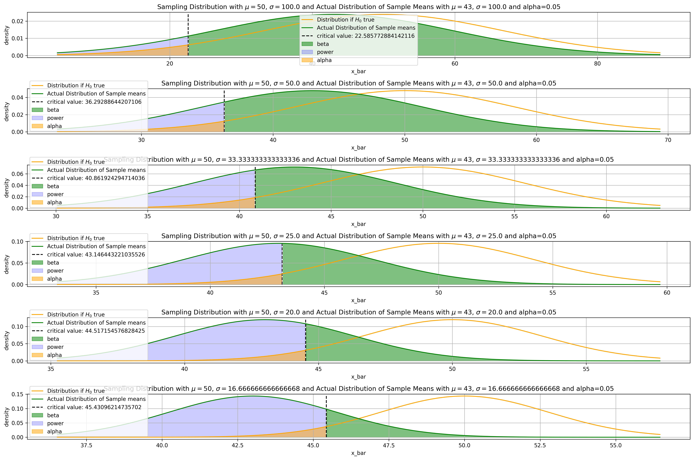

# Statistics Notes


<div markdown="1" class="cell code_cell">
<div class="input_area" markdown="1">
```python
# Visualization / ML Libraries
import numpy as np
import pandas as pd
import matplotlib
import matplotlib.pyplot as plt
import matplotlib.cm as cm
import matplotlib.font_manager as fm
import matplotlib.patches as mpatches
from mpl_toolkits.axes_grid1.anchored_artists import AnchoredSizeBar
import seaborn as sns
from scipy.stats import norm

# plotting defaults
plt.rcParams['figure.dpi'] = 300
plt.rcParams['figure.figsize'] = (18, 12)
get_colors = lambda length: plt.get_cmap('Spectral')(np.linspace(0, 1.0, length))

```
</div>

</div>


<div markdown="1" class="cell code_cell">
<div class="input_area" markdown="1">
```python
plt.rcParams['figure.dpi'] = 300
plt.rcParams['figure.figsize'] = (18, 12)

```
</div>

</div>


---
# 1. Hypothesis Testing

There are 2 probability distributions that we deal with when talking about Hypothesis testing:
1. Sampling Distribution when $H_0$ is indeed **True** (Normal $\because$ Central Limit Theorem)
    - In a basic statistics class, we care about this distribution and draw the $\alpha$ level and p-value here
    - Define a significance level = P(Type I error) = P(False Positive) 
    
    
2. Sampling Distribution when $H_0$ is indeed **False** (Normal $\because$ Central Limit Theorem)


| Truth Table | $$P(H_0 = \text{True})$$ | $$P(H_0 = \text{False})$$ |
| ------------- | ------------- | ------------- |
| Accept $H_0$, Reject $H_\alpha$ | $$\begin{aligned}P(\text{Accept}\,H_0 \mid H_0=\text{True}) &= P(\text{True Accept}) \\ &= 1 - \alpha \end{aligned}$$ | $$\begin{aligned}P(\text{Accept}\,H_0 \mid H_0=\text{False}) &= P(\text{Type II error}) \\ &= \beta \end{aligned}$$ |
| Reject $H_0$, Accept $H_\alpha$ | $$\begin{aligned}P(\text{Reject}\,H_0 \mid H_0=\text{True}) &= P(\text{Type I error}) \\ &= \alpha \end{aligned}$$ | $$\begin{aligned}P(\text{Reject}\,H_0 \mid H_0=\text{False}) &= \text{Power} \\ &= 1 - \beta \end{aligned}$$ |
| Sum | $$(1 - \alpha) + (\alpha) = 1$$ | $$(\beta) + (1 - \beta) = 1$$ |


Relationship between $\alpha$ and $\beta$:
- If we choose a very small value of $\alpha$, we will make it very difficult to reject $H_0$, making Type II errors, hence $\beta$ higher
- Normally we care more about Type I errors, so we'll set the $\alpha$ value at the start of the hypothesis test


## Calculating Power and Probability of Type II error, $\beta$ (One-Tailed Example)

Suppose we are about to randomly sample 36 values from a normally distributed population, where $\sigma=21$, but $\mu$ is unknown. We are going to test:

$$
\begin{aligned}
H_0 &: \mu = 50 \\
H_{\alpha} &: \mu < 50
\end{aligned}
$$ at $\alpha=0.09$

1. For what values of $Z = \frac{\bar{X}-\mu_0}{\frac{\sigma}{\sqrt{n} } }$ will we reject $H_0$?


<div markdown="1" class="cell code_cell">
<div class="input_area" markdown="1">
```python
def plot_dists_given_H0_true(mean, std, n, alpha):
    """
    Function:
    ---------
    Plots the actual and standardized sampling distribution and the rejection
    region given alpha, the significance level (Allowance for Type I error)
    
    Parameters:
    -----------
    mean: The sampling mean 
    std: The standard deviation
    n: Number of samples
    alpha: significance level (Allowance for Type I error)
    
    Returns:
    --------
    None. Plots the sampling distribution both standardized and actual
    """
    fig, ax = plt.subplots(2, 1)
    
    # Standard error of the mean / STD of sampling distribution
    sem = std / np.sqrt(n)
    sampling_dist = norm(loc=0, scale=1)
    p_crit = sampling_dist.ppf(alpha)

    # Plot the standardized sampling distribution
    sample_mean_z_scores = np.linspace(start=sampling_dist.ppf(0.01), 
                                       stop=sampling_dist.ppf(0.99), num=500)
    y = sampling_dist.pdf(sample_mean_z_scores)
    ax[0].plot(sample_mean_z_scores, y, c='blue')
    ax[0].vlines(p_crit, 0, np.max(y),
                 linestyles = '--', label='critical value: {}'.format(np.round(p_crit, 2)))
    ax[0].fill_between(sample_mean_z_scores, y, where=(sample_mean_z_scores <= p_crit), alpha=.5, color='blue')
    ax[0].set_xlabel('z-scores')
    ax[0].set_ylabel('density')
    ax[0].set_title('Standardized Sampling Distribution with $\mu=${}, $\sigma=${}'.format(0, 1))
    ax[0].grid()
    ax[0].legend()
    ax[0].text(0.10, 1.75, 'Reject $H_0$', transform=ax[1].transAxes, fontsize=20,
               verticalalignment='center')
    ax[0].text(0.35, 1.75, 'Fail to Reject $H_0$', transform=ax[1].transAxes, fontsize=20,
               verticalalignment='center')
    ax[0].text(0.15, 1.35, str(alpha), transform=ax[1].transAxes, fontsize=20,
               verticalalignment='center')
    
    # Plot the sampling distribution if Null Hypothesis was true
    actual_dist = norm(loc=50, scale=sem)
    x_bar = np.linspace(start=actual_dist.ppf(0.01), 
                        stop=actual_dist.ppf(0.99), num=500)
    y = actual_dist.pdf(x_bar)
    ax[1].plot(x_bar, y, c='orange')
    ax[1].vlines((p_crit*sem)+mean, 0, np.max(y),
                 linestyles = '--', label='critical value: {}'.format(np.round((p_crit*sem)+mean, 2)))
    ax[1].fill_between(x_bar, y, where=(x_bar <= (p_crit*sem)+mean), alpha=.5, color='orange')
    ax[1].set_xlabel('x_bar')
    ax[1].set_ylabel('density')
    ax[1].set_title('Actual Sampling Distribution if $H_0$ is True with $\mu=${}, $\sigma=${}'.format(mean, sem))
    ax[1].grid()
    ax[1].legend()
    ax[1].text(0.10, 0.55, 'Reject $H_0$', transform=ax[1].transAxes, fontsize=20,
               verticalalignment='center')
    ax[1].text(0.35, 0.55, 'Fail to Reject $H_0$', transform=ax[1].transAxes, fontsize=20,
               verticalalignment='center')
    ax[1].text(0.15, 0.15, str(alpha), transform=ax[1].transAxes, fontsize=20,
               verticalalignment='center')
    
    plt.show();
    
plot_dists_given_H0_true(mean=50, std=21, n=36, alpha=0.09)

```
</div>

<div class="output_wrapper" markdown="1">
<div class="output_subarea" markdown="1">

{:.output_png}


</div>
</div>
</div>


We will reject $H_0$ for $Z < -1.34$ or $\bar{X} < 45.31.$


2. If $\mu=43$, what is $P(\text{Type II error})$?

$$
\begin{aligned}
H_0 &: \mu = 50 \\
H_{\alpha} &: \mu < 50
\end{aligned}
$$

$P(\text{Type II error}) = P(\text{Fail to Reject}\,H_0 \mid \mu=43) = P(\bar{X} > 45.31 \mid \mu=43) = \beta$


<div markdown="1" class="cell code_cell">
<div class="input_area" markdown="1">
```python
def plot_H0_true_dist_and_actual_dist(ax, H0_mean, actual_mean, std, n, alpha):
    
    # Get H0 true distribution, and the actual distribution
    sem = std / np.sqrt(n)
    critical_val = (norm(loc=0, scale=1).ppf(alpha) * sem) + H0_mean
    H0_true_dist = norm(loc=H0_mean, scale=sem)
    actual_dist = norm(loc=actual_mean, scale=sem)

    # Plot the H0 true distribution
    x_bar_H0_true = np.linspace(start=actual_dist.ppf(0.01),
                                stop=H0_true_dist.ppf(0.99), num=500)
    y_H0_true = H0_true_dist.pdf(x_bar_H0_true)
    ax.plot(x_bar_H0_true, y_H0_true, c='orange', label='Distribution if $H_0$ true')
    
    # Plot the actual distribution
    x_bar_actual = np.linspace(start=actual_dist.ppf(0.01),
                               stop=H0_true_dist.ppf(0.99), num=500)
    y_actual = actual_dist.pdf(x_bar_actual)
    ax.plot(x_bar_actual, y_actual, c='green', label='Actual Distribution of Sample means')
    
    # PLot critical value
    ax.vlines(critical_val, 0, np.max(y_actual),
              linestyles = '--', label='critical value: {}'.format(critical_val))
    ax.fill_between(x_bar_actual, y_actual, where=(x_bar_actual > critical_val), alpha=.5, color='green', label='beta')
    ax.fill_between(x_bar_actual, y_actual, where=(x_bar_actual < critical_val), alpha=.2, color='blue', label='power')
    ax.fill_between(x_bar_H0_true, y_H0_true, where=(x_bar_H0_true < critical_val), alpha=.5, color='orange', label='alpha')
    ax.set_xlabel('x_bar')
    ax.set_ylabel('density')
    ax.set_title('Sampling Distribution with $\mu=${}, $\sigma=${} and Actual Distribution of Sample Means with $\mu=${}, $\sigma=${} and alpha={}'.format(H0_mean, std, actual_mean, std, alpha))
    ax.grid()
    ax.legend()
    return ax
    
fig, ax = plt.subplots(1, 1)
plot_H0_true_dist_and_actual_dist(ax=ax, H0_mean=50, actual_mean=43, std=21, n=36, alpha=0.09);

```
</div>

<div class="output_wrapper" markdown="1">
<div class="output_subarea" markdown="1">

{:.output_png}


</div>
</div>
</div>


$P(\bar{X} > 45.31 \mid \mu=43)=$ The Shaded region $\underset{\text{Standardize} }{\rightarrow} P(Z > \frac{45.31 - 43}{\frac{21}{\sqrt{36} } }) = P(Z > 0.66) = 0.255 = \beta$ . 

$$
\therefore \beta = 0.255 \\
\text{Power of Test (Ability to detect a False }H_0)=P(\text{Reject }H_0\mid \mu=43)=1-\beta=0.745
$$


## Effect of changes in $\alpha, n, \mu, \sigma$ on Power $1-\beta$

Power increases as:
- $\alpha$ increases
- $n$ increases
- $\sigma$ decreases
- The true value of $\mu$ gets further from $\mu_0$ (in the direction of the alternate hypothesis)


### As $\alpha$ increases,


<div markdown="1" class="cell code_cell">
<div class="input_area" markdown="1">
```python
fig, ax = plt.subplots(6, 1)
for idx in range(1, 7):
    ax[idx-1] = plot_H0_true_dist_and_actual_dist(ax=ax[idx-1], H0_mean=50, actual_mean=43, 
                                                std=21, n=36, alpha=(idx*0.01))
    
plt.tight_layout()
plt.show();

```
</div>

<div class="output_wrapper" markdown="1">
<div class="output_subarea" markdown="1">

{:.output_png}


</div>
</div>
</div>


### As $n$ increases, both distributions become sharper $\because S.E.M. = \frac{\sigma}{\sqrt{n} }$


<div markdown="1" class="cell code_cell">
<div class="input_area" markdown="1">
```python
fig, ax = plt.subplots(6, 1)
for idx in range(1, 7):
    ax[idx-1] = plot_H0_true_dist_and_actual_dist(ax=ax[idx-1], H0_mean=50, actual_mean=43, 
                                                std=21, n=idx*20, alpha=0.05)
    
plt.tight_layout()
plt.show();

```
</div>

<div class="output_wrapper" markdown="1">
<div class="output_subarea" markdown="1">

{:.output_png}


</div>
</div>
</div>


### As $\sigma$ decreases, both distributions become sharper $\because S.E.M. = \frac{\sigma}{\sqrt{n} }$


<div markdown="1" class="cell code_cell">
<div class="input_area" markdown="1">
```python
fig, ax = plt.subplots(6, 1)
for idx in range(1, 7):
    ax[idx-1] = plot_H0_true_dist_and_actual_dist(ax=ax[idx-1], H0_mean=50, actual_mean=43, 
                                                std=100/idx, n=36, alpha=0.05)
    
plt.tight_layout()
plt.show();

```
</div>

<div class="output_wrapper" markdown="1">
<div class="output_subarea" markdown="1">

{:.output_png}


</div>
</div>
</div>


---
# 2. A/B Testing


## Parametric Vs Non-Parametric Tests


---
# 3. Classification Metrics

## False Positive Rate:
- Ratio of false positives to total negatives, $\frac{\text{FP} }{\text{N} }=\frac{\text{FP} }{\text{FP + TN} }$

## False Negative Rate:
- Ratio of false negatives to total positives, $\frac{\text{FN} }{\text{P} }=\frac{\text{FN} }{\text{FN + TP} }$

## Precision:
- Ratio of true positives to total positives and false positives, $\frac{\text{TP} }{\text{TP + FP} }$

## Recall:
- Ratio of true positives to total positives and false negatives, $\frac{\text{TP} }{\text{TP + FN} }$

## Accuracy:
- Ratio of correct classifications to total classifications, $\frac{\text{TP + TN} }{\text{TP + FP + TN + FN} }$

## F-beta:
- Weighted Harmonic Mean of precision and recall, $(1 + \beta^2) \times \frac{\text{precision } \times \text{ recall} }{\beta^2 \times \text{precision } + \text{ recall} }$

## ROC-AUC:


---
## Resources:
- [JBStatistics Hypothesis testing videos](https://www.youtube.com/watch?v=7mE-K_w1v90)

