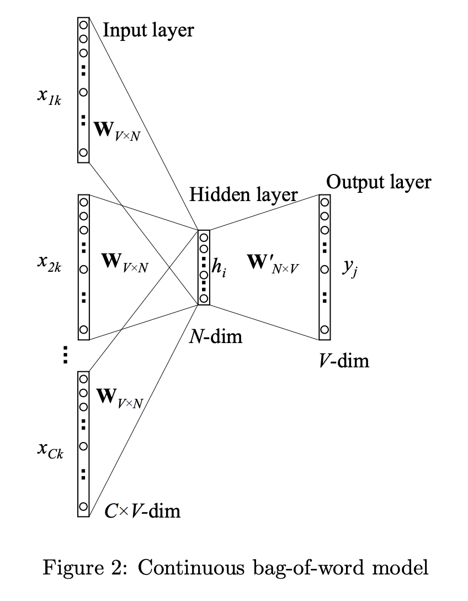

# Continuous Bag of Words (CBOW)

In this notebook, we'll go over the multi-word context CBOW implementation of Word2Vec through a code walkthrough adapted from the Keras implemention of the CBOW by Dipanjan Sarkar in his [kdnuggest blogpost](https://www.kdnuggets.com/2018/04/implementing-deep-learning-methods-feature-engineering-text-data-cbow.html). The code is sectioned into 3 main parts, namely:

1. Pre-processing Text Corpus
2. Modeling
3. Training


---
# Pre-processing Text Corpus


### 1. Get the Raw Dataset


<div markdown="1" class="cell code_cell">
<div class="input_area" markdown="1">
```python
# from nltk.corpus import gutenberg
# from string import punctuation

# bible = gutenberg.sents('bible-kjv.txt') 
# remove_terms = punctuation + '0123456789'

# norm_bible = [[word.lower() for word in sent if word not in remove_terms] for sent in bible]
# norm_bible = [' '.join(tok_sent) for tok_sent in norm_bible]
# norm_bible = filter(None, normalize_corpus(norm_bible))
# norm_bible = [tok_sent for tok_sent in norm_bible if len(tok_sent.split()) > 2]

# print('Total lines:', len(bible))
# print('\nSample line:', bible[10])
# print('\nProcessed line:', norm_bible[10])

```
</div>

</div>


### 2. Convert words to indices

1. Create a dictionary `word2id` of __key__: index, __value__: the unique word token from the text corpus
2. Create a dictionary `id2word` of __key__: the unique word token from the text corpus, __value__: index
3. Convert entire text corpus from words to indices and store in `wids`


<div markdown="1" class="cell code_cell">
<div class="input_area" markdown="1">
```python
from keras.preprocessing import text
from keras.utils import np_utils
from keras.preprocessing import sequence

tokenizer = text.Tokenizer() # Initialize the Tokenizer instance
tokenizer.fit_on_texts(norm_bible) 

# Step 1
word2id = tokenizer.word_index

# Set a fake word 'PAD' so that we can replace 
# all the padding for target words with 
# insufficient context words with this, look at 
# the generate_context_word_pairs function below
word2id['PAD'] = 0 

# Step 2
id2word = {v:k for k, v in word2id.items()}

# Step 3
wids = [[word2id[w] for w in text.text_to_word_sequence(doc)] for doc in norm_bible]

vocab_size = len(word2id)
embed_size = 100 # size of each vector representation of each unique word in text corpus
window_size = 2 # context window size

print('Vocabulary Size:', vocab_size)
print('Vocabulary Sample:', list(word2id.items())[:10])

```
</div>

</div>


### 3. Create the dataset for CBOW


Because not all center / target words will have 4 context words, we will have to pad the context words list with "fake" words, in our case we have denoted the fake word to be "PAD".


<div markdown="1" class="cell code_cell">
<div class="input_area" markdown="1">
```python
def generate_context_word_pairs(corpus, window_size, vocab_size):
    """
    Function:
    ---------
    Creates a generator object that yields fixed-length context words
    
    Parameters:
    -----------
    corpus: [[index of word for word in sentence] for sentence in corpus]
    window_size: the context window size
    vocab_size: size of our word_index / vocabulary
    
    Returns:
    --------
    X: A fixed-lenth (window_size*2) list of word indices representing the
       ids for context words, e.g. [123, 99, 23, 88] for window_size = 2
    y: The target word in the form of a binary vector of size = vocab_size 
       with 0s everywhere except the index position of the target word in the 
       word_index / vocabulary, e.g. [0, 0, 0, 0, 1, 0, 0, 0] for vocab_size = 8
       and target word is @ index position 4 in word_index
    
    """
    context_length = window_size*2
    for sentence in corpus:
        for index, word in enumerate(len(sentence)):
            context_words, label_word = [], []         
            start, end = index - window_size, index + window_size + 1
            
            # Add context words that are window_size*2 behind current
            # word and window_size*2 infront of current word
            context_words.append([sentence[i] 
                                 for i in range(start, end) 
                                 if 0 <= i < len(sentence) 
                                 and i != index])
            label_word.append(word)

            # For the target words at the start and end of the sentence,
            # we won't have all the context words because no context words 
            # exist before the first word and none exist after the last.
            # So, we need to pad those that don't have window_size*2 with 0
            X = sequence.pad_sequences(context_words, maxlen=context_length)
            y = np_utils.to_categorical(label_word, vocab_size)
            yield (X, y)
            
            
# Test this out for some samples
i = 0
for X, y in generate_context_word_pairs(corpus=wids, window_size=window_size, vocab_size=vocab_size):
    # if context word list, AKA X does not contain 
    # any padding, hence y is not the first few or 
    # last few words in the sentence
    if 0 not in X[0]: 
        print('Context (X):', [id2word[w] for w in X[0]], '-> Target (Y):', id2word[np.argwhere(y[0])[0][0]])
    
        if i == 10:
            break
        i += 1

```
</div>

</div>


---
# Modeling



Math:
$$
\begin{eqnarray}
\textbf{h} = & W^T\overline{\textbf{x} }\hspace{2.8cm}  \nonumber \\
\textbf{u} = & W'^T W^T\overline{\textbf{x} } \hspace{2cm}  \nonumber \\
\textbf{y} = & \mathbb{S}\textrm{oftmax}\left( W'^T W^T\overline{\textbf{x} }\right) \hspace{0cm}  \nonumber \\
\mathcal{L} = & -u_{j^*} + \log \sum_i \exp{(u_i)} \hspace{0cm} \nonumber \\
\frac{\partial\mathcal{L} }{\partial W'} =  & (W^T\overline{\textbf{x} }) \otimes \textbf{e} \hspace{2.0cm} \nonumber\\
\frac{\partial \mathcal{L} }{\partial W} = & \overline{\textbf{x} }\otimes(W'\textbf{e})
 \hspace{2.0cm} \nonumber
\end{eqnarray}
$$

Gradient Descent Updates:
$$
\begin{eqnarray}
W_{\textrm{new} } = W_{\textrm{old} } - \eta \frac{\partial \mathcal{L} }{\partial W} \nonumber \\
W'_{\textrm{new} } = W'_{\textrm{old} } - \eta \frac{\partial \mathcal{L} }{\partial W'} \nonumber \\
\end{eqnarray}
$$

Input Layer:
- Input is a $($`1` $\times$ $C=$`window_size*2`$)$ integer matrix, each entry in the matrix being the index of the context word according to the word_index.
- Input Shape: $($`1` $\times$ $C=$`window_size*2`$)$
$$\underbrace{
\begin{bmatrix} x_{0,0} \\ \vdots \\ x_{0,V-1} \end{bmatrix},
\begin{bmatrix} x_{1,0} \\ \vdots \\ x_{1,V-1} \end{bmatrix},
\begin{bmatrix} x_{2,0} \\ \vdots \\ x_{2,V-1} \end{bmatrix},
...,
\begin{bmatrix} x_{C-1,0} \\ \vdots \\ x_{C-1,V-1} \end{bmatrix} }_{\text{Input Layer after Embedding Layer's One hot Encoding } }$$

Embedding Layer :
- Rows of the Embedding Matrix are the vector representation of each unique word in our text corpus
$$
\underbrace{
{\begin{bmatrix} 
{w}_{0,0} & {w}_{0,1} & ... & {w}_{0,N-1} \\
{w}_{1,0} & {w}_{1,1} & ... & {w}_{1,N-1} \\
\vdots & \vdots & \vdots & \vdots \\
{w}_{V-1,0} & {w}_{V-1,1} & ... & {w}_{V-1,N-1} \\
\end{bmatrix} }^\top}_{\text{Embedding Matrix / Layer } \mathbf{W}^\top_{N \times V} }
\cdot
{\begin{bmatrix} x_{0,0} \\ \vdots \\ x_{0,V-1} \end{bmatrix},
\begin{bmatrix} x_{1,0} \\ \vdots \\ x_{1,V-1} \end{bmatrix},
\begin{bmatrix} x_{2,0} \\ \vdots \\ x_{2,V-1} \end{bmatrix},
...,
\begin{bmatrix} x_{C-1,0} \\ \vdots \\ x_{C-1,V-1} \end{bmatrix} }
=
\underbrace{
\begin{bmatrix} {w}_{0,0} \\ \vdots \\ {w}_{0,N-1} \end{bmatrix},
\begin{bmatrix} {w}_{1,0} \\ \vdots \\ {w}_{1,N-1} \end{bmatrix},
\begin{bmatrix} {w}_{2,0} \\ \vdots \\ {w}_{2,N-1} \end{bmatrix},
...,
\begin{bmatrix} {w}_{C-1,0} \\ \vdots \\ {w}_{C-1,N-1} \end{bmatrix} }_{\text{Word embedding vectors for each context word extracted from Embedding matrix} }
$$
- The Embedding Layer in Keras will convert each word index from the input layer to a one-hot binary vector and "look up" the word embedding vector from the Embedding Matrix and pass it to the Lambda Layer.
- Input Shape: $($ $V=$`vocab_size` $\times $ $N=$`embed_size`$)$
- Output Shape: $($`1` $\times $ $N=$`embed_size for each word`$)$

Lambda Layer:
$$h = \frac{1}{C} \mathbf{W}^\top (x_0 + x_1 + x_2 + ... + x_C)$$
- We will take the average of all the word embedding vectors from the output of embedding layer because we don't care about the order / sequence of the context words.
- Output Shape: $($`1` $\times $ $N=$`embed_size`$)$

Dense Layer:
- We feed the output of the lambda layer into a normal Dense layer and pass them through a `softmax` activation to get the probabilities of each word in the vocabulary / word_index. Using `categorical_crossentropy`, we compute the loss and then perform the backpropagation like a standard neural net. Ideally, for a 0 loss situation, the ouput of the dense layer would be a one-hot binary vector with 0s for all words except 1 for the target word's index according to word_index.

Summary:
1. One hot encoded vectors 


<div markdown="1" class="cell code_cell">
<div class="input_area" markdown="1">
```python
import keras.backend as K
from keras.models import Sequential
from keras.layers import Dense, Embedding, Lambda

# build CBOW architecture
cbow = Sequential()
cbow.add(Embedding(input_dim=vocab_size, 
                   output_dim=embed_size, 
                   input_length=window_size*2))
cbow.add(Lambda(lambda x: K.mean(x, axis=1), output_shape=(embed_size,)))
cbow.add(Dense(vocab_size, activation='softmax'))
cbow.compile(loss='categorical_crossentropy', optimizer='rmsprop')

# view model summary
print(cbow.summary())

# visualize model structure
from IPython.display import SVG
from keras.utils.vis_utils import model_to_dot

SVG(model_to_dot(cbow, show_shapes=True, show_layer_names=False, 
                 rankdir='TB').create(prog='dot', format='svg'))

```
</div>

</div>


---
# Training


<div markdown="1" class="cell code_cell">
<div class="input_area" markdown="1">
```python
for epoch in range(1, 6):
    loss = 0.
    i = 0
    for X, y in generate_context_word_pairs(corpus=wids, window_size=window_size, vocab_size=vocab_size):
        i += 1
        loss += cbow.train_on_batch(X, y)
        if i % 100000 == 0:
            print('Processed {} (context, word) pairs'.format(i))

    print('Epoch:', epoch, '\tLoss:', loss)
    print()

```
</div>

</div>


### Get Word Embeddings


<div markdown="1" class="cell code_cell">
<div class="input_area" markdown="1">
```python
weights = cbow.get_weights()[0]
weights = weights[1:]
print(weights.shape)

pd.DataFrame(weights, index=list(id2word.values())[1:]).head()

```
</div>

</div>


<div markdown="1" class="cell code_cell">
<div class="input_area" markdown="1">
```python
from sklearn.metrics.pairwise import euclidean_distances

# compute pairwise distance matrix
distance_matrix = euclidean_distances(weights)
print(distance_matrix.shape)

# view contextually similar words
similar_words = {search_term: [id2word[idx] for idx in distance_matrix[word2id[search_term]-1].argsort()[1:6]+1] 
                   for search_term in ['god', 'jesus', 'noah', 'egypt', 'john', 'gospel', 'moses','famine']}

similar_words

```
</div>

</div>


---
## Resources:
- [Word2Vec Training Math explained](https://arxiv.org/pdf/1411.2738.pdf)
- [Backpropagation Math for Word2Vec](http://www.claudiobellei.com/2018/01/06/backprop-word2vec/#multi-word-cbow)
- [CBOW in Tensorflow](http://www.claudiobellei.com/2018/01/07/backprop-word2vec-python/)
- [CBOW from scratch with Keras](https://www.kdnuggets.com/2018/04/implementing-deep-learning-methods-feature-engineering-text-data-cbow.html)
- [Embedding Layers in Keras](https://machinelearningmastery.com/use-word-embedding-layers-deep-learning-keras/)
- [Categorical Cross-Entropy Loss](https://gombru.github.io/2018/05/23/cross_entropy_loss/#categorical-cross-entropy-loss)

