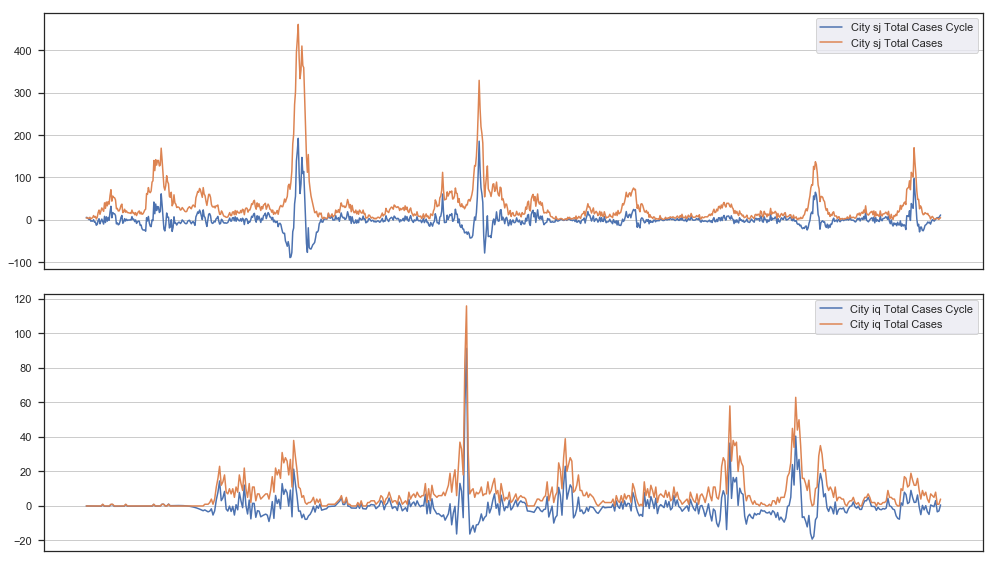
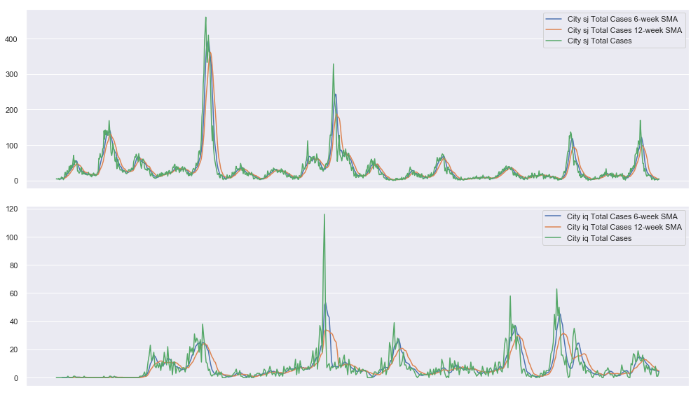
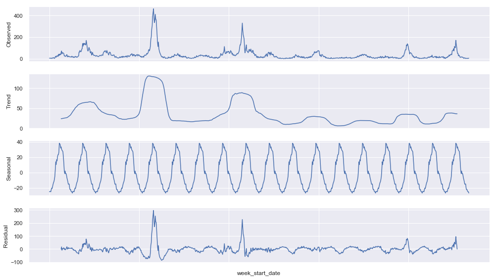
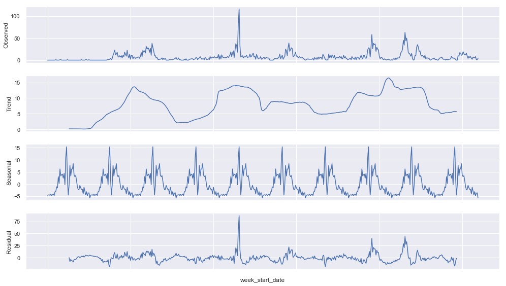
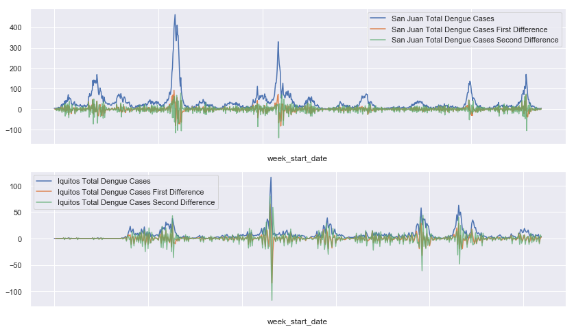
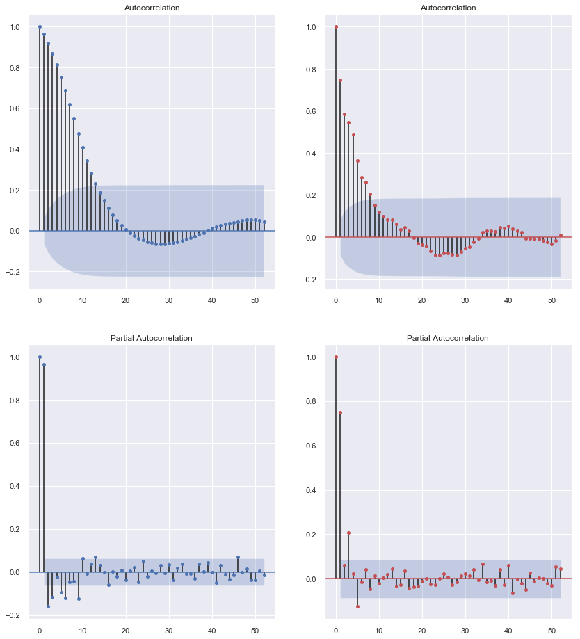
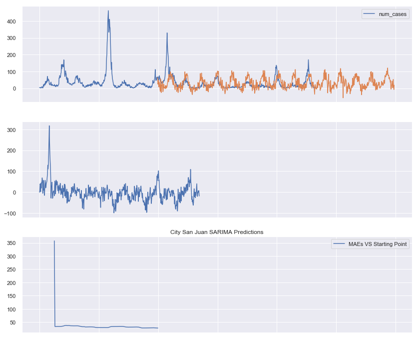
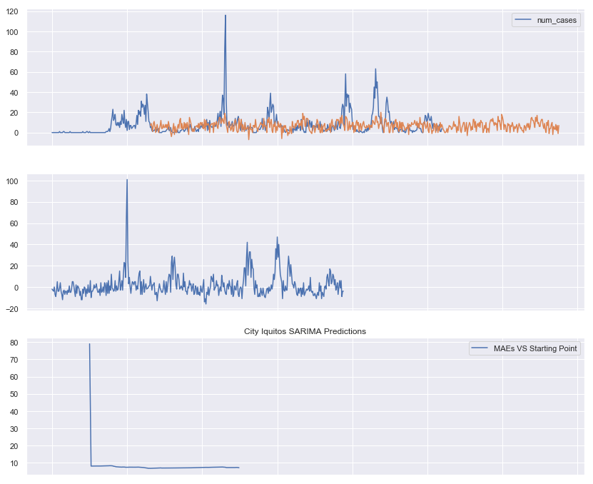
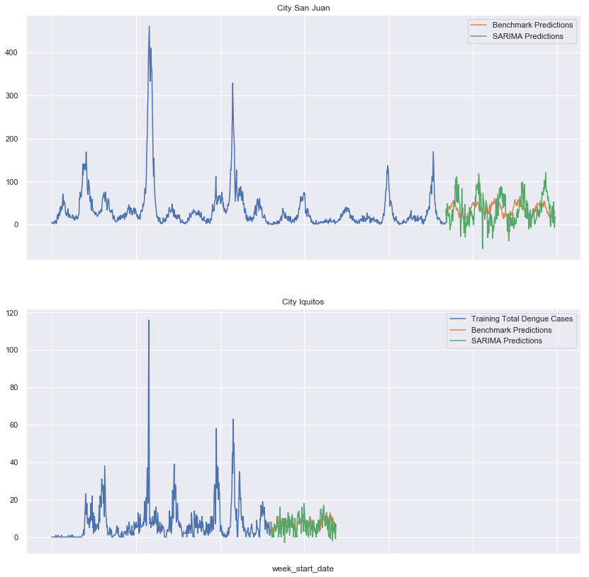

---
redirect_from:
  - "/portfolio/dengai/dengai-part-7a"
interact_link: content/portfolio/dengai/DengAI_Part_7a.ipynb
kernel_name: python3
has_widgets: false
title: 'DengAI Part 7a'
prev_page:
  url: /portfolio/dengai/DengAI_Part_6
  title: 'DengAI Part 6'
next_page:
  url: /portfolio/dengai/DengAI_Part_7b
  title: 'DengAI Part 7b'
comment: "***PROGRAMMATICALLY GENERATED, DO NOT EDIT. SEE ORIGINAL FILES IN /content***"
---


# DengAI Analysis Part 7a - Time Series Analysis

By: Chengyi (Jeff) Chen, under guidance of CSCI499: AI for Social Good Teaching Assistant - Aaron Ferber

---
## Content

In this notebook, we will explore a SARIMAX analysis of the dataset for prediction.


<a id="imports"></a>

---
## Library Imports


<div markdown="1" class="cell code_cell">
<div class="input_area" markdown="1">
```python
# Library Imports
import sys
import pandas as pd
import numpy as np
import subprocess
import statsmodels.api as sm
from scipy import stats
import os
from collections import Counter
from sklearn import model_selection, kernel_ridge, linear_model, metrics, feature_selection, preprocessing
from os import listdir
from os.path import isfile, join, isdir
from  tqdm import  tqdm
import warnings
warnings.filterwarnings('ignore')

# plotting libraries
import matplotlib
import matplotlib.pyplot as plt
plt.style.use('seaborn-paper')
import seaborn as sns
sns.set(style="ticks")
from pylab import rcParams
%matplotlib inline

```
</div>

</div>


<div markdown="1" class="cell code_cell">
<div class="input_area" markdown="1">
```python
# DengAI dataset URLs
dengai_features_url = 'https://www.dropbox.com/s/1kuf94b4mk6axyy/dengue_features_train.csv'
dengai_labels_url = 'https://www.dropbox.com/s/626ak8397abonv4/dengue_labels_train.csv'
dengai_test_features_url = 'https://s3.amazonaws.com:443/drivendata/data/44/public/dengue_features_test.csv'

```
</div>

</div>


<div markdown="1" class="cell code_cell">
<div class="input_area" markdown="1">
```python
# Helper function to create a new folder
def mkdir(path):
    try: 
        os.makedirs(path)
    except OSError:
        if not os.path.isdir(path):
            raise
        else:
            print("(%s) already exists" % (path))

```
</div>

</div>


<a id="clean_feats"></a>

---
## Cleaned Features


<div markdown="1" class="cell code_cell">
<div class="input_area" markdown="1">
```python
sj_X = pd.read_csv('./data/dengai/cleaned/sj_X.csv', index_col='week_start_date')
sj_y = pd.read_csv('./data/dengai/cleaned/sj_y.csv', header=None, names=['week_start_date', 'num_cases'], index_col='week_start_date')
iq_X = pd.read_csv('./data/dengai/cleaned/iq_X.csv', index_col='week_start_date')
iq_y = pd.read_csv('./data/dengai/cleaned/iq_y.csv', header=None, names=['week_start_date', 'num_cases'], index_col='week_start_date')

```
</div>

</div>


---

<a id="ets"></a>

## Error Trend Seasonality Decomposition


__Let's first use the Hodrick–Prescott filter from statsmodels to separate the estimated cycle and trend from the `total_cases`__


<div markdown="1" class="cell code_cell">
<div class="input_area" markdown="1">
```python
from statsmodels.api import tsa

sj_y_cycle, sj_y_trend = tsa.filters.hpfilter(sj_y)
iq_y_cycle, iq_y_trend = tsa.filters.hpfilter(iq_y)

rcParams['figure.figsize'] = 14, 8
fig, ax = plt.subplots(2,1)
sns.set()

ax[0].plot(sj_y_cycle, label='City sj Total Cases Cycle')
# ax[0].plot(sj_y_trend, label='City sj Total Cases Trend')
ax[0].plot(sj_y, label='City sj Total Cases')
ax[0].set_xticks([])
ax[0].legend()
ax[0].grid(True)

ax[1].plot(iq_y_cycle, label='City iq Total Cases Cycle')
# ax[1].plot(iq_y_trend, label='City iq Total Cases Trend')
ax[1].plot(iq_y, label='City iq Total Cases')
ax[1].set_xticks([])
ax[1].legend()
ax[1].grid(True)

plt.tight_layout()
plt.show();

```
</div>

<div class="output_wrapper" markdown="1">
<div class="output_subarea" markdown="1">

{:.output_png}


</div>
</div>
</div>


__Simple Moiving Averages: Let's create some moving averages as well__


<div markdown="1" class="cell code_cell">
<div class="input_area" markdown="1">
```python
# 6 Period moving averages
sj_y_6_period_sma = sj_y.rolling(window=6).mean()
iq_y_6_period_sma = iq_y.rolling(window=6).mean()

# 12 Period moving averages
sj_y_12_period_sma = sj_y.rolling(window=12).mean()
iq_y_12_period_sma = iq_y.rolling(window=12).mean()

rcParams['figure.figsize'] = 14, 8
fig, ax = plt.subplots(2,1)
sns.set()

ax[0].plot(sj_y_6_period_sma, label='City sj Total Cases 6-week SMA')
ax[0].plot(sj_y_12_period_sma, label='City sj Total Cases 12-week SMA')
ax[0].plot(sj_y, label='City sj Total Cases')
ax[0].set_xticks([])
ax[0].legend()
ax[0].grid(True)

ax[1].plot(iq_y_6_period_sma, label='City iq Total Cases 6-week SMA')
ax[1].plot(iq_y_12_period_sma, label='City iq Total Cases 12-week SMA')
ax[1].plot(iq_y, label='City iq Total Cases')
ax[1].set_xticks([])
ax[1].legend()
ax[1].grid(True)

plt.tight_layout()
plt.show();

```
</div>

<div class="output_wrapper" markdown="1">
<div class="output_subarea" markdown="1">

{:.output_png}


</div>
</div>
</div>


__Exponentially Weighted Moving Averages: Since our plots don't reveal a consistent trend of the total number of dengue cases of both cities with time, we will not calculate any exponentially weighted moving averages.__


__Error, Trend, and Seasonality: Let's use statsmodel's `seasonal_decompose` api to see if there's other information with can still extract from the total number of cases__


<div markdown="1" class="cell code_cell">
<div class="input_area" markdown="1">
```python
sj_ets = tsa.seasonal_decompose(sj_y, model='additive', freq=52).plot()

```
</div>

<div class="output_wrapper" markdown="1">
<div class="output_subarea" markdown="1">

{:.output_png}


</div>
</div>
</div>


<div markdown="1" class="cell code_cell">
<div class="input_area" markdown="1">
```python
iq_ets = tsa.seasonal_decompose(iq_y, model='additive', freq=52).plot()

```
</div>

<div class="output_wrapper" markdown="1">
<div class="output_subarea" markdown="1">

{:.output_png}


</div>
</div>
</div>


---
<a id="arima"></a>

## ARIMA


### Testing for Stationarity

__Here we will use the Augmented Dickey-Fuller Test to test whether our labels are indeed stationary in order to  be  used for ARIMA__


__Let's take a quick look again at the labels for each city, and also the first difference__


<div markdown="1" class="cell code_cell">
<div class="input_area" markdown="1">
```python
fig, ax = plt.subplots(2,1)
rcParams['figure.figsize'] = 14, 16

sj_y['num_cases'].plot(ax=ax[0], label='San Juan Total Dengue Cases', grid=True, legend=True);
(sj_y - sj_y.shift(1))['num_cases'].plot(ax=ax[0], label='San Juan Total Dengue Cases First Difference', grid=True, legend=True)
((sj_y - sj_y.shift(1)) - (sj_y - sj_y.shift(1)).shift(1))['num_cases'].plot(ax=ax[0], label='San Juan Total Dengue Cases Second Difference', grid=True, legend=True, alpha=0.7)

iq_y['num_cases'].plot(ax=ax[1], label='Iquitos Total Dengue Cases', grid=True, legend=True);
(iq_y - iq_y.shift(1))['num_cases'].plot(ax=ax[1], label='Iquitos Total Dengue Cases First Difference', grid=True, legend=True)
((iq_y - iq_y.shift(1)) - (iq_y - iq_y.shift(1)).shift(1))['num_cases'].plot(ax=ax[1], label='Iquitos Total Dengue Cases Second Difference', grid=True, legend=True, alpha=0.7)

plt.show();

```
</div>

<div class="output_wrapper" markdown="1">
<div class="output_subarea" markdown="1">

{:.output_png}


</div>
</div>
</div>


<div markdown="1" class="cell code_cell">
<div class="input_area" markdown="1">
```python
from statsmodels.tsa.stattools import adfuller

# Store in a function for later use!
def adf_check(time_series):
    """
    Pass in a time series, returns ADF report
    """
    result = adfuller(time_series)
    print('Augmented Dickey-Fuller Test:')
    labels = ['ADF Test Statistic','p-value','#Lags Used','Number of Observations Used']

    for value,label in zip(result,labels):
        print(label+' : '+str(value) )
    
    if result[1] <= 0.01:
        print("Strong evidence against the null hypothesis, reject the null hypothesis. Data has no unit root and is stationary")
    else:
        print("Weak evidence against null hypothesis, time series has a unit root, indicating it is non-stationary ")

```
</div>

</div>


<div markdown="1" class="cell code_cell">
<div class="input_area" markdown="1">
```python
adf_check(sj_y['num_cases'])

```
</div>

<div class="output_wrapper" markdown="1">
<div class="output_subarea" markdown="1">
{:.output_stream}
```
Augmented Dickey-Fuller Test:
ADF Test Statistic : -6.650077901931188
p-value : 5.1473186737592894e-09
#Lags Used : 9
Number of Observations Used : 926
Strong evidence against the null hypothesis, reject the null hypothesis. Data has no unit root and is stationary
```
</div>
</div>
</div>


<div markdown="1" class="cell code_cell">
<div class="input_area" markdown="1">
```python
adf_check((sj_y - sj_y.shift(1))['num_cases'].dropna())

```
</div>

<div class="output_wrapper" markdown="1">
<div class="output_subarea" markdown="1">
{:.output_stream}
```
Augmented Dickey-Fuller Test:
ADF Test Statistic : -10.227970545594637
p-value : 5.117134120459222e-18
#Lags Used : 12
Number of Observations Used : 922
Strong evidence against the null hypothesis, reject the null hypothesis. Data has no unit root and is stationary
```
</div>
</div>
</div>


<div markdown="1" class="cell code_cell">
<div class="input_area" markdown="1">
```python
adf_check(iq_y['num_cases'])

```
</div>

<div class="output_wrapper" markdown="1">
<div class="output_subarea" markdown="1">
{:.output_stream}
```
Augmented Dickey-Fuller Test:
ADF Test Statistic : -6.085428681900057
p-value : 1.0672522948401663e-07
#Lags Used : 4
Number of Observations Used : 515
Strong evidence against the null hypothesis, reject the null hypothesis. Data has no unit root and is stationary
```
</div>
</div>
</div>


<div markdown="1" class="cell code_cell">
<div class="input_area" markdown="1">
```python
adf_check((iq_y - iq_y.shift(1))['num_cases'].dropna())

```
</div>

<div class="output_wrapper" markdown="1">
<div class="output_subarea" markdown="1">
{:.output_stream}
```
Augmented Dickey-Fuller Test:
ADF Test Statistic : -11.682119354999621
p-value : 1.7313438978739138e-21
#Lags Used : 5
Number of Observations Used : 513
Strong evidence against the null hypothesis, reject the null hypothesis. Data has no unit root and is stationary
```
</div>
</div>
</div>


__Looks like our labels are already stationary, even before first differencing, now let's take a look at the Autocorrelation and Partial Autocorrelation plots to determine if we should use an Autoregressive or Moving Average model.__


---
## Autocorrelation and Partial Autocorrelation Plots


<div markdown="1" class="cell code_cell">
<div class="input_area" markdown="1">
```python
from statsmodels.graphics.tsaplots import plot_acf, plot_pacf

```
</div>

</div>


<div markdown="1" class="cell code_cell">
<div class="input_area" markdown="1">
```python
fig, ax = plt.subplots(2,2)
rcParams['figure.figsize'] = 16, 16

sj_acf = plot_acf(sj_y['num_cases'], ax=ax[0,0], lags=52)
sj_pacf = plot_pacf(sj_y['num_cases'], ax=ax[1,0], lags=52)

iq_acf = plot_acf(iq_y['num_cases'], ax=ax[0,1], color='r', lags=52)
iq_pacf = plot_pacf(iq_y['num_cases'], ax=ax[1,1], color='r', lags=52)

plt.show();

```
</div>

<div class="output_wrapper" markdown="1">
<div class="output_subarea" markdown="1">

{:.output_png}


</div>
</div>
</div>


---
## Seasonal AutoRegressive Integrated Moving Average with Exogenous Features (SARIMAX)


<div markdown="1" class="cell code_cell">
<div class="input_area" markdown="1">
```python
test_dates = pd.read_csv('./data/dengai/test_features/dengue_features_test.csv', index_col='week_start_date')['city']
sj_y = pd.concat([sj_y, pd.DataFrame(index=test_dates[test_dates == 'sj'].index, columns=['num_cases'])], axis=0)
iq_y = pd.concat([iq_y, pd.DataFrame(index=test_dates[test_dates == 'iq'].index, columns=['num_cases'])], axis=0)

```
</div>

</div>


<div markdown="1" class="cell code_cell">
<div class="input_area" markdown="1">
```python
sj_X_train = pd.read_csv('./data/dengai/cleaned/sj_X.csv', index_col=[0])
iq_X_train = pd.read_csv('./data/dengai/cleaned/iq_X.csv', index_col=[0])

# Clean Test Features
test_feats_df = pd.read_csv('./data/dengai/test_features/dengue_features_test.csv', index_col='week_start_date')

# Taking care of missing data
test_feats_df.fillna(test_feats_df.mode().iloc[0], inplace=True)

# Drop unecessary feature columns
test_feats_df = test_feats_df.drop(['year', 'weekofyear'], axis=1)

# Split dataset to City sj and City iq
sj_X_test = test_feats_df[test_feats_df['city'] == 'sj'].drop(['city'], axis=1)
iq_X_test = test_feats_df[test_feats_df['city'] == 'iq'].drop(['city'], axis=1)

```
</div>

</div>


<div markdown="1" class="cell code_cell">
<div class="input_area" markdown="1">
```python
def get_best_sarimax_start(results, y, X=None, min_samples=50, max_samples=None):
    """
    ============
    = FUNCTION =
    ============
    Function to find the best number of samples to 
    use SARIMAX to predict on to get lowest MAE
    
    ==============
    = PARAMETERS =
    ==============
    results: MLE Estimate of SARIMAX
    y: DataFrame of the total dengue cases
    X: DataFrame with exogenous features required for our SARIMAX
    min_samples: The minimum number of samples used to make a prediction on
    max_samples: The maximum number of samples used to make a prediction on
    
    ===========
    = RETURNS =
    ===========
    predictions: The dictionary of DataFrames containing the predictions of total number of dengue cases
    residuals: The dicitionary of Series containing the residuals between predictions and ground truth values of total dengue cases
    best_start: The most optimal location to start the prediction in order to eliminate seasonality and get lowest MAE
    maes: The dictionary of mae scores for each starting point
    
    """
    # Parameters we tuned to get the best model for City predictions
    best_start = 0
    best_mae = sys.maxsize
    predictions = {start: None for start in range(min_samples, max_samples)}
    residuals = {start: None for start in range(min_samples, max_samples)}
    maes = {start: None for start in range(min_samples, max_samples)}

    # Loop through all the possible training samples we can train on
    for start in tqdm(range(min_samples, max_samples)):
        
        # Predict for City 
        if X:
            predictions[start] = pd.DataFrame(
                [np.nan for i in range(start)] +
                list(map(int, results.predict(
                    start=start,
                    end=len(y['num_cases']) - 1,
                    exog=X.loc[y['num_cases'].last_valid_index():].iloc[1:], # Exogenous Features from Out of Sample forecast onwards
                    dynamic=True))), 
                index=y['num_cases'].index,
                columns=['num_cases'])
        else:
            predictions[start] = pd.DataFrame(
                [np.nan for i in range(start)] +
                list(map(int, results.predict(
                    start=start,
                    end=len(y['num_cases']) - 1,
                    dynamic=True))), 
                index=y['num_cases'].index,
                columns=['num_cases'])
        
        # Get Training Data Residuals
        residuals[start] = y['num_cases'].loc[y.iloc[start].name:y['num_cases'].last_valid_index()] - predictions[start]['num_cases'].loc[y.iloc[start].name:y['num_cases'].last_valid_index()]
        mae = np.sum(np.abs(residuals[start])) / len(residuals[start])
        maes[start] = mae
        
        if mae < best_mae:
            best_start = start
            best_mae = mae
    
    print('Best Number of Training Samples: {}'.format(best_start))
    print('Best MAE on Training Data: {}'.format(best_mae))
    
    return predictions, residuals, maes, best_start

```
</div>

</div>


<div markdown="1" class="cell code_cell">
<div class="input_area" markdown="1">
```python
sj_mod = sm.tsa.statespace.SARIMAX(endog=np.asarray(sj_y['num_cases'][:sj_y['num_cases'].last_valid_index()].astype(int)), 
                                   exog=sj_X_train,
                                   trend='n', 
                                   order=(0,0,0), 
                                   seasonal_order=(1,1,1,52))
sj_results = sj_mod.fit()
print(sj_results.summary())

```
</div>

<div class="output_wrapper" markdown="1">
<div class="output_subarea" markdown="1">
{:.output_stream}
```
                            Statespace Model Results                            
================================================================================
Dep. Variable:                        y   No. Observations:                  936
Model:             SARIMAX(1, 1, 1, 52)   Log Likelihood               -4698.768
Date:                  Thu, 18 Apr 2019   AIC                           9443.535
Time:                          23:22:34   BIC                           9553.578
Sample:                               0   HQIC                          9485.609
                                  - 936                                         
Covariance Type:                    opg                                         
=========================================================================================================
                                            coef    std err          z      P>|z|      [0.025      0.975]
---------------------------------------------------------------------------------------------------------
ndvi_ne                                  -9.6985     29.754     -0.326      0.744     -68.015      48.618
ndvi_nw                                 -13.6143     33.304     -0.409      0.683     -78.890      51.661
ndvi_se                                -364.6461     49.332     -7.392      0.000    -461.335    -267.957
ndvi_sw                                 347.0362     55.244      6.282      0.000     238.760     455.312
precipitation_amt_mm                     -0.0364      0.032     -1.128      0.259      -0.100       0.027
reanalysis_air_temp_k                    29.9452     97.220      0.308      0.758    -160.603     220.493
reanalysis_avg_temp_k                   -57.5795     19.112     -3.013      0.003     -95.039     -20.120
reanalysis_dew_point_temp_k              43.5696     96.634      0.451      0.652    -145.830     232.969
reanalysis_max_air_temp_k                 6.3508      5.309      1.196      0.232      -4.055      16.756
reanalysis_min_air_temp_k                 6.3384      6.469      0.980      0.327      -6.340      19.017
reanalysis_precip_amt_kg_per_m2          -0.0249      0.075     -0.331      0.740      -0.172       0.122
reanalysis_relative_humidity_percent     -0.4254     19.303     -0.022      0.982     -38.259      37.409
reanalysis_sat_precip_amt_mm             -0.0364      0.032     -1.128      0.259      -0.100       0.027
reanalysis_specific_humidity_g_per_kg   -41.8202     14.742     -2.837      0.005     -70.714     -12.927
reanalysis_tdtr_k                         7.1129      6.629      1.073      0.283      -5.881      20.106
station_avg_temp_c                        1.3550      7.240      0.187      0.852     -12.835      15.545
station_diur_temp_rng_c                  -5.2118      4.192     -1.243      0.214     -13.427       3.004
station_max_temp_c                       11.2451      3.133      3.589      0.000       5.104      17.386
station_min_temp_c                       -1.4176      3.762     -0.377      0.706      -8.792       5.957
station_precip_mm                        -0.0111      0.083     -0.134      0.893      -0.174       0.151
ar.S.L52                                 -0.1432      0.038     -3.816      0.000      -0.217      -0.070
ma.S.L52                                 -0.8975      0.053    -16.936      0.000      -1.001      -0.794
sigma2                                 2261.8355    101.214     22.347      0.000    2063.459    2460.212
===================================================================================
Ljung-Box (Q):                     3666.97   Jarque-Bera (JB):              7127.57
Prob(Q):                              0.00   Prob(JB):                         0.00
Heteroskedasticity (H):               0.30   Skew:                             2.72
Prob(H) (two-sided):                  0.00   Kurtosis:                        15.80
===================================================================================

Warnings:
[1] Covariance matrix calculated using the outer product of gradients (complex-step).
[2] Covariance matrix is singular or near-singular, with condition number 6.89e+18. Standard errors may be unstable.
```
</div>
</div>
</div>


<div markdown="1" class="cell code_cell">
<div class="input_area" markdown="1">
```python
# Get Best Model
sj_pred, sj_resid, sj_maes, sj_best_start = get_best_sarimax_start(sj_results, sj_y, pd.concat([sj_X_train, sj_X_test], axis=0), min_samples=50, max_samples=400)

# Plot the Predictions against Original
sns.set()
fig, ax = plt.subplots(3, 1, figsize=(14, 12), sharex=True)
sj_y[['num_cases']].plot(ax=ax[0])
sj_pred[sj_best_start]['num_cases'].plot(ax=ax[0], label="Total Predicted Number of Dengue Cases")
sj_resid[sj_best_start].plot(ax=ax[1])
ax[2].plot(sj_maes.keys(), sj_maes.values(), label="MAEs VS Starting Point")

plt.title('City San Juan SARIMA Predictions')
plt.legend()
plt.show();

```
</div>

<div class="output_wrapper" markdown="1">
<div class="output_subarea" markdown="1">
{:.output_stream}
```
Best Number of Training Samples: 397
Best MAE on Training Data: 27.771799628942485
```
</div>
</div>
<div class="output_wrapper" markdown="1">
<div class="output_subarea" markdown="1">

{:.output_png}


</div>
</div>
</div>


<div markdown="1" class="cell code_cell">
<div class="input_area" markdown="1">
```python
iq_mod = sm.tsa.statespace.SARIMAX(endog=np.asarray(iq_y['num_cases'][:iq_y['num_cases'].last_valid_index()].astype(int)),
                                   exog=iq_X_train,
                                   trend='n',
                                   order=(0,0,0),
                                   seasonal_order=(1,1,1,52))
iq_results = iq_mod.fit()
print(iq_results.summary())

```
</div>

<div class="output_wrapper" markdown="1">
<div class="output_subarea" markdown="1">
{:.output_stream}
```
                            Statespace Model Results                            
================================================================================
Dep. Variable:                        y   No. Observations:                  520
Model:             SARIMAX(1, 1, 1, 52)   Log Likelihood               -1802.236
Date:                  Thu, 18 Apr 2019   AIC                           3650.472
Time:                          23:26:24   BIC                           3745.887
Sample:                               0   HQIC                          3688.018
                                  - 520                                         
Covariance Type:                    opg                                         
=========================================================================================================
                                            coef    std err          z      P>|z|      [0.025      0.975]
---------------------------------------------------------------------------------------------------------
ndvi_ne                                   3.0058     16.249      0.185      0.853     -28.841      34.853
ndvi_nw                                   0.8726     12.868      0.068      0.946     -24.347      26.092
ndvi_se                                 -14.3681     15.399     -0.933      0.351     -44.549      15.813
ndvi_sw                                  -3.5093     13.583     -0.258      0.796     -30.131      23.113
precipitation_amt_mm                      0.0032      0.010      0.325      0.745      -0.016       0.022
reanalysis_air_temp_k                    16.6859      6.270      2.661      0.008       4.396      28.976
reanalysis_avg_temp_k                    -2.7840      2.749     -1.013      0.311      -8.172       2.604
reanalysis_dew_point_temp_k              -7.8200      8.943     -0.874      0.382     -25.348       9.708
reanalysis_max_air_temp_k                -0.8163      0.583     -1.400      0.161      -1.959       0.326
reanalysis_min_air_temp_k                -0.3503      1.037     -0.338      0.736      -2.383       1.683
reanalysis_precip_amt_kg_per_m2          -0.0135      0.019     -0.720      0.472      -0.050       0.023
reanalysis_relative_humidity_percent      3.1850      1.336      2.384      0.017       0.566       5.804
reanalysis_sat_precip_amt_mm              0.0032      0.010      0.325      0.745      -0.016       0.022
reanalysis_specific_humidity_g_per_kg    -4.6146      7.733     -0.597      0.551     -19.771      10.542
reanalysis_tdtr_k                         0.6366      0.956      0.666      0.505      -1.237       2.510
station_avg_temp_c                       -1.1119      1.117     -0.995      0.320      -3.302       1.078
station_diur_temp_rng_c                  -0.7098      0.392     -1.809      0.070      -1.479       0.059
station_max_temp_c                        0.7338      0.711      1.033      0.302      -0.659       2.127
station_min_temp_c                        0.4642      0.822      0.565      0.572      -1.147       2.075
station_precip_mm                        -0.0068      0.010     -0.686      0.493      -0.026       0.013
ar.S.L52                                 -0.1574      0.057     -2.768      0.006      -0.269      -0.046
ma.S.L52                                 -0.7968      0.058    -13.852      0.000      -0.910      -0.684
sigma2                                  113.5205      5.409     20.987      0.000     102.919     124.122
===================================================================================
Ljung-Box (Q):                      551.21   Jarque-Bera (JB):              6818.93
Prob(Q):                              0.00   Prob(JB):                         0.00
Heteroskedasticity (H):               2.07   Skew:                             2.73
Prob(H) (two-sided):                  0.00   Kurtosis:                        20.89
===================================================================================

Warnings:
[1] Covariance matrix calculated using the outer product of gradients (complex-step).
[2] Covariance matrix is singular or near-singular, with condition number 1.09e+18. Standard errors may be unstable.
```
</div>
</div>
</div>


<div markdown="1" class="cell code_cell">
<div class="input_area" markdown="1">
```python
# Get Best Model
iq_pred, iq_resid, iq_maes, iq_best_start = get_best_sarimax_start(iq_results, iq_y, pd.concat([iq_X_train, iq_X_test], axis=0), min_samples=50, max_samples=250)

# Plot the Predictions against Original
sns.set()
fig, ax = plt.subplots(3, 1, figsize=(14, 12), sharex=True)
iq_y[['num_cases']].plot(ax=ax[0])
iq_pred[iq_best_start]['num_cases'].plot(ax=ax[0], label="Total Predicted Number of Dengue Cases")
iq_resid[iq_best_start].plot(ax=ax[1])
ax[2].plot(iq_maes.keys(), iq_maes.values(), label="MAEs VS Starting Point")

plt.title('City Iquitos SARIMA Predictions')
plt.legend()
plt.show();

```
</div>

<div class="output_wrapper" markdown="1">
<div class="output_subarea" markdown="1">
{:.output_stream}
```
Best Number of Training Samples: 131
Best MAE on Training Data: 6.745501285347044
```
</div>
</div>
<div class="output_wrapper" markdown="1">
<div class="output_subarea" markdown="1">

{:.output_png}


</div>
</div>
</div>


<div markdown="1" class="cell code_cell">
<div class="input_area" markdown="1">
```python
# Save the results to csv and upload to competition
submission_df = pd.read_csv('./data/dengai/submission_format.csv')

# City SJ
sj_submission_df = submission_df[submission_df['city'] == 'sj'].drop(['total_cases'], axis=1)
sj_submission_df.reset_index(inplace=True)
sj_submission_df = pd.concat([sj_submission_df, 
                              pd.DataFrame(sj_pred[sj_best_start].loc[test_dates[test_dates == 'sj'].index]['num_cases'].values.flatten().astype(int),
                                           columns=['total_cases'])], 
                             axis=1)
sj_submission_df.index = sj_submission_df['index']
sj_submission_df.drop(['index'], axis=1, inplace=True)

# City IQ
iq_submission_df = submission_df[submission_df['city'] == 'iq'].drop(['total_cases'], axis=1)
iq_submission_df.reset_index(inplace=True)
iq_submission_df = pd.concat([iq_submission_df, 
                              pd.DataFrame(iq_pred[iq_best_start].loc[test_dates[test_dates == 'iq'].index]['num_cases'].values.flatten().astype(int), 
                                           columns=['total_cases'])], 
                             axis=1)
iq_submission_df.index = iq_submission_df['index']
iq_submission_df.drop(['index'], axis=1, inplace=True)

submission_df = pd.concat([sj_submission_df, iq_submission_df], axis=0).reset_index().drop(['index'], axis=1)
submission_df.head()

```
</div>

<div class="output_wrapper" markdown="1">
<div class="output_subarea" markdown="1">


<div markdown="0" class="output output_html">
<div>
<style scoped>
    .dataframe tbody tr th:only-of-type {
        vertical-align: middle;
    }

    .dataframe tbody tr th {
        vertical-align: top;
    }

    .dataframe thead th {
        text-align: right;
    }
</style>
<table border="1" class="dataframe">
  <thead>
    <tr style="text-align: right;">
      <th></th>
      <th>city</th>
      <th>year</th>
      <th>weekofyear</th>
      <th>total_cases</th>
    </tr>
  </thead>
  <tbody>
    <tr>
      <th>0</th>
      <td>sj</td>
      <td>2008</td>
      <td>18</td>
      <td>36</td>
    </tr>
    <tr>
      <th>1</th>
      <td>sj</td>
      <td>2008</td>
      <td>19</td>
      <td>4</td>
    </tr>
    <tr>
      <th>2</th>
      <td>sj</td>
      <td>2008</td>
      <td>20</td>
      <td>15</td>
    </tr>
    <tr>
      <th>3</th>
      <td>sj</td>
      <td>2008</td>
      <td>21</td>
      <td>43</td>
    </tr>
    <tr>
      <th>4</th>
      <td>sj</td>
      <td>2008</td>
      <td>22</td>
      <td>49</td>
    </tr>
  </tbody>
</table>
</div>
</div>


</div>
</div>
</div>


<div markdown="1" class="cell code_cell">
<div class="input_area" markdown="1">
```python
# Benchmark Predictions
benchmark = pd.read_csv('./data/dengai/benchmark.csv')

sj_bench = benchmark[benchmark['city'] == 'sj']['total_cases']
sj_bench = pd.DataFrame([np.nan for i in range(len(sj_y.loc[:sj_y.last_valid_index()]))] + list(sj_bench.values),
                         index=sj_y.index,
                         columns=['Benchmark Predictions'])

iq_bench = benchmark[benchmark['city'] == 'iq']['total_cases']
iq_bench = pd.DataFrame([np.nan for i in range(len(iq_y.loc[:iq_y.last_valid_index()]))] + list(iq_bench.values),
                         index=iq_y.index,
                         columns=['Benchmark Predictions'])

# SARIMA Predictions
sj_sarima = sj_pred[sj_best_start].loc[test_dates[test_dates == 'sj'].index]['num_cases']
sj_sarima = pd.DataFrame([np.nan for i in range(len(sj_y.loc[:sj_y.last_valid_index()]))] + list(sj_sarima.values),
                         index=sj_y.index,
                         columns=['SARIMA Predictions'])

iq_sarima = iq_pred[iq_best_start].loc[test_dates[test_dates == 'iq'].index]['num_cases']
iq_sarima = pd.DataFrame([np.nan for i in range(len(iq_y.loc[:iq_y.last_valid_index()]))] + list(iq_sarima.values),
                         index=iq_y.index,
                         columns=['SARIMA Predictions'])

# Plot 
sns.set()
fig, ax = plt.subplots(2, 1, figsize=(14, 14), sharex=True)

ax[0].set_title("City San Juan")
ax[0].plot(sj_y[['num_cases']].values, label="Training Total Dengue Cases")
sj_bench.plot(ax=ax[0])
sj_sarima.plot(ax=ax[0])

ax[1].set_title("City Iquitos")
ax[1].plot(iq_y[['num_cases']].values, label="Training Total Dengue Cases")
iq_bench.plot(ax=ax[1])
iq_sarima.plot(ax=ax[1])

plt.legend()
plt.show();

```
</div>

<div class="output_wrapper" markdown="1">
<div class="output_subarea" markdown="1">

{:.output_png}


</div>
</div>
</div>


<div markdown="1" class="cell code_cell">
<div class="input_area" markdown="1">
```python
# Save to csv
submission_df.to_csv('./data/dengai/sarimax_submission.csv', index=False)

```
</div>

</div>


__Submission MAE: 29.9663__

