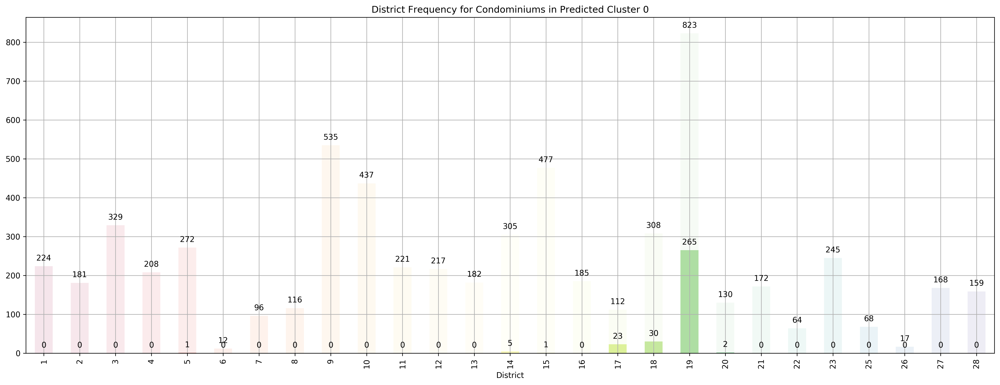
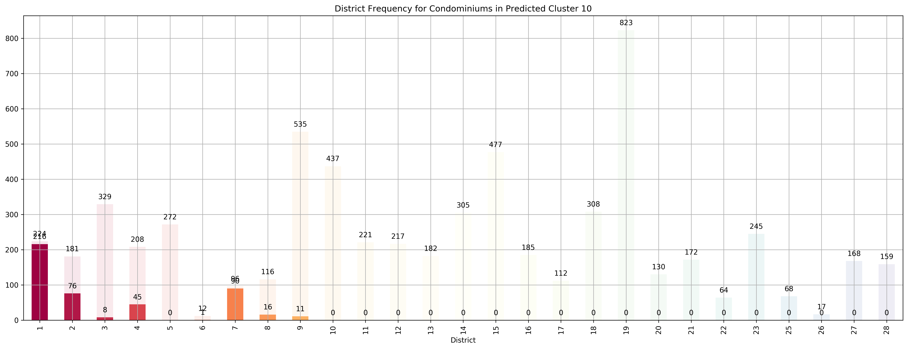
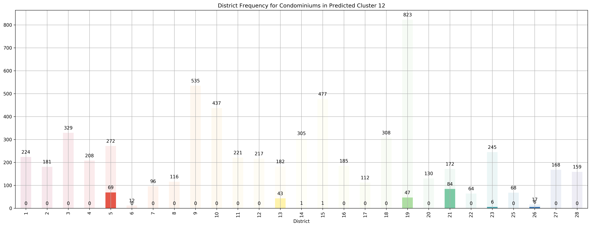
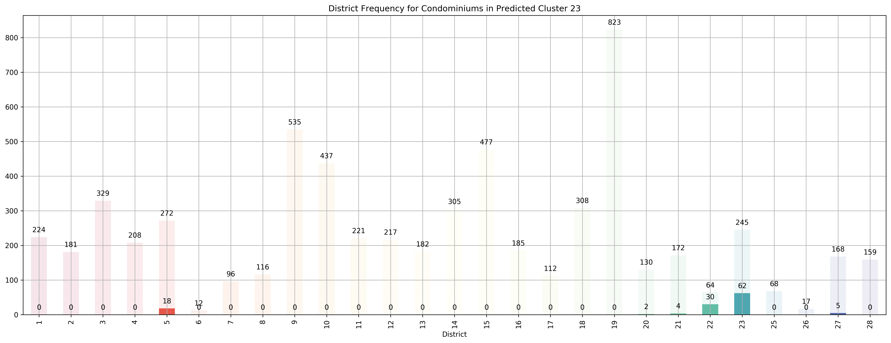
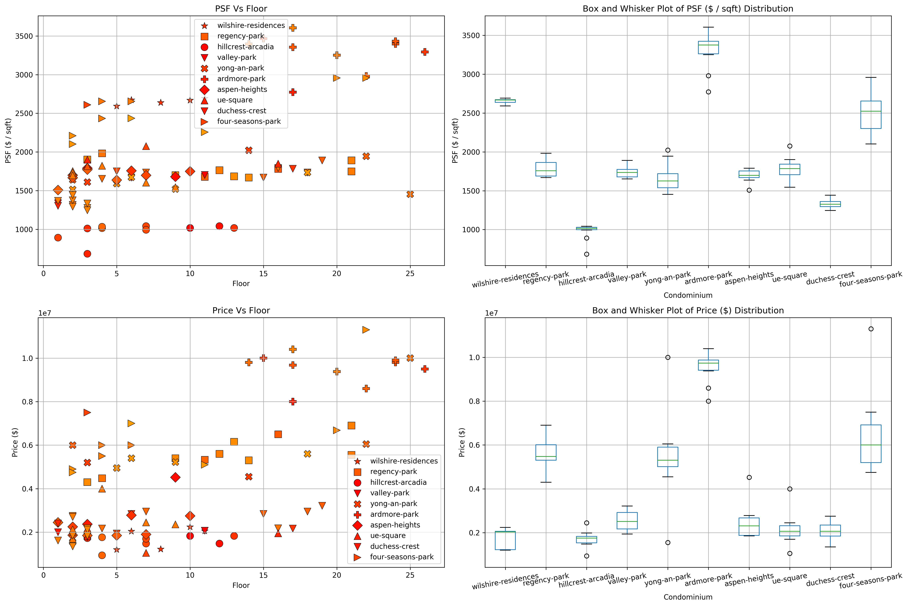

# Exploring Residential House Prices in Singapore
By: Chengyi (Jeff) Chen

In this project, we will be exploring housing prices and features in Singapore, trying to see whether we can derive any cool insights. As a preliminary to this project, we've performed all the ETL operations necessary - scraping Singapore Residential housing prices and their features from [99.co](https://www.99.co/singapore), a popular online marketplace for property in Singapore, cleaned the data by both manually and also imputing missing values using a nearest neighbours approach. 

*Disclaimer: The data that we have gathered might be of pretty low "resolution". In our ETL pipelines, we've made a ton of assumptions when performing some of the manual cleaning. Moving forward, I'll probably find a better data source (or make one myself lol) because having interacted with 99.co's data, I've realized that though their data is quite structured, it lacks alot of key details that I might have been better off gathering from the official Urban Recreation Authority website of Singapore. But nonetheless, we'll just work with what we have now*

Here, we will explore the data we've scraped using the CRoss Industry Standard Process for Data Mining, or CRISP-DM.

---
# Business Understanding

This is the first stage of the CRISP-DM process. In the context of Singapore residential housing, what questions would we like to address and along what type of insights do we want to gather from this dataset? 

A brief preliminary:
- Singapore's residential real estate market contains both Public and Private Housing options. 

- Public Housing contains 2 main types, HDB Flats (subsidized and regulated by the Housing and Development Boards (hence HDB)) and Executive Condominiums that have facilities similar to that of private condominiums but cheaper. Private Housing contains Condominiums and Landed Property such as Bungalows. You can read more about the different housing types in Singapore [here](https://www.99.co/blog/singapore/a-general-guide-to-types-of-housing-in-singapore/). 

- There are several factors that affect the prices of Singapore houses that might be atypical from other places in the world. Factors such as how accessible schools / shopping malls / mrt (train station) are very important features that are factored into the  price of a house, on top of other things such as size. Condominiums and Landed Property around the primary shopping district in Singapore, Orchard Road, for example, are extremely expensive because of their accessibility. Hence, it'll be really nice to be able to quantify how much these features affect their prices.

- There are a multitude of other factors that affect the price of a property and whether a transaction will take place, these include features that can't directly be observed (data isn't that easily available) such as:
    1. Interior design of the apartment
    - View and Facing 
        - If a property is surrounded by a lot of other tall buildings, the price of lower floors will be much lower
            - Hence, prices aren't directly proportional to the floor - more like a piecewise function - e.g. an apartment located on the 30th floor while all surrounding property developments are > 30 floors will have a comparatively lower price to the same property but on the 31st floor
        - An apartment is facing prominent structures in Singapore such as the shopping mall, Marina Bay Sands, or places like Bukit Timah hill might call for a much higher price
    - Size of the land plot of the property development
        - The larger the size of the land that the property development owns, the more valuable it is as an investment opportunity, especially since Singapore is already so small

Business Questions:
1. Cluster Analysis - Currently, there are [28 designated districts](https://www.singaporeexpats.com/housing-in-singapore/singapore-district-guide.htm) in Singapore. After clustering our data, could we discern these 28 districts well, or is there a different clustering of the data?
2. Feature Importance / Regression Analysis - Out of the physical features of the property we have gathered in our dataset, are there any that are most helpful in predicting the price of the house?
3. Popularity - What are the "hottest" properties now, especially in the District 9, 10, 11 area (Primary Shopping district)?

---
# Exploratory Data Analysis

Let's take a look at the number of observations we have for each property type.

How about the district breakdown?

We are missing `D24`, and it appears that we have a highly imbalanced dataset - we have really few `D6` and `D26` properties, and a ton of `D19` properties. Let's see the property type breakdown by district.

Because we have an overwhelmingly larger portion of condominium observations compared to HDBs or Landed properties, we'll focus the analysis on condominiums.

## Condominiums

It appears that many properties in the D19 (North-East) area of Singapore are listed for Sale as well as those in the D9 (Primary Shopping District). Let's take a look at the heat map of the features of our condominiums to get a sense of which features might be helpful in helping explain the `price` of a condo.

Seems like there are no features that are correlated with `price`, but there are quite a few features that are either highly positively and negatively correlated with each other. For example, `average_transit_duration_to_subway`, `average_transit_duration_to_supermarket`, `average_walking_duration_to_bus_station`, `average_walking_duration_to_clinic` are highly positively correlated with each other, while they are highly negatively correlated with `atm_nearby`, a binary variable. Intuitively, this makes a lot of sense since places that are very accessible (near various transportation modes, clinics, and supermarkets) would likely be very near to atms. Let's take a closer look at those correlated features.

We see a good number of condos that have prices in the 10 mil and above range but below 60 mil that may probably be penthouses. Furthermore, majority of condos are below 10 mil which is perfectly logical. Let's proceed on with the Data Preparation stage!

---
# Modeling

## 1. Cluster Analysis

Currently, there are [28 designated districts](https://www.singaporeexpats.com/housing-in-singapore/singapore-district-guide.htm) in Singapore. After clustering our data, could we discern these 28 districts well, or is there a different clustering of the data?

We want to visualize the clusters created using the KMeans clustering algorithm which assigns data points to the cluster that the data point has the shortest euclidean distance to. Furthermore, since we have >3 features, we'll want to either visualize the clusters based on 2-3 features or like what we'll  be doing below, visualize the first 2 TSNE embeddings of the features, helping us best preserve the relative "distance" between data points in a lower dimensional space.

But how will we choose the "optimal" number of clusters? We will be using 2 metrics:
1. [KMeans objective: The Within-Cluster Sum of Squares (WCSS) / Variance](https://en.wikipedia.org/wiki/K-means_clustering)
    - The pairwise squared deviations of points in the same cluster
    - If every data point is it's own cluster, this metric will be 0
    
$$
\underset{ \mathbf{S} }{ \operatorname{arg\,min} } \sum_{i=1}^{k} \sum_{ \mathbf{x} \in S_i} {\mid \mathbf{x} - \boldsymbol{\mu_i} \mid}^2 = \underset{ \mathbf{S} } {\operatorname{arg\,min} }\sum_{i=1}^k \mid S_i \mid \operatorname{Var} S_i, \text{ where } \mu_i \text{ is the mean of points in } S_i
$$
    
2. [The Silhouette Score](https://en.wikipedia.org/wiki/Silhouette_(clustering))
    - A measure of how similar an object is to its own cluster (cohesion) compared to other clusters (separation)
    
The goal for choosing the best number of clusters becomes a problem of trying to find the number of clusters that best maximizes the silhouette score, but yet minimizes the WCSS. This is what's known as a multi-objective optimization problem (You can learn more about it [here](https://engineering.purdue.edu/~sudhoff/ee630/Lecture09.pdf)). In multi-objective optimization problems, it's very rare to find a single most optimal solution for the problem. Instead, we'll find what is called a "Pareto Optimal Set / Pareto-efficient Frontier" which is a set of solutions that are not "dominated" by any others. "Not Dominated" intuitively meaning that a solution does not have any other solutions that are better than it in all objectives. Below, we have a written a function that does just this - determine the pareto frontier and plot it.

But how will we choose the "best" clustering from this reduced pareto-optimal set? For now, we'll determine the "best" clustering using the silhouette scores of each data point - our objective is "out of all the clusterings in the pareto frontier, choose the clustering that best minimizes the mean squared error and mean absolute error of each data point's silhouette score to the average silhouette score". In simple terms, we just want clusterings that have individual sample silhouette scores that are more or less similar to everyone else's.

We observe that in the "WCSS Vs. K" plot, there isn't a directly obvious "elbow" in the graph, making it hard for us to use the "elbow" method in order to determine the best number of clusters for our data, which is why we chose to complement the decision with silhouette scores too. Number of clusters $k=2, 4, 5, 8, 9, 29$ all lie on the pareto frontier making them candidates for the best number of clusters. According to the MSE and MAE silhouette scores, $k=27$ performs the best.

**Top 5 districts associated with Predicted Cluster 0:**
1. 19 - North East - Hougang, Punggol, Sengkang
2. 17 - Far East - Changi, Loyang, Pasir Ris
3. 18 - Far East - Pasir Ris, Simei, Tampines
4. 14 - Central East - Eunos, Geylang, Kembangan, Paya Lebar
5. 20 - Central North - Ang Mo Kio, Bishan, Braddell Road, Thomson

**Top 5 districts associated with Predicted Cluster 1:**
1. 9 - Central Orchard - Cairnhill, Killiney, Leonie Hill, Orchard, Oxley
2. 12 - Central - Balestier, Moulmein, Novena, Toa Payoh
3. 2 - City Business District - Anson Road, Chinatown, Neil Road, Raffles Place, Shenton Way, Tanjong Pagar
4. 8 - Central - Little India, Farrer Park, Serangoon Road
5. 10 - Central Near Orchard - Balmoral, Bukit Timah, Grange Road, Holland, Orchard Boulevard, River Valley, Tanglin Road

**Top 5 districts associated with Predicted Cluster 2:**
1. 27 - Far North - Admiralty, Sembawang, Yishun
2. 18 - Far East - Pasir Ris, Simei, Tampines
3. 16 - Upper East Coast - Bayshore, Bedok, Chai Chee
4. 20 - Central North - Ang Mo Kio, Bishan, Braddell Road, Thomson
5. 17 - Far East - Changi, Loyang, Pasir Ris

**Top 5 districts associated with Predicted Cluster 3:**
1. 13 - Central East - Potong Pasir, Machpherson
2. 9 - Central Orchard - Cairnhill, Killiney, Leonie Hill, Orchard, Oxley
3. 3 - Central South - Alexandra Road, Tiong Bahru, Queenstown
4. 10 - Central Near Orchard - Balmoral, Bukit Timah, Grange Road, Holland, Orchard Boulevard, River Valley, Tanglin Road
5. 7 - City - Beach Road, Bencoolen Road, Bugis, Rochor

**Top 5 districts associated with Predicted Cluster 4:**
1. 4 - South - Keppel, Mount Faber, Sentosa, Telok Blangah
2. 10 - Central Near Orchard - Balmoral, Bukit Timah, Grange Road, Holland, Orchard Boulevard, River Valley, Tanglin Road
3. 15 - East Coast - Katong, Marine Parade, Siglap, Tanjong Rhu
4. 28 - North East - Seletar, Yio Chu Kang
5. 13 - Central East - Potong Pasir, Machpherson

**Top 5 districts associated with Predicted Cluster 5:**
1. 6 - City Business District - City Hall, High Street, North Bridge Road
2. 10 - Central Near Orchard - Balmoral, Bukit Timah, Grange Road, Holland, Orchard Boulevard, River Valley, Tanglin Road
3. 9 - Central Orchard - Cairnhill, Killiney, Leonie Hill, Orchard, Oxley
4. 11 - Central Near Orchard - Chancery, Bukit Timah, Dunearn Road, Newton
5. 4 - South - Keppel, Mount Faber, Sentosa, Telok Blangah

**Top 5 districts associated with Predicted Cluster 6:**
1. 19 - North East - Hougang, Punggol, Sengkang
2. 23 - North West - Bukit Batok, Choa Chu Kang, Hillview Avenue, Upper Bukit Timah
3. 28 - North East - Seletar, Yio Chu Kang
4. 12 - Central - Balestier, Moulmein, Novena, Toa Payoh
5. 2 - City Business District - Anson Road, Chinatown, Neil Road, Raffles Place, Shenton Way, Tanjong Pagar

**Top 5 districts associated with Predicted Cluster 7:**
1. 13 - Central East - Potong Pasir, Machpherson
2. 12 - Central - Balestier, Moulmein, Novena, Toa Payoh
3. 11 - Central Near Orchard - Chancery, Bukit Timah, Dunearn Road, Newton
4. 5 - South West - Buona Vista, Dover, Pasir Panjang, West Coast
5. 10 - Central Near Orchard - Balmoral, Bukit Timah, Grange Road, Holland, Orchard Boulevard, River Valley, Tanglin Road

**Top 5 districts associated with Predicted Cluster 8:**
1. 8 - Central - Little India, Farrer Park, Serangoon Road
2. 11 - Central Near Orchard - Chancery, Bukit Timah, Dunearn Road, Newton
3. 14 - Central East - Eunos, Geylang, Kembangan, Paya Lebar
4. 9 - Central Orchard - Cairnhill, Killiney, Leonie Hill, Orchard, Oxley
5. 12 - Central - Balestier, Moulmein, Novena, Toa Payoh

**Top 5 districts associated with Predicted Cluster 9:**
1. 28 - North East - Seletar, Yio Chu Kang
2. 19 - North East - Hougang, Punggol, Sengkang
3. 27 - Far North - Admiralty, Sembawang, Yishun
4. 13 - Central East - Potong Pasir, Machpherson
5. 14 - Central East - Eunos, Geylang, Kembangan, Paya Lebar

**Top 5 districts associated with Predicted Cluster 10:**
1. 1 - City Business District - Boat Quay, Chinatown, Havelock Road, Marina Square, Raffles Place, Suntec City
2. 7 - City - Beach Road, Bencoolen Road, Bugis, Rochor
3. 2 - City Business District - Anson Road, Chinatown, Neil Road, Raffles Place, Shenton Way, Tanjong Pagar
4. 4 - South - Keppel, Mount Faber, Sentosa, Telok Blangah
5. 8 - Central - Little India, Farrer Park, Serangoon Road

**Top 5 districts associated with Predicted Cluster 11:**
1. 10 - Central Near Orchard - Balmoral, Bukit Timah, Grange Road, Holland, Orchard Boulevard, River Valley, Tanglin Road
2. 2 - City Business District - Anson Road, Chinatown, Neil Road, Raffles Place, Shenton Way, Tanjong Pagar
3. 11 - Central Near Orchard - Chancery, Bukit Timah, Dunearn Road, Newton
4. 15 - East Coast - Katong, Marine Parade, Siglap, Tanjong Rhu
5. 14 - Central East - Eunos, Geylang, Kembangan, Paya Lebar

**Top 5 districts associated with Predicted Cluster 12:**
1. 21 - Central West - Clementi, Upper Bukit Timah, Hume Avenue
2. 26 - North - Tagore, Yio Chu Kang
3. 5 - South West - Buona Vista, Dover, Pasir Panjang, West Coast
4. 13 - Central East - Potong Pasir, Machpherson
5. 19 - North East - Hougang, Punggol, Sengkang

**Top 5 districts associated with Predicted Cluster 13:**
1. 3 - Central South - Alexandra Road, Tiong Bahru, Queenstown
2. 12 - Central - Balestier, Moulmein, Novena, Toa Payoh
3. 5 - South West - Buona Vista, Dover, Pasir Panjang, West Coast
4. 10 - Central Near Orchard - Balmoral, Bukit Timah, Grange Road, Holland, Orchard Boulevard, River Valley, Tanglin Road
5. 23 - North West - Bukit Batok, Choa Chu Kang, Hillview Avenue, Upper Bukit Timah

**Top 5 districts associated with Predicted Cluster 14:**
1. 15 - East Coast - Katong, Marine Parade, Siglap, Tanjong Rhu
2. 14 - Central East - Eunos, Geylang, Kembangan, Paya Lebar
3. 19 - North East - Hougang, Punggol, Sengkang
4. 21 - Central West - Clementi, Upper Bukit Timah, Hume Avenue
5. 11 - Central Near Orchard - Chancery, Bukit Timah, Dunearn Road, Newton

**Top 5 districts associated with Predicted Cluster 15:**
1. 26 - North - Tagore, Yio Chu Kang
2. 5 - South West - Buona Vista, Dover, Pasir Panjang, West Coast
3. 23 - North West - Bukit Batok, Choa Chu Kang, Hillview Avenue, Upper Bukit Timah
4. 21 - Central West - Clementi, Upper Bukit Timah, Hume Avenue
5. 27 - Far North - Admiralty, Sembawang, Yishun

**Top 5 districts associated with Predicted Cluster 16:**
1. 18 - Far East - Pasir Ris, Simei, Tampines
2. 17 - Far East - Changi, Loyang, Pasir Ris
3. 25 - Far North - Admiralty, Woodlands
4. 27 - Far North - Admiralty, Sembawang, Yishun
5. 19 - North East - Hougang, Punggol, Sengkang

**Top 5 districts associated with Predicted Cluster 17:**
1. 25 - Far North - Admiralty, Woodlands
2. 22 - Far West - Boon Lay, Jurong, Tuas
3. 27 - Far North - Admiralty, Sembawang, Yishun
4. 23 - North West - Bukit Batok, Choa Chu Kang, Hillview Avenue, Upper Bukit Timah
5. 17 - Far East - Changi, Loyang, Pasir Ris

**Top 5 districts associated with Predicted Cluster 18:**
1. 16 - Upper East Coast - Bayshore, Bedok, Chai Chee
2. 20 - Central North - Ang Mo Kio, Bishan, Braddell Road, Thomson
3. 3 - Central South - Alexandra Road, Tiong Bahru, Queenstown
4. 12 - Central - Balestier, Moulmein, Novena, Toa Payoh
5. 14 - Central East - Eunos, Geylang, Kembangan, Paya Lebar

**Top 5 districts associated with Predicted Cluster 19:**
1. 4 - South - Keppel, Mount Faber, Sentosa, Telok Blangah
2. 11 - Central Near Orchard - Chancery, Bukit Timah, Dunearn Road, Newton
3. 28 - North East - Seletar, Yio Chu Kang
4. 13 - Central East - Potong Pasir, Machpherson
5. 2 - City Business District - Anson Road, Chinatown, Neil Road, Raffles Place, Shenton Way, Tanjong Pagar

**Top 5 districts associated with Predicted Cluster 20:**
1. 17 - Far East - Changi, Loyang, Pasir Ris
2. 16 - Upper East Coast - Bayshore, Bedok, Chai Chee
3. 15 - East Coast - Katong, Marine Parade, Siglap, Tanjong Rhu
4. 18 - Far East - Pasir Ris, Simei, Tampines
5. 27 - Far North - Admiralty, Sembawang, Yishun

**Top 5 districts associated with Predicted Cluster 21:**
1. 25 - Far North - Admiralty, Woodlands
2. 22 - Far West - Boon Lay, Jurong, Tuas
3. 23 - North West - Bukit Batok, Choa Chu Kang, Hillview Avenue, Upper Bukit Timah
4. 18 - Far East - Pasir Ris, Simei, Tampines
5. 27 - Far North - Admiralty, Sembawang, Yishun

**Top 5 districts associated with Predicted Cluster 22:**
1. 6 - City Business District - City Hall, High Street, North Bridge Road
2. 10 - Central Near Orchard - Balmoral, Bukit Timah, Grange Road, Holland, Orchard Boulevard, River Valley, Tanglin Road
3. 1 - City Business District - Boat Quay, Chinatown, Havelock Road, Marina Square, Raffles Place, Suntec City
4. 7 - City - Beach Road, Bencoolen Road, Bugis, Rochor
5. 4 - South - Keppel, Mount Faber, Sentosa, Telok Blangah

**Top 5 districts associated with Predicted Cluster 23:**
1. 22 - Far West - Boon Lay, Jurong, Tuas
2. 23 - North West - Bukit Batok, Choa Chu Kang, Hillview Avenue, Upper Bukit Timah
3. 5 - South West - Buona Vista, Dover, Pasir Panjang, West Coast
4. 27 - Far North - Admiralty, Sembawang, Yishun
5. 21 - Central West - Clementi, Upper Bukit Timah, Hume Avenue

**Top 5 districts associated with Predicted Cluster 24:**
1. 20 - Central North - Ang Mo Kio, Bishan, Braddell Road, Thomson
2. 3 - Central South - Alexandra Road, Tiong Bahru, Queenstown
3. 14 - Central East - Eunos, Geylang, Kembangan, Paya Lebar
4. 5 - South West - Buona Vista, Dover, Pasir Panjang, West Coast
5. 15 - East Coast - Katong, Marine Parade, Siglap, Tanjong Rhu

**Top 5 districts associated with Predicted Cluster 25:**
1. 15 - East Coast - Katong, Marine Parade, Siglap, Tanjong Rhu
2. 21 - Central West - Clementi, Upper Bukit Timah, Hume Avenue
3. 14 - Central East - Eunos, Geylang, Kembangan, Paya Lebar
4. 26 - North - Tagore, Yio Chu Kang
5. 10 - Central Near Orchard - Balmoral, Bukit Timah, Grange Road, Holland, Orchard Boulevard, River Valley, Tanglin Road

**Top 5 districts associated with Predicted Cluster 26:**
1. 18 - Far East - Pasir Ris, Simei, Tampines
2. 27 - Far North - Admiralty, Sembawang, Yishun
3. 28 - North East - Seletar, Yio Chu Kang
4. 26 - North - Tagore, Yio Chu Kang
5. 14 - Central East - Eunos, Geylang, Kembangan, Paya Lebar

Coincidentally, we got $k=27$ as the best number of clusters for our data, very close to the 28 districts in Singapore. However, our clusters arent exactly like the ones in the 28 districts as virtually all the 27 clusters overlap various districts, not just a cluster for  each district. Although, the clusters do not seem too random and do appear to cluster some apartments quite logically. As you can see, Cluster 0 covers mostly Far East apartments, Clusters 1 and 8 covers mostly central apartments, Clusters 15 and  17 cover mostly North-west apartments, and Clusters 20 and 26 cover mostly Far-east / Far-north apartments. Cluster 9 covers mostly the Noth-east properties in District 19 and 28.

## 2. Feature Importance / Regression Analysis

Out of the physical features of the property we have gathered in our dataset, are there any that are most helpful in predicting the price of the house?

| test_r2  | test_neg_mean_absolute_error | test_neg_mean_squared_error | Rescaled MAE  | Rescaled RMSE  | 
|:--------:|:----------------------------:|:---------------------------:|:-------------:|:--------------:|
| 0.878781 | -0.102859                    | -0.121644                   | \\$2267644.54  | \\$2845858.46   |

After fitting Random Forest with $5$-fold cross validation, we get pretty good $r^2$ and low MAE and MSE scores. However, once we rescale them back, it appears that we're mispredicting the prices on the scale of millions which is pretty bad. We'll improve that next time, but now let's take a closer look at which features were most important for the price predictions.

We will be using the built-in `feature_importance_` attribute of most sklearn Tree models - how the feature importance is calculated can be better understood [here](https://alexisperrier.com/datascience/2015/08/27/feature-importance-random-forests-gini-accuracy.html), noting that RandomForestRegressor implements *Gini importance* or in layman terms, how important a feature is will be proportionate  to the number of times it is used in making a split in building the Decision Tree. 

It appears the `sqft` is the most important feature so far in making a prediction of the house  price, making intuitive sense since larger houses tend to command a higher price. Next up would be the `transit_duration_to_orchard_road`. This makes perfect sense since the apartments located in the prime shopping district in Singapore (Orchard Road) are known to be more luxurious and command a higher price for its accessibility. Following would be either `num_supermarkets_nearby` (Measure of Accessibility), `transit_duration_to_raffles_place` (Another Measure of Accessibility), or `total_units` (Density of the neighbourhood). 

## 3. Popularity

What are the "hottest" properties now, especially in the District 9, 10, 11 area (Primary Shopping district)?

I'm by far no expert on properties. However, I have heard that how "valuable" a piece of property is can be approximiately attributed to how much land is owned by the property development, so that's the first step we're going to do - find the size of land owned by each of the District 9, 10, and 11 property developments. Afterwards, we'll gather a few of the property developments that own the largest land plots and check out which of them are the most popular recently.

Let's take a look at the top 10 property developments with the largest land plots.

`wilshire-residences` looks to have the largest land plot size among the property developments in District 9, 10, 11.

*In the `PSF Vs. Floor` and `Price Vs. Floor` plots, the deeper the color (more red), the more recent the transaction has taken place.*

As we can see, `hillcrest-arcadia` and `aspen-heights` seem to have the most frequent transactions recently and `wilshire-residences` has the shortest transaction history out of all the property developments in districts 9, 10, 11 with the largest land plots. Another noteworthy point would be that `ardmore-park` has the highest price per square foot as seen from the box and whisker's plot, and `four-seasons-park` has the greatest standard deviation in  transaction prices.

---
# Conclusion

1. The clusters formed using features of each property development do not correspond exactly with the 28 designated districts in Singapore. However, they do encode some information about proximity as the clusters seem to form in nearby locations like how properties in the Far-East area will cluster together and properties in the Central area will cluster together. This means that properties nearby to each other do have more or less similar features, leading them to cluster together.

2. The most important features for predicting a property listing's price is firstly the `sqft` and secondly, it's nearness to the primary shopping district in Singapore.

3. Within the primary shopping district in Singapore, `wilshire-residences` seems to have the largest land plot size, `ardmore-park` has the highest price per sqft, and `four-seasons-park` has the greatest standard deviation in previous transaction prices.

We are still far from exploring the data that we have to the fullest. I hope to continue this analysis by gathering more features specific to each property such as floor plan dimensions and using external economic indicators for house price prediction in the future.

---
## Resources
- https://www.99.co/blog/singapore/a-general-guide-to-types-of-housing-in-singapore/
- https://www.99.co/blog/singapore/freehold-vs-leasehold-condos/

