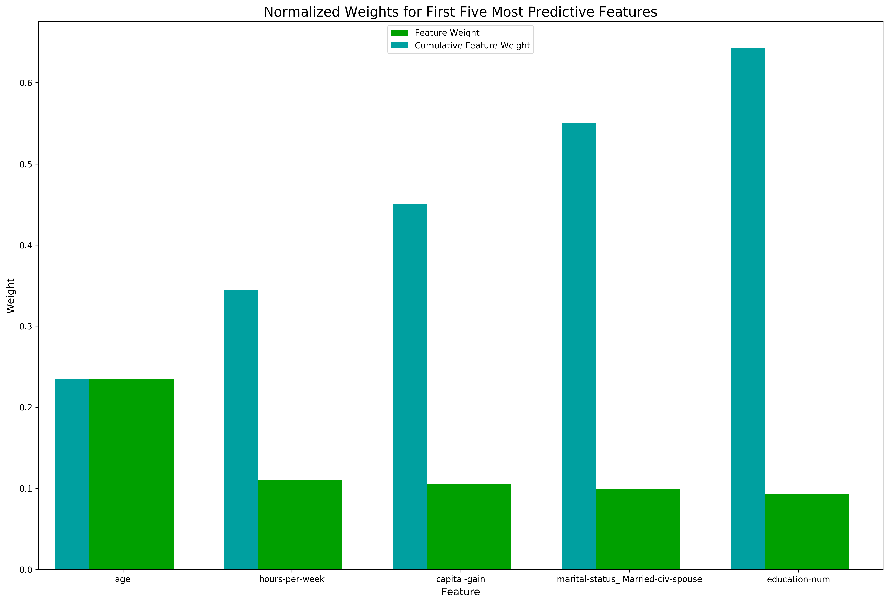

# Finding Donors for CharityML

### Table of Contents

1. [Installation](#installation)
2. [Project Motivation](#motivation)
3. [File Descriptions](#files)
4. [Data](#data)
5. [Results](#results)
6. [Licensing, Authors, and Acknowledgements](#licensing)

## Installation 

This project requires **Python 3.x** and the following Python libraries installed:

- [NumPy](http://www.numpy.org/)
- [Pandas](http://pandas.pydata.org)
- [matplotlib](http://matplotlib.org/)
- [scikit-learn](http://scikit-learn.org/stable/)

## Project Motivation

CharityML is a fictitious charity organization located in the heart of Silicon Valley that was established to provide financial support for people eager to learn machine learning. After nearly 32,000 letters were sent to people in the community, CharityML determined that every donation they received came from someone that was making more than $50,000 annually. To expand their potential donor base, CharityML has decided to send letters to residents of California, but to only those most likely to donate to the charity. With nearly 15 million working Californians, CharityML has brought you on board to help build an algorithm to best identify potential donors and reduce overhead cost of sending mail. Your goal will be evaluate and optimize several different supervised learners to determine which algorithm will provide the highest donation yield while also reducing the total number of letters being sent.

## File Descriptions 

The notebook for this project:
1. `finding_donors.ipynb` - The template `.ipynb` provided by Udacity's Data Scientist Nanodegree Program and also my code to answer the questions.

## Data

The modified census dataset consists of approximately 32,000 data points, with each datapoint having 13 features. This dataset is a modified version of the dataset published in the paper *"Scaling Up the Accuracy of Naive-Bayes Classifiers: a Decision-Tree Hybrid",* by Ron Kohavi. You may find this paper [online](https://www.aaai.org/Papers/KDD/1996/KDD96-033.pdf), with the original dataset hosted on [UCI](https://archive.ics.uci.edu/ml/datasets/Census+Income).

**Features**
- `age`: Age
- `workclass`: Working Class (Private, Self-emp-not-inc, Self-emp-inc, Federal-gov, Local-gov, State-gov, Without-pay, Never-worked)
- `education_level`: Level of Education (Bachelors, Some-college, 11th, HS-grad, Prof-school, Assoc-acdm, Assoc-voc, 9th, 7th-8th, 12th, Masters, 1st-4th, 10th, Doctorate, 5th-6th, Preschool)
- `education-num`: Number of educational years completed
- `marital-status`: Marital status (Married-civ-spouse, Divorced, Never-married, Separated, Widowed, Married-spouse-absent, Married-AF-spouse)
- `occupation`: Work Occupation (Tech-support, Craft-repair, Other-service, Sales, Exec-managerial, Prof-specialty, Handlers-cleaners, Machine-op-inspct, Adm-clerical, Farming-fishing, Transport-moving, Priv-house-serv, Protective-serv, Armed-Forces)
- `relationship`: Relationship Status (Wife, Own-child, Husband, Not-in-family, Other-relative, Unmarried)
- `race`: Race (White, Asian-Pac-Islander, Amer-Indian-Eskimo, Other, Black)
- `sex`: Sex (Female, Male)
- `capital-gain`: Monetary Capital Gains
- `capital-loss`: Monetary Capital Losses
- `hours-per-week`: Average Hours Per Week Worked
- `native-country`: Native Country (United-States, Cambodia, England, Puerto-Rico, Canada, Germany, Outlying-US(Guam-USVI-etc), India, Japan, Greece, South, China, Cuba, Iran, Honduras, Philippines, Italy, Poland, Jamaica, Vietnam, Mexico, Portugal, Ireland, France, Dominican-Republic, Laos, Ecuador, Taiwan, Haiti, Columbia, Hungary, Guatemala, Nicaragua, Scotland, Thailand, Yugoslavia, El-Salvador, Trinadad&Tobago, Peru, Hong, Holand-Netherlands)

**Target Variable**
- `income`: Income Class (<=50K, >50K)

## Results

Here's a summary of the results we've gathered:

Tree-based algorithms (`DecisionTreeClassifier`, `RandomForestClassifier`, `AdaBoostClassifier`) were chosen because of their interpretability. 

Looking at the F-scores on the testing, the AdaBoost Model performs the best. All 3 models also beat the Naive Predictor's Accuracy score: 0.2478, F-score: 0.2917, which is a good sign. However, out of the 3 models, AdaBoost too, seems to be taking significantly more time to run as well. Because we have <50k observations in our dataset, performing AdaBoost would still give the best results even with the time it takes, given that it has proven to not overfit the data relative to the other models like DecisionTree and RandomForest which have shown to overfit by having very high F-scores on the Training set, but much lower F-scores for testing, while AdaBoost performed roughly well for both training and testing. However, if the number of observations do increase, it might be wiser to use something like Random Forest instead which will be much faster, but reducing the max depth in order to minimize overfitting.

|     Metric     | Unoptimized Model | Optimized Model |
| :------------: | :---------------: | :-------------: | 
| Accuracy Score |       85.76%      |      86.45%     |
| F-score        |       72.46%      |      73.75%     |

Taking a look at the built-in sklearn `feature_importances_` attribute for the `RandomForestClassifier`:

Results on Reduced Dataset (Keeping only the top 5 most important features for prediction) with Best Classifier from `GridSearchCV` (`AdaBoostClassifier(algorithm='SAMME.R', base_estimator=None, learning_rate=1.5, n_estimators=150, random_state=42)`):

|     Metric     | Optimized Model with Full Data | Optimized Model with Reduced Data |
| :------------: | :----------------------------: | :-------------------------------: | 
| Accuracy Score |              86.45%            |               84.84%              |
| F-score        |              73.75%            |               70.35%              |

The reduced data model is lower in both accuracy and F-score, but not too much. Since the reduced data model is not much lower in accuracy and F-score, if time was a factor, we would much rather use the reduced data model instead or perform PCA to reduce the dimensions of the dataset. However, this would make it harder for us to explain and communicate what we are partitioning the dataset on. Thus, it would be wise to use the reduced data model because it is easier to communicate which features explain the most of the variance in our dataset so we can source for donor candidates specifically looking out for those features.

## Licensing, Authors, Acknowledgements

Must give credit to Udacity's Data Scientist Nanodegree Program for the template notebook and modified dataset.